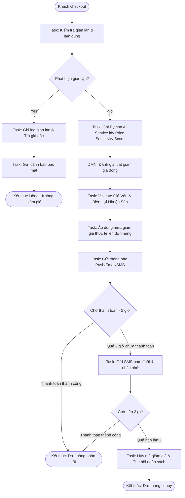

# 📌 ĐẶC TẢ CHI TIẾT BÀI TOÁN: HỆ THỐNG ĐIỀU PHỐI CHIẾN DỊCH KHUYẾN MÃI ĐỘNG (CAMUNDA BPMN & DMN)

Hệ thống được thiết kế dựa trên một bài toán lớn duy nhất: **Bộ điều phối chiến dịch quảng cáo và áp dụng mức giảm giá động cá nhân hóa (Dynamic Personalized Marketing Campaign & Promotion Orchestrator)**. 

Tài liệu này đặc tả chi tiết cách hệ thống xử lý, tính toán điểm số AI, phát hiện gian lận và các chốt chặn tài chính để bảo vệ biên lợi nhuận của người bán.

---

## 1. Kiến Trúc Phối Hợp Tổng Thể (Luồng BPMN 100% Khép Kín)

Khi khách hàng nhấn nút **"Thanh toán" (Checkout)** trên website, hệ thống sẽ gửi một Event kích hoạt luồng Camunda. Sơ đồ xử lý khép kín diễn ra như sau:



---

## 2. Chi Tiết Cách AI Tính Điểm Nhạy Cảm Giá (AI Price Sensitivity Scoring)

Mô hình AI chạy trên dịch vụ Python Service độc lập, nhận vào `userId` và `productId` để trả về điểm số nhạy cảm giá **$p\_score$** (nằm trong đoạn $[0, 1]$ hoặc $[0\%, 100\%]$). 

### A. Các Thuộc Tính Đầu Vào (Features) Được Thu Thập
Hệ thống sử dụng Middleware thu thập lịch sử hành động người dùng (`user_actions`) để tính toán các chỉ số:
1.  **Tỷ lệ sử dụng coupon ($R_{coupon}$):** Số đơn hàng đã mua có áp mã giảm giá / Tổng số đơn hàng đã mua trong quá khứ.
2.  **Tỷ lệ bỏ giỏ hàng ($R_{abandon}$):** Số lần thêm sản phẩm vào giỏ hàng nhưng không thanh toán / Tổng số lần thêm vào giỏ hàng (tính trong 30 ngày qua).
3.  **Tần suất xem sản phẩm ($F_{view}$):** Số lần xem chi tiết sản phẩm này trong 7 ngày qua.
4.  **Thời gian xem trung bình ($T_{view}$):** Thời gian trung bình ở lại trang chi tiết sản phẩm này (tính bằng giây).
5.  **Phần trăm chi tiêu ($P_{spend}$):** Vị thế chi tiêu của khách hàng so với toàn bộ người dùng hệ thống (tính từ mô hình RFM, ví dụ: khách thuộc top 10% chi tiêu nhiều nhất thì $P_{spend} = 0.9$).

### B. Công Thức Tính Điểm Nhạy Cảm Giá ($p\_score$)
Để đảm bảo tính minh bạch và dễ kiểm soát, mô hình Machine Learning (LightGBM) sẽ được chuẩn hóa đầu ra qua hàm Sigmoid để trả về điểm số nhạy cảm giá cuối cùng:

$$p\_score = \frac{1}{1 + e^{-z}}$$

Trong đó, hàm tuyến tính $z$ được xác định dựa trên trọng số huấn luyện:
$$z = w_1 \cdot R_{coupon} + w_2 \cdot R_{abandon} + w_3 \cdot \log(F_{view} + 1) + w_4 \cdot \log(T_{view}) - w_5 \cdot P_{spend} + b$$

*Ý nghĩa của các trọng số ($w_i > 0$):*
*   $R_{coupon}$ và $R_{abandon}$ càng lớn ➔ Khách càng nhạy cảm với giá (điểm số tiến gần về $1.0$).
*   $P_{spend}$ (mức chịu chi) càng lớn ➔ Khách càng ít nhạy cảm với giá (điểm số tiến gần về $0.0$).

### C. Phân Loại Điểm Số Để Đưa Vào Camunda DMN:
Dịch vụ Python sẽ phân loại điểm số $p\_score$ thành 3 mức độ nhạy cảm:
*   **HIGH (Nhạy cảm cao - $p\_score \ge 0.7$):** Khách rất đắn đo, có xu hướng bỏ đi nếu không được giảm giá lớn.
*   **MEDIUM (Nhạy cảm vừa - $0.4 \le p\_score < 0.7$):** Khách cần một ưu đãi nhỏ để thúc đẩy hành vi mua hàng.
*   **LOW (Nhạy cảm thấp - $p\_score < 0.4$):** Khách cực kỳ muốn mua sản phẩm này, không cần giảm giá nhiều họ vẫn mua.

---

## 3. Xử Lý Gian Lận & Lạm Dụng Khuyến Mãi (Fraud & Abuse Detection)

Để tránh trường hợp các tài khoản rác, bot, hoặc người dùng lạm dụng lỗ hổng khuyến mãi mua đi mua lại nhiều lần (gây tổn thất tài chính), hệ thống tích hợp chốt chặn chống gian lận ở đầu quy trình.

### A. Các Quy Tắc Phát Hiện Gian Lận (Fraud Detection Rules)
Khi nhận yêu cầu, `Fraud Detection Service` sẽ thực hiện các bước kiểm tra tự động sau:
1.  **Quy tắc Vân Tay Thiết Bị (Device Fingerprint Correlation):** Kiểm tra xem có nhiều tài khoản khác nhau đăng nhập và mua hàng trên cùng một ID thiết bị (`deviceId`) trong vòng 24 giờ qua hay không. Nếu số lượng tài khoản $\ge 3$ trên cùng 1 thiết bị ➔ **Đánh dấu gian lận**.
2.  **Quy tắc Trùng Lặp Địa Chỉ & SĐT (Duplicate Delivery Info):** Kiểm tra xem đơn hàng này có trùng số điện thoại nhận hàng (`recipientPhone`) hoặc địa chỉ chi tiết (`detailAddress`) với một tài khoản khác đã áp dụng mã giảm giá của chiến dịch này hay chưa.
3.  **Kiểm tra Tần Suất (Velocity Checking):**
    *   Giới hạn **1 lần/giờ** đối với mỗi địa chỉ IP.
    *   Giới hạn tối đa **3 lần/toàn bộ chiến dịch** đối với mỗi khách hàng.
    *   Nếu vượt quá giới hạn ➔ **Đánh dấu lạm dụng**.

### B. Kịch Bản Xử Lý Khi Phát Hiện Gian Lận
Nếu bất kỳ quy tắc nào ở trên bị vi phạm, hệ thống gán biến `isFraud = true`. Trong luồng Camunda, luồng sẽ đi qua cổng rẽ nhánh sang nhánh xử lý gian lận:
1.  **Chặn áp dụng khuyến mãi:** Thiết lập mức giảm giá của đơn hàng này về $0\%$.
2.  **Ghi log bảo mật:** Ghi nhận toàn bộ thông tin đơn hàng, IP, Device ID vào cơ sở dữ liệu `fraud_logs_db` để admin theo dõi.
3.  **Cảnh báo tài khoản:** Tạm khóa quyền áp dụng khuyến mãi của tài khoản này trong 7 ngày, gửi cảnh báo bảo mật qua email/SMS cho chủ tài khoản.

---

## 4. Đặc Tả Luật Giảm Giá Qua Bảng Quyết Định (Camunda DMN)

Bảng quyết định DMN (Decision Table) nhận vào các biến đã được tiền xử lý: `customerTier` (VIP/Gold/Silver/Member), `priceSensitivity` (HIGH/MEDIUM/LOW), và `isHoliday` (true/false) để đưa ra đề xuất giảm giá.

| STT | Hạng khách hàng (`customerTier`) | Độ nhạy cảm giá (`priceSensitivity`) | Ngày lễ? (`isHoliday`) | Mức giảm đề xuất (`suggestedPercent`) | Kênh thông báo (`channels`) |
|---|---|---|---|---|---|
| 1 | **VIP** | **HIGH** | true | **25%** | `["PUSH", "EMAIL"]` |
| 2 | **VIP** | **HIGH** | false | **20%** | `["PUSH", "EMAIL"]` |
| 3 | **VIP** | **MEDIUM** | - | **15%** | `["PUSH"]` |
| 4 | **VIP** | **LOW** | - | **5%** (giảm nhẹ tri ân) | `["PUSH"]` |
| 5 | **Gold / Silver** | **HIGH** | true | **15%** | `["PUSH"]` |
| 6 | **Gold / Silver** | **HIGH** | false | **10%** | `["PUSH"]` |
| 7 | **Gold / Silver** | **MEDIUM** | - | **8%** | `["PUSH"]` |
| 8 | **Gold / Silver** | **LOW** | - | **0%** | `[]` |
| 9 | **Member** | **HIGH** | - | **8%** | `["PUSH"]` |
| 10| **Member** | **MEDIUM / LOW** | - | **0%** | `[]` |

---

## 5. Các Chốt Chặn Validate Bảo Vệ Lợi Nhuận Người Bán (Profit Guards)

Đây là tầng validate kỹ thuật cuối cùng được thực thi tại Backend (`Discount Service`), độc lập với Camunda để làm chốt chặn bảo mật tuyệt đối trước khi cập nhật giá trị hóa đơn xuống database.

### A. Chốt Chặn Giá Vốn & Biên Lợi Nhuận Sàn (Cost Price Guard)
Hệ thống không cho phép bán dưới giá vốn trong mọi tình huống khuyến mãi.
*   **Tham số đầu vào:**
    *   $P_{cost}$: Tổng giá vốn của tất cả sản phẩm trong đơn hàng ($\sum \text{costPrice} \times \text{quantity}$).
    *   $P_{sell\_original}$: Tổng giá trị đơn hàng theo giá bán niêm yết ban đầu.
    *   $D_{suggested}$: Số tiền giảm giá được đề xuất từ Camunda DMN ($P_{sell\_original} \times \text{suggestedPercent}$).
    *   $M_{min\_margin}$: Biên lợi nhuận sàn tối thiểu mong muốn của người bán (mặc định là **10%** để bù đắp chi phí đóng gói, nhân sự, vận hành).
*   **Quy tắc Validate:**
    $$\text{Giá trị thanh toán thực tế} \ge P_{cost} \times (1 + M_{min\_margin})$$
    $$\Leftrightarrow (P_{sell\_original} - D_{suggested}) \ge P_{cost} \times 1.10$$
*   **Cách xử lý (Override Logic):**
    Nếu đơn hàng có giá gốc là 2.000.000đ, giá vốn nhập hàng của các sản phẩm là 1.600.000đ. Biên lợi nhuận sàn tối thiểu là $1.600.000 \times 1.10 = 1.760.000đ$.
    *   Nếu Camunda đề xuất giảm 20% (giảm 400.000đ) ➔ Giá bán sau giảm chỉ còn $2.000.000 - 400.000 = 1.600.000đ$ (Bán lỗ dưới biên sàn 1.760.000đ).
    *   Hệ thống tự động **ghi đè mức giảm tối đa** chỉ còn: $2.000.000 - 1.760.000 = 240.000đ$ (tương đương giảm tối đa **12%** thay vì 20%).

### B. Chốt Chặn Trần Giảm Giá Tuyệt Đối (Max Discount Cap)
Ngăn chặn các đơn hàng giá trị cực lớn sử dụng mã phần trăm làm thất thoát số tiền quá nhiều:
*   Mức giảm giá tối đa không vượt quá **30%** giá trị đơn hàng.
*   Số tiền giảm tối đa trên một đơn hàng không vượt quá **500,000đ**.
*   *Ví dụ:* Khách hàng mua đơn hàng trị giá 10.000.000đ, kể cả DMN trả về mức giảm 20% (theo lý thuyết là giảm 2.000.000đ) thì hệ thống cũng tự động kích hoạt chốt chặn và áp mức giảm tối đa chỉ là **500.000đ**.

### C. Chốt Chặn Ngân Sách Chiến Dịch (Campaign Budget Cap)
*   **Nguyên lý:** Mỗi chiến dịch được cấp một ngân sách cụ thể (Ví dụ: 50.000.000 VNĐ).
*   **Sử dụng Redis Distributed Counter:** Mỗi khi có đơn hàng áp mã thành công, hệ thống gọi lệnh `DECRBY campaign:budget:{campaignId} {discountAmount}` trên Redis (hoạt động đơn luồng, cực nhanh và atomic).
*   **Validate:** Nếu số dư ngân sách $\le 0$:
    *   Hệ thống tự động cập nhật trạng thái chiến dịch thành `EXHAUSTED` (Hết ngân sách).
    *   Mọi đơn hàng đang xử lý trong Camunda lập tức đi qua nhánh Bypass giảm giá (giảm 0%).
    *   Tự động bắn Alert sang kênh Slack/Email của phòng Marketing để dừng hoặc bổ sung ngân sách.

---

## 6. Giao Diện Kéo Thả & Sinh File BPMN Tự Động (Frontend Campaign Builder & BPMN Generator)

Để phòng Marketing có thể tự chỉnh sửa chiến dịch mà không cần can thiệp code, hệ thống cung cấp một trình kéo thả trực quan trên Admin Portal, sau đó tự động sinh file BPMN XML hợp lệ để deploy lên Camunda.

```
┌────────────────────────────────┐
│   Admin Portal (React Flow)    │ ◄── Nhân viên kéo thả các node & cấu hình tham số
└───────────────┬────────────────┘
                │
                ▼ (Dạng JSON Graph)
┌────────────────────────────────┐
│    Graph Validation Guard      │ ◄── Kiểm tra tính tuần tự, rẽ nhánh, loops (DFS/BFS)
└───────────────┬────────────────┘
                │ (Nếu hợp lệ)
                ▼
┌────────────────────────────────┐
│     BPMN XML Generator         │ ◄── Dịch JSON Graph sang thẻ XML tiêu chuẩn Camunda 8
└───────────────┬────────────────┘
                │
                ▼ (BPMN 2.0 XML)
┌────────────────────────────────┐
│  Zeebe Client Deployment API   │ ◄── Deploy trực tiếp lên Camunda Engine để thực thi
└────────────────────────────────┘
```

### A. Trải nghiệm kéo thả phía Frontend (React Flow / Rete.js)
Giao diện quản trị cung cấp các khối (Nodes) chuẩn hóa tương ứng với các phần tử BPMN:
*   **Trigger Node:** Điểm bắt đầu (Checkout đơn hàng).
*   **Condition Node (Gateway):** Rẽ nhánh theo bộ lọc (ví dụ: Khách trong danh sách đen?, Ngày lễ?, Khung giờ vàng?).
*   **AI Service Node:** Tích hợp gọi mô hình AI để lấy Price Sensitivity.
*   **Discount Rule Node (DMN):** Áp dụng bảng quyết định để tính mức giảm đề xuất.
*   **Action Node:** Gửi thông báo (FCM Push / Email / SMS) hoặc áp dụng mức giảm lên giỏ hàng.
*   **Timer Node:** Độ trễ (Chờ thanh toán 2 giờ).

### B. Cấu trúc dữ liệu luồng (JSON Graph Schema)
Bản vẽ kéo thả được lưu trong DB dưới dạng JSON Graph gồm các `nodes` và `edges`:
```json
{
  "campaignId": "holiday_sales_2026",
  "nodes": [
    { "id": "start", "type": "trigger", "label": "Khách checkout" },
    { "id": "check_fraud", "type": "serviceTask", "taskType": "fraud-check-task" },
    { "id": "is_fraud_gate", "type": "exclusiveGateway" },
    { "id": "get_ai_score", "type": "serviceTask", "taskType": "ai-pricing-task" }
  ],
  "edges": [
    { "source": "start", "target": "check_fraud" },
    { "source": "check_fraud", "target": "is_fraud_gate" },
    { "source": "is_fraud_gate", "target": "get_ai_score", "condition": "isFraud == false" }
  ]
}
```

### C. Quy Tắc Validate Sơ Đồ (Graph Validation Guard)
Trước khi biên dịch sang XML, Backend sẽ chạy các thuật toán để validate sơ đồ kéo thả nhằm tránh lỗi luồng:
1.  **Kiểm tra tính tuần tự & Khép kín:**
    *   Sử dụng thuật toán tìm kiếm theo chiều sâu (**DFS**) để phát hiện chu trình (Cycles) bất hợp lệ. Quy trình khuyến mãi không được phép có vòng lặp vô hạn.
    *   Mọi đường đi xuất phát từ nút Bắt đầu (Start) bắt buộc phải kết thúc tại các nút Kết thúc (End Event). Không chấp nhận "node mồ côi" (node không có kết nối ra).
2.  **Validate Gateway (Rẽ nhánh):**
    *   Mỗi Gateway rẽ nhánh bắt buộc phải cấu hình ít nhất 2 nhánh ra và bắt buộc phải có một nhánh **Default** (Nhánh mặc định) để luồng không bị treo khi dữ liệu thực tế không khớp với bất kỳ điều kiện lọc nào.
3.  **Validate tham số các Node:**
    *   Node gửi thông báo bắt buộc phải điền Template nội dung.
    *   Node cài đặt Timer phải có giá trị thời gian dương lớn hơn 0 (ví dụ: `duration >= 5m`).

### D. Cơ chế biên dịch tự động JSON Graph sang BPMN 2.0 XML
Khi Admin nhấn nút **"Duyệt & Chạy chiến dịch"**, Java backend sử dụng thư viện `camunda-bpmn-model` để tạo cấu trúc cây XML theo đặc tả BPMN 2.0:

*   **Ánh xạ Node:**
    *   `trigger` ➔ `<bpmn:startEvent id="start" name="Checkout"/>`
    *   `serviceTask` ➔ `<bpmn:serviceTask id="check_fraud" name="Check Fraud">` kèm thẻ định danh Zeebe:
        ```xml
        <bpmn:extensionElements>
          <zeebe:taskDefinition type="fraud-check-task" retries="3"/>
        </bpmn:extensionElements>
        ```
    *   `exclusiveGateway` ➔ `<bpmn:exclusiveGateway id="is_fraud_gate" default="flow_to_ai"/>`
*   **Ánh xạ Edge:**
    *   Cạnh nối ➔ `<bpmn:sequenceFlow id="flow1" sourceRef="start" targetRef="check_fraud"/>`
    *   Cạnh nối có điều kiện rẽ nhánh ➔ Thêm thẻ `<bpmn:conditionExpression xsi:type="bpmn:tFormalExpression">isFraud == false</bpmn:conditionExpression>` vào sequenceFlow.

File XML sau khi tạo tự động sẽ được gửi trực tiếp sang Zeebe Engine qua kết nối gRPC Client của **Promotion Service** để deploy chạy trực tiếp trong thời gian thực.

