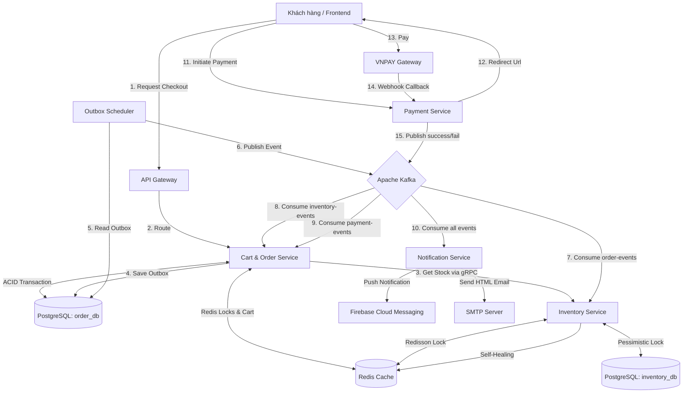
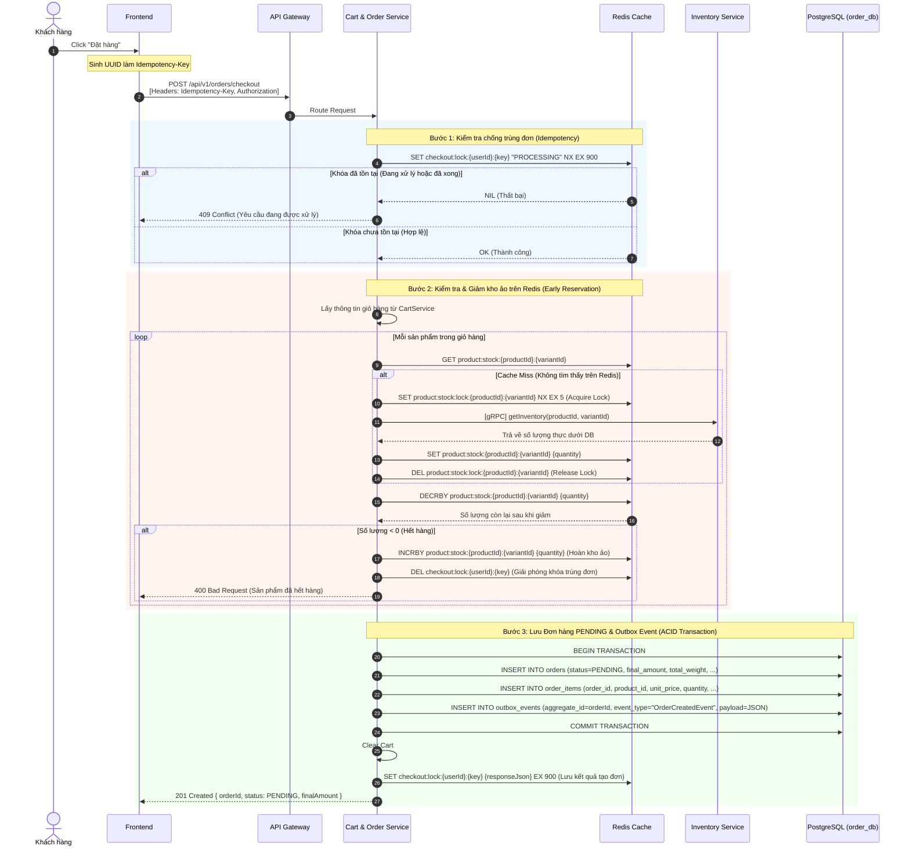
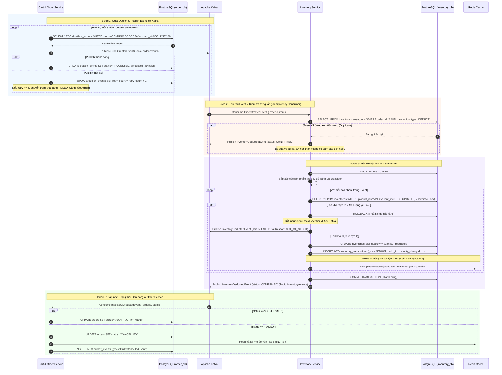
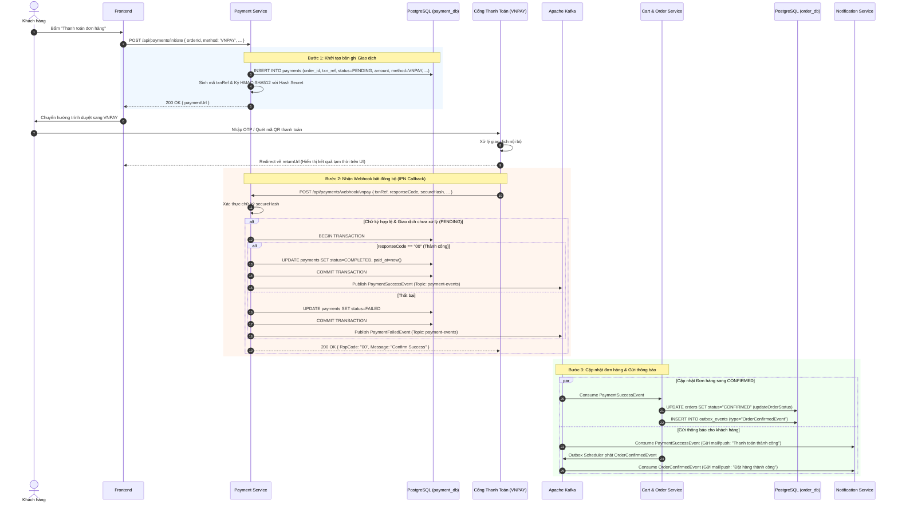
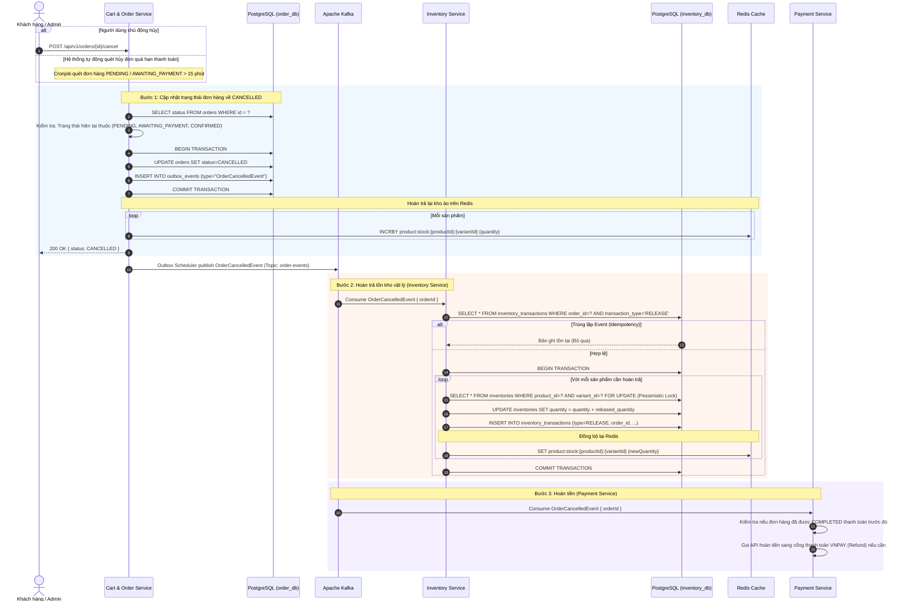
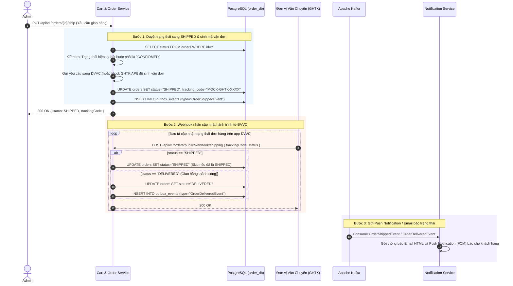

# 📋 TÀI LIỆU THIẾT KẾ: SƠ ĐỒ LUỒNG ĐẶT HÀNG CHI TIẾT (END-TO-END)
## Hệ thống E-Commerce Microservices

Tài liệu này đặc tả chi tiết luồng nghiệp vụ đặt hàng (Checkout & Order Lifecycle) của hệ thống, bao gồm sự tương tác giữa các dịch vụ: **API Gateway, Cart & Order Service, Promotion Service, Inventory Service, Payment Service, Notification Service**, cùng với hạ tầng **Kafka, Redis, PostgreSQL** và **MongoDB**.

---

## I. TỔNG QUAN KIẾN TRÚC LUỒNG ĐẶT HÀNG

Hệ thống sử dụng mô hình kết hợp giữa **Đồng bộ (Synchronous - REST/gRPC API)** cho các thao tác trực tiếp của người dùng và **Bất đồng bộ (Asynchronous - Event-Driven via Kafka & Transactional Outbox Pattern)** cho các tác vụ xử lý nền, đảm bảo tính nhất quán dữ liệu (Eventual Consistency), hiệu năng cao (High Throughput) và khả năng chịu tải tốt.

---

## II. CHI TIẾT CÁC GIAI ĐOẠN XỬ LÝ (SEQUENCES)

Luồng đặt hàng từ khi người dùng click "Đặt hàng" cho đến khi nhận hàng được chia làm 5 giai đoạn chính:

### Giai đoạn 1: Khởi tạo Đơn hàng & Giữ chỗ kho tạm thời (Checkout & Early Reservation)
*   **Mục tiêu**: Nhận request từ người dùng, chống gửi trùng đơn (Idempotency), kiểm tra tồn kho nhanh trên RAM (Redis) để chặn sớm 99% request hết hàng, tự động tải kho từ database qua gRPC nếu Redis bị cache miss, và lưu đơn hàng tạm thời ở trạng thái `PENDING`.

---

### Giai đoạn 2: Gửi Event & Trừ kho vật lý (Async Inventory Deduction & State Transition)
*   **Mục tiêu**: Đảm bảo sự kiện tạo đơn được gửi thành công đến Kafka (Transactional Outbox Pattern), Inventory Service thực hiện trừ kho vật lý an toàn dưới DB bằng cơ chế Pessimistic Lock (SELECT FOR UPDATE) kết hợp sắp xếp danh sách sản phẩm để tránh deadlock, và chuyển trạng thái đơn hàng sang `AWAITING_PAYMENT`.

---

### Giai đoạn 3: Thanh toán Đơn hàng (Payment Integration Flow)
*   **Mục tiêu**: Khách hàng thanh toán qua cổng thanh toán (VNPAY). Payment Service tiếp nhận kết quả qua Webhook bất đồng bộ (IPN), xác thực HMAC chữ ký bảo mật, và phát sự kiện thanh toán. Order Service nhận sự kiện để cập nhật trạng thái đơn sang `CONFIRMED`.

---

### Giai đoạn 4: Hủy đơn hàng và Hoàn trả kho / Hoàn tiền (Cancellation & Rollback Flow)
*   **Mục tiêu**: Xử lý hoàn trả tồn kho vật lý, kho ảo và hoàn tiền (nếu đã thanh toán) khi khách hàng yêu cầu hủy đơn, hoặc khi đơn hàng bị quá hạn thanh toán (Timeout sau 15 phút).

---

### Giai đoạn 5: Giao hàng và Hoàn tất đơn hàng (Shipping & Delivery Flow)
*   **Mục tiêu**: Người vận hành duyệt đơn hàng để chuyển vận chuyển, cập nhật trạng thái giao hàng thông qua webhook hành trình của đơn vị vận chuyển (ĐVVC), và kết thúc vòng đời đơn hàng.

---

## III. ĐẶC TẢ CHI TIẾT CÁC CƠ CHẾ AN TOÀN & HIỆU NĂNG

> [!IMPORTANT]
> **1. Chống trùng lặp (Idempotency) ở 3 tầng:**
> *   **Tầng API (Checkout)**: Sử dụng Header `Idempotency-Key` (UUID sinh từ Client) lưu vào Redis dưới dạng `checkout:lock:{userId}:{key}` trong 15 phút. Nếu double-submit, request thứ hai bị từ chối ngay lập tức hoặc nhận về kết quả cũ đã được cache lại.
> *   **Tầng Inventory (Deduction)**: Inventory Service kiểm tra bảng `inventory_transactions` theo cặp `(order_id, transaction_type='DEDUCT')`. Nếu đã tồn tại, bỏ qua nghiệp vụ và trả về kết quả thành công ngay để đảm bảo tính hội tụ.
> *   **Tầng Webhook (Payment)**: Cổng thanh toán có thể gọi lại Webhook nhiều lần nếu timeout. Payment Service kiểm tra trạng thái giao dịch trong DB trước khi xử lý, nếu trạng thái đã là `COMPLETED` hoặc `FAILED` thì trả về `200 OK` ngay.

> [!WARNING]
> **2. Chống thất thoát Sự kiện (Exactly-Once Delivery via Transactional Outbox Pattern):**
> Việc ghi vào DB và gửi message sang Broker (Kafka) KHÔNG thể thực hiện một cách atomic (lỗi mạng có thể làm hỏng bước 2 sau khi bước 1 thành công). Để giải quyết:
> *   Khi cập nhật trạng thái đơn hàng (tạo đơn, hủy đơn, giao hàng), thông tin sự kiện được chèn vào bảng `outbox_events` trong **cùng một Transaction DB** của đơn hàng.
> *   Một luồng OutboxScheduler chạy ngầm quét bảng `outbox_events` định kỳ mỗi 5 giây, gửi tin nhắn lên Kafka, và chỉ cập nhật trạng thái sự kiện thành `PROCESSED` khi nhận được ACK thành công từ Kafka Broker. Hàng ngày vào lúc 2:00 AM, một cronjob dọn dẹp các outbox đã xử lý quá 48 giờ để tránh đầy bảng.

> [!TIP]
> **3. Cơ chế tự phục hồi dữ liệu kho (Self-Healing Cache):**
> *   Để tối ưu tốc độ checkout, số lượng tồn kho khả dụng được giảm nhanh trên Redis (`DECRBY`).
> *   Tuy nhiên, dữ liệu trên Redis có thể bị lệch (drift) so với DB vật lý do lỗi mạng khi rollback hoặc server crash.
> *   Sau mỗi thao tác thay đổi kho vật lý (trừ kho, nhập kho, hoàn kho), Inventory Service sẽ truy vấn số lượng thực tế từ DB và thực hiện `SET product:stock:{productId}:{variantId} {actualQuantity}` ghi đè lên Redis.
> *   Một Scheduler định kỳ hàng giờ (fixedDelay = 1h) quét toàn bộ bảng `inventories` và đồng bộ lại sang Redis để dọn dẹp các sai lệch tích lũy.

---
*Tài liệu thiết kế chi tiết luồng xử lý đơn hàng hệ thống E-Commerce AI.*
