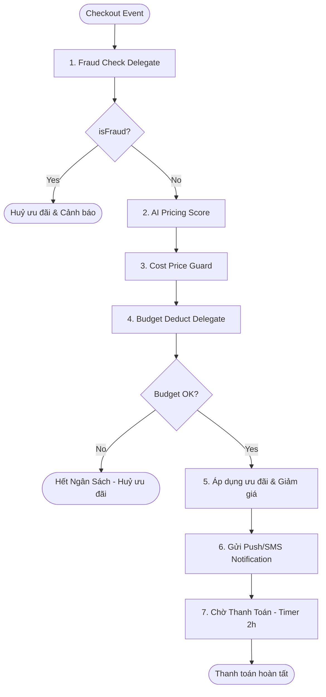

# TÀI LIỆU CẤU HÌNH & XÁC THỰC CÁC NODE TRONG QUY TRÌNH KHUYẾN MÃI (PROMOTION WORKFLOW)

Tài liệu này đặc tả chi tiết cấu hình đầu vào, đầu ra, các quy tắc kiểm tra (validation), và cơ chế hoạt động của từng node nghiệp vụ tích hợp trong Camunda 7 engine thuộc `promotion-service`.

---

## 1. Bản Đồ Tổng Quan Luồng Xử Lý (Workflow Pipeline)

Quy trình áp dụng khuyến mãi cá nhân hóa được điều phối theo chuỗi tuần tự sau:

---

## 2. Chi Tiết Cấu HÌnh Và Validation Từng Node

### 2.1. Node 1: Kiểm Tra Gian Lận (Fraud Check)
*   **Java Delegate Bean**: `${fraudCheckDelegate}`
*   **Mục đích**: Ngăn chặn tài khoản clone, gian lận IP hoặc thiết bị trước khi tính toán mã giảm giá.

#### A. Dữ liệu đầu vào từ Context Hệ thống (Variables)
| Tên biến | Kiểu dữ liệu | Bắt buộc | Mô tả |
| :--- | :--- | :---: | :--- |
| `userId` | String | Có | ID người dùng thực hiện checkout |
| `orderId` | Long | Có | ID đơn hàng tạm thời |
| `ipAddress` | String | Có | Địa chỉ IP của client gửi request |
| `deviceId` | String | Có | Mã định danh thiết bị (Browser Fingerprint / Device ID) |

#### B. Tham số cấu hình thiết lập trên UI (Input Parameters)
| Tham số | Kiểu dữ liệu | Mặc định | Quy tắc Validate đầu vào (UI) |
| :--- | :--- | :---: | :--- |
| `maxDevices` | Integer | `3` | Số nguyên dương > 0. Số tài khoản tối đa được dùng chung 1 thiết bị. |
| `velocityLimitHour` | Integer | `1` | Số lượt checkout tối đa trong 1 giờ của cùng 1 IP. |
| `bannedIps` | String | `1.1.1.1` | Chuỗi danh sách IP cách nhau dấu phẩy. Không chứa ký tự đặc biệt ngoài `.`, `,`. |

#### C. Quy tắc xử lý và Validation ở Backend (Business Logic)
1.  **Kiểm tra IP Blacklist**: Nếu `ipAddress` thuộc danh sách `bannedIps` -> Đánh dấu gian lận.
2.  **Kiểm tra thiết bị**: Nếu `deviceId` nằm trong danh sách đen thiết bị (ví dụ: `FRAUD_DEVICE`) -> Đánh dấu gian lận.
3.  **Lưu vết**: Nếu phát hiện gian lận (`isFraud == true`), lưu thông tin chi tiết vào bảng `FraudLog` (gồm lý do, IP, thiết bị, thời gian) để truy vết sau này.

#### D. Dữ liệu đầu ra (Outputs)
| Tên biến | Kiểu dữ liệu | Mô tả |
| :--- | :--- | :--- |
| `isFraud` | Boolean | `true` nếu phát hiện gian lận, `false` nếu tài khoản sạch. |

---

### 2.2. Node 2: Tính Điểm Nhạy Cảm Giá AI (AI Scoring)
*   **Java Delegate Bean**: `${getAIScoreDelegate}`
*   **Mục đích**: Gọi dịch vụ Python AI để tính toán điểm nhạy cảm giá của khách hàng nhằm đưa ra mức chiết khấu tối ưu nhất.

#### A. Dữ liệu đầu vào từ Context Hệ thống (Variables)
| Tên biến | Kiểu dữ liệu | Bắt buộc | Mô tả |
| :--- | :--- | :---: | :--- |
| `userId` | String | Có | ID khách hàng để AI truy vấn hành vi lịch sử |

#### B. Tham số cấu hình thiết lập trên UI (Input Parameters)
| Tham số | Kiểu dữ liệu | Mặc định | Quy tắc Validate đầu vào (UI) |
| :--- | :--- | :---: | :--- |
| `aiServiceUrl` | String | `http://ai-service:5000` | URL hợp lệ của service Python AI (phải có tiền tố `http://` hoặc `https://`). |
| `fallbackScore` | Double | `0.5` | Giá trị thập phân từ `0.0` đến `1.0`. Dùng khi gọi AI Service bị timeout hoặc lỗi. |

#### C. Quy tắc xử lý và Validation ở Backend (Business Logic)
1.  **Gọi API AI**: Spring Boot gửi request kèm `userId` tới `aiServiceUrl` để lấy điểm số dự báo.
2.  **Xử lý lỗi / Timeout**: Nếu dịch vụ AI phản hồi chậm (> 500ms) hoặc gặp sự cố, hệ thống tự động gán điểm số bằng `fallbackScore` để đảm bảo không đứt gãy luồng thanh toán của khách hàng.

#### D. Dữ liệu đầu ra (Outputs)
| Tên biến | Kiểu dữ liệu | Mô tả |
| :--- | :--- | :--- |
| `aiScore` | Double | Điểm nhạy cảm giá từ `0.0` (thấp) đến `1.0` (cao). |
| `customerSegment` | String | Phân khúc khách hàng định dạng chuỗi (`VIP`, `GOLD`, `REGULAR`). |

---

### 2.3. Node 3: Bảo Vệ Biên Lợi Nhuận (Cost Price Guard)
*   **Java Delegate Bean**: `${costPriceGuardDelegate}`
*   **Mục đích**: Đảm bảo số tiền giảm giá không vượt quá ngưỡng an toàn tài chính của doanh nghiệp (tránh lỗ vốn).

#### A. Dữ liệu đầu vào từ Context Hệ thống (Variables)
| Tên biến | Kiểu dữ liệu | Bắt buộc | Mô tả |
| :--- | :--- | :---: | :--- |
| `orderAmount` | BigDecimal | Có | Tổng giá trị đơn hàng trước giảm giá |
| `discountAmount` | BigDecimal | Có | Số tiền đề xuất giảm giá (do AI hoặc DMN tính toán trước đó) |

#### B. Tham số cấu hình thiết lập trên UI (Input Parameters)
| Tham số | Kiểu dữ liệu | Mặc định | Quy tắc Validate đầu vào (UI) |
| :--- | :--- | :---: | :--- |
| `minMarginPercent` | Integer | `10` | Số nguyên từ `1` đến `100`. Biên lợi nhuận sàn cần bảo vệ. |
| `maxDiscountCapPercent` | Integer | `30` | Số nguyên từ `1` đến `100`. Tỷ lệ giảm giá tối đa cho phép trên đơn hàng. |
| `absoluteCapAmount` | Long | `500000` | Số tiền giảm tối đa (Ví dụ: Giảm tối đa 500,000đ). |

#### C. Quy tắc xử lý và Validation ở Backend (Business Logic)
1.  **Giới hạn giảm tối đa**: Hệ thống tính toán mức giảm trần dựa trên `maxDiscountCapPercent` (Ví dụ: `orderAmount * 30%`).
2.  **So sánh ngưỡng**: Số tiền giảm giá thực tế `discountAmount` sẽ được hạ xuống mức trần nếu:
    *   Vượt quá `maxDiscountCapPercent` của đơn hàng.
    *   Hoặc vượt quá số tiền tuyệt đối `absoluteCapAmount`.
3.  **Ghi nhận cảnh báo**: Nếu có sự điều chỉnh hạ mức giảm giá, gán biến cảnh báo `isMarginViolated` thành `true`.

#### D. Dữ liệu đầu ra (Outputs)
| Tên biến | Kiểu dữ liệu | Mô tả |
| :--- | :--- | :--- |
| `discountAmount` | BigDecimal | Số tiền giảm giá sau khi đã kiểm tra và điều chỉnh áp trần. |
| `isMarginViolated` | Boolean | `true` nếu hệ thống phải can thiệp giảm mức chiết khấu, ngược lại `false`. |

---

### 2.4. Node 4: Khấu Trừ Ngân Sách Chiến Dịch (Budget Deduct)
*   **Java Delegate Bean**: `${budgetDeductDelegate}`
*   **Mục đích**: Kiểm tra và trừ ngân sách khả dụng của chiến dịch khuyến mãi trong Database/Redis.

#### A. Dữ liệu đầu vào từ Context Hệ thống (Variables)
| Tên biến | Kiểu dữ liệu | Bắt buộc | Mô tả |
| :--- | :--- | :---: | :--- |
| `discountAmount` | BigDecimal | Có | Số tiền ưu đãi cuối cùng sẽ trừ vào ngân sách |

#### B. Tham số cấu hình thiết lập trên UI (Input Parameters)
| Tham số | Kiểu dữ liệu | Mặc định | Quy tắc Validate đầu vào (UI) |
| :--- | :--- | :---: | :--- |
| `campaignId` | Long | (Không) | ID chiến dịch (bắt buộc nhập, phải là số nguyên dương). |
| `totalBudget` | Long | `50000000` | Ngân sách giới hạn tối đa ban đầu của chiến dịch. |

#### C. Quy tắc xử lý và Validation ở Backend (Business Logic)
1.  **Truy vấn số dư**: Truy xuất thông tin chiến dịch bằng `campaignId`. Nếu không tìm thấy, ném ngoại lệ dừng luồng.
2.  **Kiểm tra số dư**: So sánh `remainingBudget` (ngân sách còn lại) với `discountAmount`.
    *   Nếu `remainingBudget >= discountAmount`: Trừ trực tiếp ngân sách trong Database và gán `budgetDeductSuccess = true`.
    *   Nếu ngân sách thiếu hụt: Gán `budgetDeductSuccess = false` và giữ nguyên ngân sách.

#### D. Dữ liệu đầu ra (Outputs)
| Tên biến | Kiểu dữ liệu | Mô tả |
| :--- | :--- | :--- |
| `budgetDeductSuccess` | Boolean | Kết quả trừ ngân sách. `true` nếu thành công, `false` nếu hết ngân sách. |

---

### 2.5. Node 5: Gửi Thông Báo (Push Notification / SMS)
*   **Java Delegate Bean**: `${pushNotificationDelegate}` hoặc `${smsDelegate}`
*   **Mục đích**: Gửi thông báo đẩy (Push) trên ứng dụng hoặc gửi SMS nhắc khách hàng hoàn tất đơn hàng.

#### A. Dữ liệu đầu vào từ Context Hệ thống (Variables)
| Tên biến | Kiểu dữ liệu | Bắt buộc | Mô tả |
| :--- | :--- | :---: | :--- |
| `userId` | String | Có | ID người nhận thông báo |

#### B. Tham số cấu hình thiết lập trên UI (Input Parameters)
| Tham số | Kiểu dữ liệu | Mặc định | Quy tắc Validate đầu vào (UI) |
| :--- | :--- | :---: | :--- |
| `messageText` | String | (Không) | Nội dung tin nhắn (Bắt buộc nhập, không được bỏ trống). |

#### C. Quy tắc xử lý và Validation ở Backend (Business Logic)
1.  **Kiểm tra ký tự**: Nội dung tin nhắn SMS không được chứa ký tự không dấu hoặc ký tự đặc biệt gây lỗi nhà mạng.
2.  **Fallback**: Nếu thiết bị của khách hàng không bật nhận thông báo Push, hệ thống tự động chuyển sang gửi SMS để tránh mất liên lạc.

---

### 2.6. Node 6: Chờ Thanh Toán (Timer Event)
*   **Camunda Element**: Intermediate Catch Event (Timer)
*   **Mục đích**: Tạm dừng quy trình để đợi khách hàng thanh toán hoá đơn.

#### A. Tham số cấu hình thiết lập trên UI (Input Parameters)
*   `durationValue`: Số lượng đơn vị thời gian (ví dụ: `2`).
*   `durationUnit`: Đơn vị thời gian (`minutes`, `hours`, `days`).

#### B. Quy tắc định dạng Camunda XML (ISO-8601 Duration)
Hệ thống UI tự động chuyển đổi cấu hình sang định dạng chuẩn ISO-8601 trước khi ghi vào XML:
*   `2 minutes` -> `PT2M`
*   `2 hours` -> `PT2H`
*   `1 day` -> `P1D`
