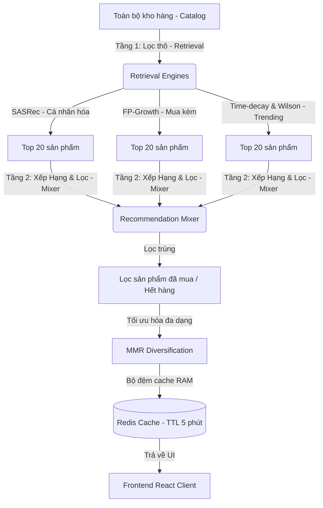
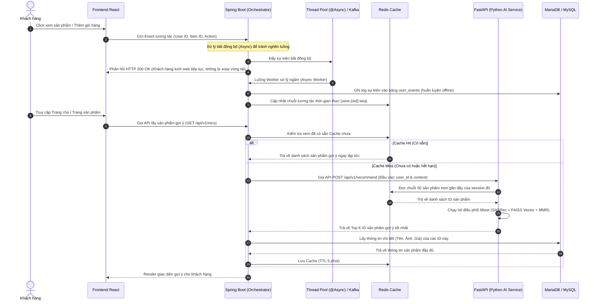

# 📑 Recommendation System — Hệ Thống Gợi Ý Hành Vi Toàn Diện (A+ Grade Blueprint)

Tài liệu này phác thảo ý tưởng, luồng hoạt động và hướng triển khai hệ thống gợi ý cho dự án thương mại điện tử, tập trung vào các thuật toán tối ưu nhất hiện nay. Tài liệu không chứa code lập trình mô hình phức tạp, giúp bạn dễ dàng nắm bắt tư duy hệ thống để viết báo cáo và thuyết trình.

---

## 🏷️ 1. TỔNG QUAN & MỤC TIÊU (OVERVIEW & OBJECTIVES)

Hệ thống gợi ý được xây dựng bằng cách kết hợp 4 thành phần tốt nhất tương ứng với các nghiệp vụ thực tế:

1. **Gợi ý cá nhân hóa (Trang chủ):** Sử dụng thuật toán **SASRec (Self-Attentive)** để nhận diện xu hướng mua sắm dựa trên chuỗi sản phẩm khách hàng vừa click xem gần đây.
2. **Gợi ý tương tự (Trang chi tiết sản phẩm):** Sử dụng công nghệ tìm kiếm vector **FAISS (FlatIP)** để tìm ra các sản phẩm giống với sản phẩm khách hàng đang xem về kiểu dáng, màu sắc, hoặc tính năng.
3. **Bán chéo (Trang giỏ hàng):** Sử dụng thuật toán khai phá luật kết hợp **FP-Growth** để tìm các phụ kiện hoặc sản phẩm thường được mua chung với món đồ chính.
4. **Giải quyết người dùng mới (Cold-start):** Sử dụng xếp hạng **Trending** dựa trên điểm số kết hợp **Hao mòn thời gian (Time-decay)** và đánh giá chất lượng **Wilson Score** để gợi ý cho khách hàng mới chưa có lịch sử duyệt web.

* **Mục tiêu hiệu năng:** Đảm bảo toàn bộ hệ thống phản hồi kết quả trong thời gian **dưới 50ms**.

### 🔹 Bảng tổng hợp kiến trúc hệ thống (Input - Output - Xử lý - Lưu trữ)

| Thành phần | Đặc tả triển khai thực tế |
| :--- | :--- |
| **📥 ĐẦU VÀO (INPUT)** | 1. **Thông tin khách hàng:** ID người dùng (`user_id`) hoặc ID phiên duyệt (`session_id`).<br>2. **Hành vi thời gian thực:** Danh sách ID sản phẩm khách vừa click xem gần nhất (ví dụ: `[12, 45, 99]`).<br>3. **Dữ liệu lịch sử:** Lịch sử mua hàng (để lọc bỏ sản phẩm đã mua) và các đơn hàng cũ (để phân tích quy luật mua kèm).<br>4. **Ngữ cảnh yêu cầu (Context):** Vị trí trang đang đứng (Trang chủ, Trang chi tiết, hay Giỏ hàng). |
| **📤 ĐẦU RA (OUTPUT)** | * Danh sách xếp hạng từ 10 đến 20 **ID sản phẩm** tối ưu nhất (ví dụ: `[prod_102, prod_56, prod_88]`) kèm thông tin chi tiết (Tên, Ảnh, Giá, Danh mục) đã được lọc trùng, sắp xếp và đa dạng hóa để hiển thị trực tiếp lên giao diện Frontend. |
| **⚙️ XỬ LÝ (PROCESSING)** | **Tầng 1: Lọc thô (Candidate Retrieval - < 5ms)**<br>* Chạy song song các nguồn để gom ~60 ứng viên: lấy sản phẩm tương đồng từ **FAISS** (dựa trên vector sản phẩm đang xem), lấy dự đoán tiếp theo từ **SASRec** (dựa trên chuỗi sản phẩm đã xem), và lấy danh sách bán chạy từ **Trending**.<br><br>**Tầng 2: Xếp hạng & Bộ trộn (Ranking & Mixer - < 10ms)**<br>* **Lọc (Filtering):** Đối chiếu với danh sách sản phẩm khách đã mua hoặc sản phẩm hết hàng để xóa bỏ.<br>* **Chuẩn hóa (Normalization):** Đưa mọi thang điểm khác nhau về khoảng $[0, 1]$ bằng Min-Max Scaling.<br>* **Nhân trọng số (Weighting):** Nhân với hệ số trọng số tương ứng theo trang hiển thị.<br>* **Đa dạng hóa (MMR):** Phạt điểm các sản phẩm trùng lặp danh mục đứng gần nhau.<br>* **Cache:** Lưu kết quả cuối cùng vào Redis RAM. |
| **💾 LƯU TRỮ (STORAGE)** | 1. **Hành vi thô:** Lưu vào bảng `user_events` trong **MariaDB/MySQL** để làm nguyên liệu huấn luyện AI.<br>2. **Hành vi thời gian thực:** Lưu dạng danh sách (`List`) trong **Redis RAM** (Key: `sess:{sid}:seq`) để truy cập thời gian thực.<br>3. **Quy tắc mua kèm:** Lưu vào bảng `cross_sell_rules` trong **MySQL** sau khi chạy thuật toán FP-Growth offline.<br>4. **Chỉ mục vector:** Lưu thành file chỉ mục `.faiss` trên ổ cứng server FastAPI.<br>5. **Kết quả gợi ý tạm thời:** Lưu vào bộ đệm **Redis Cache** với thời gian sống (TTL) 5 phút. |
| **🚀 CÔNG NGHỆ (TECH STACK)** | * **Spring Boot (Java):** Điều phối chính, kết nối DB, kiểm soát cache Redis và xử lý nghiệp vụ.<br>* **Xử lý bất đồng bộ (Spring Boot @Async / Thread Pool hoặc Kafka):** Nhận và chuyển tiếp luồng click chuột bất đồng bộ giúp hệ thống không bị nghẽn mà không cần dùng RabbitMQ.<br>* **FastAPI (Python):** Nơi triển khai mô hình học sâu SASRec (PyTorch) và thư viện FAISS vì Python xử lý AI tối ưu nhất.<br>* **Neo4j (Graph DB):** (Định hướng nâng cao) Để kết nối đa chiều mối quan hệ khách hàng - sản phẩm - thương hiệu. |

---

## 💡 2. BẢN CHẤT Ý TƯỞNG & LUỒNG HOẠT ĐỘNG (CONCEPT & WORKFLOW)

### 🔹 2.1. Ý tưởng thiết kế 2 tầng (Two-stage Architecture)
Để xử lý kho hàng lớn mà không gây chậm ứng dụng, quy trình gợi ý được chia làm 2 tầng rõ rệt:
* **Tầng 1 - Lọc thô (Candidate Retrieval):** Sử dụng các thuật toán chạy song song (SASRec, FAISS, Trending) để lọc nhanh từ hàng chục nghìn sản phẩm ra khoảng 60 sản phẩm ứng viên có triển vọng nhất.
* **Tầng 2 - Xếp hạng & Bộ trộn (Ranking & Mixer):** Gom 60 sản phẩm ứng viên này lại, lọc bỏ các mặt hàng hết kho hoặc đã mua gần đây. Tiếp tục nhân hệ số trọng số tương ứng với vị trí trang hiển thị và chạy thuật toán đa dạng hóa danh mục để chọn lọc ra 10-20 sản phẩm tối ưu nhất hiển thị cho khách hàng.



### 🔹 2.2. Sơ đồ tuần tự tích hợp Microservices (Sequence Diagram)
Ý tưởng tích hợp là kết hợp thế mạnh của **Spring Boot** (quản lý nghiệp vụ, giao dịch, bảo mật) và **Python FastAPI** (tập trung chạy các mô hình AI tính toán nặng):



---

## 🧠 3. CƠ SỞ LÝ THUYẾT & THUẬT TOÁN TỐT NHẤT (THEORY & ALGORITHMS)

Dưới đây là cơ sở khoa học của các thuật toán được lựa chọn sử dụng trong hệ thống:

### 🔹 3.1. Thuật toán gợi ý cá nhân hóa: SASRec (Self-Attentive Sequential Recommendation)
* **Bản chất ý tưởng:** Khác với các thuật toán cũ chỉ coi các hành động của người dùng có vai trò như nhau hoặc giảm dần theo thứ tự thời gian một cách máy móc, SASRec sử dụng cơ chế **Self-Attention**. Cơ chế này tự động tính toán mối liên kết ngữ nghĩa giữa các sản phẩm trong chuỗi lướt web của khách hàng. Nó tự động hiểu rằng: *"Nếu khách hàng đã xem Điện thoại $\rightarrow$ Ốp lưng $\rightarrow$ Tai nghe, thì hành động quan trọng nhất là chiếc Điện thoại, và sản phẩm tiếp theo nên gợi ý là Củ sạc nhanh."*
* **Công thức toán học cốt lõi:**
  * **Cộng vị trí (Positional Embedding):** Do cơ chế Attention tự nhiên không phân biệt trước sau, ta phải cộng thêm vector vị trí $P$ vào vector sản phẩm $E$ để mô hình biết được sản phẩm nào được xem trước, sản phẩm nào được xem sau:
    $$X = E + P$$
  * **Mặt nạ nhân quả (Causal Masking):** Khi huấn luyện mô hình dự đoán sản phẩm tiếp theo, ta phải sử dụng một ma trận mặt nạ $M$ để che đi các sản phẩm ở tương lai, bắt mô hình chỉ được phép nhìn các sản phẩm ở quá khứ:
    $$\text{Attention}(Q, K, V) = \text{softmax}\left(\frac{Q K^T}{\sqrt{d}} + M\right) V$$
    *(Với $M_{i, j} = -\infty$ nếu $i < j$, đại diện cho việc che đi thông tin tương lai)*

### 🔹 3.2. Thuật toán gợi ý tương tự: FAISS Vector Retrieval
* **Bản chất ý tưởng:** Mỗi sản phẩm được chuyển hóa thành một chuỗi số (Vector nhúng) đại diện cho đặc trưng hình ảnh hoặc mô tả chữ của nó. FAISS (thư viện của Meta) sẽ quản lý các vector này trên bộ nhớ RAM. Khi cần tìm sản phẩm tương tự với sản phẩm A, FAISS tính nhanh khoảng cách hình học giữa vector sản phẩm A và tất cả các sản phẩm khác để tìm ra những sản phẩm gần nhất.
* **Công thức khoảng cách:** Sử dụng tích vô hướng (Inner Product) sau khi các vector đã được chuẩn hóa về độ dài bằng 1, tương đương với độ tương đồng Cosine:
  $$\text{Similarity}(q, v) = q \cdot v^T$$
  *(Điểm số gần bằng 1.0 nghĩa là hai sản phẩm có mức độ tương đồng cực kỳ cao)*

### 🔹 3.3. Thuật toán gợi ý mua kèm: FP-Growth (Frequent Pattern Growth)
* **Bản chất ý tưởng:** Quét toàn bộ lịch sử đơn hàng để tìm ra các nhóm sản phẩm thường được mua chung với nhau. Thuật toán nén dữ liệu giao dịch thành một cây cấu trúc (FP-Tree), sau đó trích xuất ra các luật bán chéo dạng $A \Rightarrow B$ (Nếu mua $A$ thì gợi ý mua kèm $B$).
* **Công thức đánh giá quy luật:**
  * **Confidence (Độ tin cậy):** Tỷ lệ đơn hàng chứa sản phẩm B trong số các đơn đã mua sản phẩm A:
    $$\text{Confidence}(A \Rightarrow B) = \frac{\text{Số đơn chứa cả A và B}}{\text{Số đơn chứa A}}$$
  * **Lift (Độ ảnh hưởng):** Đo lường xem việc mua chung giữa A và B là do chúng thực sự liên quan, hay chỉ là do ngẫu nhiên vì cả hai đều quá hot:
    $$\text{Lift}(A \Rightarrow B) = \frac{\text{Support}(A \Rightarrow B)}{\text{Support}(A) \times \text{Support}(B)}$$
    *(Hệ thống chỉ chấp nhận gợi ý bán chéo khi chỉ số $\text{Lift} > 1.0$)*

### 🔹 3.4. Thuật toán xếp hạng sản phẩm thịnh hành (Trending Score)
* **Hao mòn thời gian (Time-decay):** Đảm bảo các tương tác gần đây (hôm nay) có giá trị cao hơn nhiều so với các tương tác cũ (tuần trước):
  $$\text{Score}(i) = \sum_{e \in E_i} \text{Weight}(e) \times e^{-\lambda \times \Delta t_e}$$
  *(Với $\Delta t_e$ là số giờ trôi qua từ khi tương tác xảy ra, và $\lambda = 0.1$ là hệ số hao mòn)*
* ** Wilson Score (Xếp hạng chất lượng rating):** Tính toán biên dưới khoảng tin cậy của đánh giá sao, giúp loại bỏ các sản phẩm chỉ có duy nhất một đánh giá 5 sao vượt lên trên các sản phẩm uy tín có hàng nghìn đánh giá 4.8 sao.

### 🔹 3.5. Thuật toán đa dạng hóa gợi ý: MMR (Maximal Marginal Relevance)
* **Bản chất ý tưởng:** Nếu hệ thống chỉ gợi ý các sản phẩm có điểm số cao nhất, giao diện sẽ dễ bị lặp (ví dụ gợi ý 5 chiếc iPhone liền nhau). MMR giải quyết bài toán này bằng cách duyệt qua danh sách đề xuất, nếu sản phẩm tiếp theo trùng danh mục sản phẩm (Category) với sản phẩm đã xếp phía trước, điểm số của nó sẽ bị phạt giảm xuống để nhường chỗ cho sản phẩm thuộc ngành hàng khác (như tai nghe, sạc).

### 🔹 3.6. Định hướng nâng cao: Gợi ý dựa trên Đồ thị Tri thức (Graph-based Recommendation)
* **Bản chất ý tưởng:** Xây dựng Đồ thị Tri thức Mua sắm (E-commerce Knowledge Graph) nhằm liên kết đa chiều các thực thể trong hệ thống thay vì chỉ phân tích hành vi đơn lẻ. Các nút (Node) trong đồ thị đại diện cho: Khách hàng (User), Sản phẩm (Product), Danh mục (Category), Thương hiệu (Brand). Các cạnh (Edge) đại diện cho mối quan hệ: `(User)-[:PURCHASED]->(Product)`, `(Product)-[:BELONGS_TO]->(Category)`, `(Product)-[:BRANDED_BY]->(Brand)`.
* **Lợi ích:** Hệ thống có thể thực hiện các gợi ý bắc cầu thông minh mà học máy truyền thống khó nhận diện trực tiếp. Ví dụ: *"Người dùng A mua Điện thoại Samsung S24 $\rightarrow$ Samsung S24 thuộc Thương hiệu Samsung $\rightarrow$ Samsung S24 có mẫu Tai nghe Buds $\rightarrow$ Đề xuất Tai nghe Buds cho Người dùng A."*
* **Công nghệ lựa chọn:** Sử dụng hệ quản trị cơ sở dữ liệu đồ thị **Neo4j** và ngôn ngữ truy vấn **Cypher** để thực hiện truy vấn quan hệ thời gian thực. Đối với mô hình học sâu đồ thị (GNN), sử dụng thư viện **PyTorch Geometric (PyG)** hoặc **DGL** để nhúng các nút đồ thị thành các vector đặc trưng.

### 🔹 3.7. Quy luật chấm điểm tổng hợp (Hybrid Scoring Rule)
* **Bản chất ý tưởng:** Để kết hợp được nhiều nguồn gợi ý (SASRec, FAISS, Trending, FP-Growth) đang có các thang điểm thô rất khác nhau, bộ trộn Mixer sẽ tiến hành quy đổi toàn bộ điểm số về cùng khoảng $[0, 1]$, sau đó nhân hệ số theo ngữ cảnh để tính ra điểm xếp hạng cuối cùng.
* **Bước 1: Chuẩn hóa Min-Max (Min-Max Normalization):**
  Với mỗi nguồn gợi ý $S_{raw}$, chuyển đổi điểm số của mỗi sản phẩm ứng viên $i$ về khoảng $[0, 1]$:
  $$S_{norm}(i) = \frac{S_{raw}(i) - \min(S_{raw})}{\max(S_{raw}) - \min(S_{raw})}$$
* **Bước 2: Kết hợp tuyến tính theo trọng số ngữ cảnh (Contextual Weighting):**
  Tính toán điểm tổng hợp cuối cùng của sản phẩm $i$ tại ngữ cảnh yêu cầu:
  $$S_{final}(i) = w_{sas} \cdot S_{sas}(i) + w_{faiss} \cdot S_{faiss}(i) + w_{cross} \cdot S_{cross}(i) + w_{trend} \cdot S_{trend}(i)$$
  *(Trong đó tổng các trọng số $\sum w = 1.0$. Trọng số thay đổi linh động: Trang chủ ưu tiên $w_{sas} = 0.5$, Trang giỏ hàng ưu tiên $w_{cross} = 0.6$)*

---

## 🛠️ 4. KIẾN TRÚC KỸ THUẬT & TRIỂN KHAI (ENGINEERING & INTEGRATION)

### 🔹 4.1. Thiết Kế Schema DDL Cơ Cơ Dữ Liệu
Để vận hành ý tưởng trên, hệ thống cần cấu trúc lưu trữ dữ liệu như sau:

```sql
-- Bảng ghi nhận sự kiện tương tác của người dùng phục vụ học máy
CREATE TABLE user_events (
    id BIGINT AUTO_INCREMENT PRIMARY KEY,
    user_id BIGINT NULL,                  -- Có thể NULL nếu là khách vãng lai
    session_id VARCHAR(100) NOT NULL,     -- Session ID lưu vết tương tác tạm thời
    item_id BIGINT NOT NULL,              -- FK liên kết bảng sản phẩm
    action_type VARCHAR(50) NOT NULL,     -- Loại hành vi: view, add_to_cart, purchase
    weight FLOAT NOT NULL,                -- Trọng số hành vi (view=1, cart=4, purchase=10)
    created_at TIMESTAMP DEFAULT CURRENT_TIMESTAMP,
    FOREIGN KEY (item_id) REFERENCES products(id) ON DELETE CASCADE
);

CREATE INDEX idx_user_events_retrieval ON user_events (user_id, created_at DESC);
CREATE INDEX idx_session_events_retrieval ON user_events (session_id, created_at DESC);

-- Bảng lưu trữ quy tắc mua kèm được tính ngầm offline định kỳ bằng FP-Growth
CREATE TABLE cross_sell_rules (
    id BIGINT AUTO_INCREMENT PRIMARY KEY,
    antecedent_item_id BIGINT NOT NULL,   -- Sản phẩm khách đang chọn mua (Sản phẩm A)
    consequent_item_id BIGINT NOT NULL,   -- Sản phẩm gợi ý mua kèm (Sản phẩm B)
    support FLOAT NOT NULL,               -- Độ hỗ trợ của cặp sản phẩm
    confidence FLOAT NOT NULL,            -- Độ tin cậy của quy tắc
    lift FLOAT NOT NULL,                  -- Độ ảnh hưởng tương quan
    FOREIGN KEY (antecedent_item_id) REFERENCES products(id) ON DELETE CASCADE,
    FOREIGN KEY (consequent_item_id) REFERENCES products(id) ON DELETE CASCADE
);

CREATE INDEX idx_cross_sell_lookup ON cross_sell_rules (antecedent_item_id, lift DESC);
```

#### Thiết kế cấu trúc lưu trữ cache trong Redis:
* `sess:{sid}:seq` (Type: `List`): Danh sách lưu chuỗi tối đa 50 ID sản phẩm người dùng đã xem trong session đó phục vụ đầu vào thời gian thực cho SASRec.
* `user:{uid}:purchased` (Type: `Set`): Danh sách ID sản phẩm khách đã mua trong vòng 30 ngày để bộ lọc loại bỏ khỏi phần gợi ý.

---

### 🔹 4.2. Ý Tưởng Quy Trình Triển Khai Thực Tế

#### Quy trình 1: Triển khai Gợi ý tuần tự (SASRec)
* **Huấn luyện ngầm định kỳ (Offline Training Pipeline):**
  1. Hàng đêm, một tiến trình tự động quét bảng `user_events` trong MySQL.
  2. Gom nhóm các click theo `session_id`, sắp xếp thời gian để tạo chuỗi sản phẩm đã duyệt.
  3. Cắt/đệm chuỗi về kích thước cố định là 50 sản phẩm để làm đầu vào cho mô hình mạng neural SASRec.
  4. Chạy quá trình huấn luyện bằng PyTorch trên GPU để tối ưu hóa khả năng dự đoán sản phẩm tiếp theo dựa trên chuỗi lịch sử.
  5. Xuất tệp tin trọng số mạng neural đã học được dưới dạng tệp tin `sasrec.pt` và tải trực tiếp vào bộ nhớ RAM của Service FastAPI.
* **Gọi ý thời gian thực (Online Inference Pipeline):**
  1. Khi người dùng lướt web, mỗi click chuột được Spring Boot đẩy vào Redis key `sess:{sid}:seq` để tích lũy chuỗi hành vi.
  2. Khi trang web yêu cầu danh sách gợi ý, FastAPI nhận chuỗi 50 sản phẩm gần nhất này từ Redis, đưa vào mô hình `sasrec.pt` tính toán và trả về ngay lập tức Top 20 ID sản phẩm có khả năng được click tiếp theo cao nhất.

#### Quy trình 2: Triển khai Truy xuất tương đồng (FAISS)
* **Sinh đặc trưng sản phẩm (Offline Vector Generation):**
  1. Chạy tất cả ảnh sản phẩm qua mô hình trích xuất đặc trưng hình ảnh (như CLIP hoặc DINOv2) thu được vector hình ảnh $\vec{v}_{img}$.
  2. Chạy tên/mô tả sản phẩm qua mô hình ngôn ngữ (như e5-large) để lấy vector văn bản $\vec{v}_{txt}$.
  3. Chuẩn hóa vector và nạp vào thư viện tìm kiếm nhanh chỉ mục FAISS trên RAM. Lưu chỉ mục này thành file chỉ mục `.faiss` trên ổ cứng.
* **Tìm kiếm thời gian thực (Online Retrieval):**
  1. Khi khách hàng bấm xem sản phẩm A, FastAPI lấy vector nhúng của sản phẩm A.
  2. Gọi lệnh tìm kiếm của FAISS đối sánh tích vô hướng trên RAM để tìm ra Top 20 sản phẩm có khoảng cách gần nhất trong thời gian cực nhanh ($<5ms$).
* **Đồng bộ hóa sản phẩm mới (Incremental Sync):**
  1. Khi Admin thêm sản phẩm mới vào hệ thống, Spring Boot kích hoạt một Webhook gửi thông tin sản phẩm mới sang Service FastAPI.
  2. FastAPI lập tức sinh vector đặc trưng cho sản phẩm mới và gọi hàm chèn tăng dần của FAISS để nạp vector mới vào RAM mà không cần build lại toàn bộ chỉ mục từ đầu.

#### Quy trình 3: Đồng bộ & Truy vấn Đồ thị Tri thức (Neo4j Integration)
* **Đồng bộ hóa đồ thị (Graph Sync):** Sử dụng các connector hoặc cơ chế CDC (Change Data Capture) để đồng bộ sản phẩm, danh mục, thương hiệu và các giao dịch mua hàng từ database MySQL chính sang cơ sở dữ liệu đồ thị **Neo4j**.
* **Truy vấn gợi ý (Graph Querying):** Khi khách hàng xem sản phẩm A, Spring Boot chạy một câu truy vấn quan hệ bằng ngôn ngữ **Cypher** sang Neo4j để tìm các sản phẩm có khoảng cách liên kết ngắn nhất (ví dụ: cùng hãng, cùng phân khúc giá, hoặc thường được mua chung bởi những khách hàng có cùng sở thích).

---

## 🔬 5. QUY TRÌNH ĐÁNH GIÁ CHUẨN HỌC MÁY (EVALUATION PROTOCOL)

* **Phân chia dữ liệu kiểm thử (Evaluation Splitting):**
  Hệ thống sử dụng kỹ thuật phân chia dữ liệu **Leave-One-Out**. Với mỗi chuỗi tương tác sản phẩm của người dùng, ta tách sản phẩm cuối cùng ra làm nhãn kiểm thử (Test Set), sản phẩm kề cuối làm nhãn điều chỉnh tham số (Validation Set), toàn bộ các phần trước đó dùng để huấn luyện mô hình (Train Set). Việc này đảm bảo tính khách quan và kiểm chứng chính xác khả năng dự đoán tương lai của AI.

* **Các chỉ số đo lường hiệu năng của hệ thống (Evaluation Metrics):**

| Chỉ số đo lường | Định nghĩa và Ý nghĩa thực tế | Ngưỡng yêu cầu đạt điểm xuất sắc |
| :--- | :--- | :---: |
| **HR@10 (Hit Rate)** | Tỷ lệ sản phẩm người dùng click tiếp theo thực tế nằm trong danh sách Top 10 sản phẩm được hệ thống đề xuất gợi ý. | **$\ge 0.65$** |
| **NDCG@10** | Đánh giá vị trí hiển thị. Sản phẩm gợi ý đúng nằm ở vị trí càng cao (vị trí 1, 2) thì điểm số nhận được càng lớn. | **$\ge 0.45$** |
| **MRR** | Đo lường mức độ nhanh chóng tìm thấy đúng sản phẩm mong muốn của khách hàng (giá trị nghịch đảo của vị trí hiển thị đúng đầu tiên). | **$\ge 0.40$** |
| **Coverage** | Tỷ lệ số sản phẩm độc bản được hệ thống đề xuất gợi ý trên tổng kho hàng, đánh giá xem hệ thống có giúp bán đều kho hay không. | **$\ge 25\%$** |
| **Latency (ms)** | Thời gian phản hồi tính bằng mili giây của API. | **$< 50\text{ms}$** |
