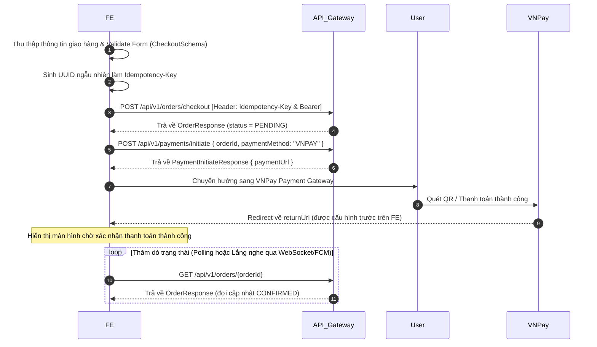

# 🌐 TÀI LIỆU TÍCH HỢP FRONTEND (FRONTEND API CONTRACT)
## Hệ thống E-Commerce Microservices

Tài liệu này cung cấp đầy đủ thông số kỹ thuật, quy trình gọi, dữ liệu đầu vào/đầu ra và các tệp tin hỗ trợ validate giúp đội ngũ **Frontend (FE)** tích hợp API mượt mà, không gặp lỗi lệch luồng nghiệp vụ.

---

## I. CẤU HÌNH CHUNG & XÁC THỰC

### 1. Base URL (API Gateway)
Tất cả các API được định tuyến thông qua API Gateway chạy tại địa chỉ:
*   **API Gateway URL**: `http://localhost:8080`
*   **Bản đồ định tuyến (Routing Rules)**: Gateway sẽ phân tích tiền tố của đường dẫn (`/api/v1/users`, `/api/v1/products`, v.v.) để chuyển tiếp đến microservice tương ứng.

### 2. Xác thực người dùng (Authentication via Keycloak)
Hệ thống sử dụng **Keycloak OAuth2 (JWT)** để xác thực.
*   **Cổng xác thực qua Gateway**: `http://localhost:8080/realms/ecommerce-realm/protocol/openid-connect/token`
*   **Luồng hoạt động**:
    1.  FE gửi request POST (`Content-Type: application/x-www-form-urlencoded`) để lấy Token.
    2.  Sau khi đăng nhập thành công, FE lưu `access_token` và gửi kèm vào **Header** của các API yêu cầu xác thực:
        ```http
        Authorization: Bearer <access_token>
        ```

### 3. Phân quyền và Header Đặc biệt
*   **Header `X-User-Id` & `X-User-Email`**: Khi người dùng gọi các API cá nhân (ví dụ: giỏ hàng, đặt hàng), API Gateway sẽ tự động verify JWT token, trích xuất `userId` và `email` rồi chèn vào Header để gửi xuống dịch vụ phía sau. **FE không cần tự gửi thủ công hai header này khi gọi qua Gateway** (nhưng có thể mô phỏng khi test trực tiếp microservice).
*   **Header `Idempotency-Key` (Bắt buộc khi Đặt hàng)**:
    *   Sử dụng để chống gửi trùng đơn hàng khi mạng chập chờn hoặc người dùng click đúp.
    *   FE cần tự sinh một mã UUID ngẫu nhiên (ví dụ: `idemp-983192`) và đặt vào Header:
        ```http
        Idempotency-Key: idemp-983192
        ```

---

## II. DANH SÁCH FILE FE SỬ DỤNG ĐỂ VALIDATE

Để tránh lỗi lệch kiểu dữ liệu hoặc gửi thiếu trường bắt buộc, FE hãy sử dụng các tệp tin cấu hình sẵn trong thư mục `docs/`:

1.  **TypeScript Types Definition File (`docs/fe_types.d.ts`)**:
    *   [Đường dẫn file](file:///d:/Code/DA/docs/fe_types.d.ts)
    *   **Nhiệm vụ**: Chứa toàn bộ các Interface cấu trúc dữ liệu Request Body và Response Body của tất cả API. Hãy import vào dự án React/NextJS/Vue để đảm bảo tính an toàn kiểu dữ liệu (Type Safety) từ compile-time.
2.  **Zod Validation Schemas (`docs/fe_validation_schemas.ts`)**:
    *   [Đường dẫn file](file:///d:/Code/DA/docs/fe_validation_schemas.ts)
    *   **Nhiệm vụ**: Chứa các Schema định nghĩa quy tắc kiểm tra dữ liệu đầu vào (Form validation) trùng khớp với annotation validation của Spring Boot Backend (như `@NotBlank`, `@Min`, `@DecimalMin`, RegExp số điện thoại, v.v.). Dùng trực tiếp với React Hook Form hoặc Formik.
3.  **Bộ sưu tập Postman (Postman Collections)**:
    *   Import trực tiếp các file `.json` dưới đây vào Postman để kiểm thử payload thực tế:
        *   [User Service Collection](file:///d:/Code/DA/docs/user_service_test_collection.json) (Auth, Profile, Sổ địa chỉ, Admin Blacklist)
        *   [Product Service Collection](file:///d:/Code/DA/docs/product_service_test_collection.json) (Danh mục, Thương hiệu, Sản phẩm & Variant, Đánh giá, Wishlist)
        *   [Order Service Collection](file:///d:/Code/DA/docs/order_service_test_collection.json) (Giỏ hàng, Đặt hàng, Hủy đơn, Mock giao hàng & Webhook)
        *   [Inventory Service Collection](file:///d:/Code/DA/docs/inventory_service_test_collection.json) (Tồn kho thực tế, Restock, Lịch sử kho)
        *   [Payment Service Collection](file:///d:/Code/DA/docs/ecommerce_testing_postman_collection.json) (Khởi tạo link thanh toán, Hoàn tiền)

---

## III. THÔNG SỐ CHI TIẾT TỪNG API THEO MODULE

### 1. Module Đăng Nhập & Người Dùng (User Service)

#### Đăng nhập Keycloak lấy Access Token
*   **Method**: `POST`
*   **Endpoint**: `/realms/ecommerce-realm/protocol/openid-connect/token`
*   **Headers**: `Content-Type: application/x-www-form-urlencoded`
*   **Body Params**:
    *   `grant_type`: `password`
    *   `client_id`: `ecommerce-frontend`
    *   `username`: `<username>`
    *   `password`: `<password>`
*   **Dữ liệu trả về**: `KeycloakTokenResponse` (Chứa `access_token` và `refresh_token`).

#### Lấy thông tin cá nhân (Profile)
*   **Method**: `GET`
*   **Endpoint**: `/api/v1/users/me`
*   **Headers**: `Authorization: Bearer <token>`
*   **Dữ liệu trả về**: `ApiResponse<UserProfile>`

#### Cập nhật thông tin cá nhân
*   **Method**: `PUT`
*   **Endpoint**: `/api/v1/users/me`
*   **Headers**: `Authorization: Bearer <token>`
*   **Request Body**: `UpdateProfileRequest`
*   **Dữ liệu trả về**: `ApiResponse<UserProfile>`

#### Thêm địa chỉ nhận hàng mới
*   **Method**: `POST`
*   **Endpoint**: `/api/v1/users/me/addresses`
*   **Headers**: `Authorization: Bearer <token>`
*   **Request Body**: `AddressRequest` (Sử dụng `AddressSchema` của Zod để validate)
*   **Dữ liệu trả về**: `ApiResponse<AddressResponse>`

#### Xóa địa chỉ nhận hàng
*   **Method**: `DELETE`
*   **Endpoint**: `/api/v1/users/me/addresses/{id}`
*   **Headers**: `Authorization: Bearer <token>`
*   **Dữ liệu trả về**: `ApiResponse<Void>`

---

### 2. Module Catalog & Danh Mục (Product Service)

#### Lấy cây danh mục sản phẩm (Category Tree)
*   **Method**: `GET`
*   **Endpoint**: `/api/v1/public/categories/tree` (Public - Không cần Token)
*   **Dữ liệu trả về**: `ApiResponse<List<CategoryDto>>` (Danh sách danh mục phân tầng cha-con)

#### Lấy danh sách sản phẩm (Public)
*   **Method**: `GET`
*   **Endpoint**: `/api/v1/public/products` (Public)
*   **Query Params**:
    *   `active`: `true` (chỉ lấy sản phẩm đang bán)
    *   `page`: Số trang (0-indexed)
    *   `size`: Số sản phẩm/trang
*   **Dữ liệu trả về**: `ApiResponse<Page<ProductDto>>`

#### Lấy chi tiết sản phẩm kèm Variant
*   **Method**: `GET`
*   **Endpoint**: `/api/v1/public/products/{productId}` (Public)
*   **Dữ liệu trả về**: `ApiResponse<ProductDto>` (Chứa mảng `variants` chi tiết của sản phẩm)

#### Thêm sản phẩm vào Wishlist (Yêu thích)
*   **Method**: `POST`
*   **Endpoint**: `/api/v1/wishlist/{productId}`
*   **Headers**: `Authorization: Bearer <token>`
*   **Dữ liệu trả về**: `ApiResponse<Void>`

#### Viết đánh giá sản phẩm (Review)
*   **Method**: `POST`
*   **Endpoint**: `/api/v1/products/reviews`
*   **Headers**: `Authorization: Bearer <token>`
*   **Request Body**: `ReviewRequest`
*   **Dữ liệu trả về**: `ApiResponse<ReviewResponse>`

---

### 3. Module Giỏ Hàng & Đặt Hàng (Cart & Order Service)

#### Lấy giỏ hàng hiện tại
*   **Method**: `GET`
*   **Endpoint**: `/api/v1/cart`
*   **Headers**: `Authorization: Bearer <token>`
*   **Dữ liệu trả về**: `ApiResponse<CartResponse>`

#### Thêm sản phẩm/variant vào giỏ hàng
*   **Method**: `POST`
*   **Endpoint**: `/api/v1/cart`
*   **Headers**: `Authorization: Bearer <token>`
*   **Request Body**: `CartItemRequest` (productId, variantId, quantity)
*   **Dữ liệu trả về**: `ApiResponse<CartResponse>`

#### Cập nhật số lượng sản phẩm trong giỏ hàng
*   **Method**: `PUT`
*   **Endpoint**: `/api/v1/cart/items/{productId}`
*   **Headers**: `Authorization: Bearer <token>`
*   **Query Params**:
    *   `variantId`: ID phiên bản sản phẩm (nếu có)
    *   `quantity`: Số lượng mới (bắt buộc >= 1)
*   **Dữ liệu trả về**: `ApiResponse<CartResponse>`

#### Xóa sản phẩm khỏi giỏ hàng
*   **Method**: `DELETE`
*   **Endpoint**: `/api/v1/cart/items/{productId}`
*   **Headers**: `Authorization: Bearer <token>`
*   **Query Params**: `variantId` (nếu có)
*   **Dữ liệu trả về**: `ApiResponse<CartResponse>`

#### Đặt hàng (Checkout) - Idempotent
*   **Method**: `POST`
*   **Endpoint**: `/api/v1/orders/checkout`
*   **Headers**: 
    *   `Authorization: Bearer <token>`
    *   `Idempotency-Key`: `<UUID>` (Mã sinh ngẫu nhiên từ client)
*   **Request Body**: `CheckoutRequest` (shippingAddress, phoneNumber, couponCode, note)
*   **Dữ liệu trả về**: `ApiResponse<OrderResponse>` (Đơn hàng khởi tạo trạng thái `PENDING`)

---

### 4. Module Cổng Thanh Toán (Payment Service)

#### Khởi tạo thanh toán (COD / VNPAY)
*   **Method**: `POST`
*   **Endpoint**: `/api/v1/payments/initiate`
*   **Headers**: `Authorization: Bearer <token>`
*   **Request Body**: `PaymentInitiateRequest` (orderId, paymentMethod: "COD" | "VNPAY")
*   **Dữ liệu trả về**: `ApiResponse<PaymentInitiateResponse>`
*   **Hành động tiếp theo**:
    *   Nếu `paymentMethod` là `VNPAY`: Response trả về sẽ kèm trường `paymentUrl`. FE cần **chuyển hướng trình duyệt của User** sang link này để họ thanh toán thẻ/QR.
    *   Nếu `paymentMethod` là `COD`: Status sẽ là `PENDING` và không có link chuyển hướng.

---

### 5. Module Khuyến Mãi & Trình thiết kế (Promotion Service)

#### Đánh giá tính hợp lệ của Giỏ hàng đối với Chiến dịch (Evaluate)
*   **Method**: `POST`
*   **Endpoint**: `/api/v1/public/campaigns/evaluate`
*   **Query Params**: `processKey` (Mã luồng BPMN của chiến dịch đang hoạt động)
*   **Request Body**: Map các biến giỏ hàng cần đánh giá (ví dụ: `totalAmount`, `userId`, `items`)
*   **Dữ liệu trả về**: `ApiResponse<Map<String, Object>>` (Kết quả tính toán giảm giá)

#### [Admin/Staff] Kiểm tra tính hợp lệ của bản vẽ Workflow (Validate)
*   **Method**: `POST`
*   **Endpoint**: `/api/v1/admin/campaigns/validate`
*   **Headers**: `Authorization: Bearer <token>`
*   **Request Body**: `WorkflowGraphDto` (Bản vẽ nodes và edges từ thư viện React Flow)
*   **Dữ liệu trả về**: `ApiResponse<ValidationResultDto>` (Báo cáo lỗi cú pháp BPMN chi tiết nếu có)

---

## IV. BẢN ĐỒ LUỒNG ĐI (WORKFLOW INTEGRATION MATRIX)

### 1. Luồng mua hàng & thanh toán VNPay chuẩn:


---

## V. CÁCH XỬ LÝ LỖI TRÊN FE (ERROR HANDLING)

Hệ thống trả về mã trạng thái HTTP tiêu chuẩn kèm cấu trúc `ApiResponse` khi xảy ra lỗi. FE cần bắt các trường hợp sau để hiển thị thông báo thân thiện:

1.  **Mã `400 Bad Request` (Validation Failed)**:
    *   Trường hợp gửi sai định dạng dữ liệu (ví dụ: số lượng < 1).
    *   Response chứa chi tiết lỗi trong trường `message` hoặc `data.errors`.
2.  **Mã `409 Conflict` (Double Submit)**:
    *   Khi FE gửi trùng `Idempotency-Key` của một đơn hàng đang xử lý.
    *   **Giải pháp**: FE hiển thị thông báo "Yêu cầu đang được xử lý, vui lòng không click liên tục".
3.  **Mã `401 Unauthorized` / `403 Forbidden`**:
    *   Token hết hạn hoặc không có quyền truy cập API quản trị.
    *   **Giải pháp**: FE tự động gọi API refresh token hoặc chuyển hướng người dùng về trang Đăng nhập.
