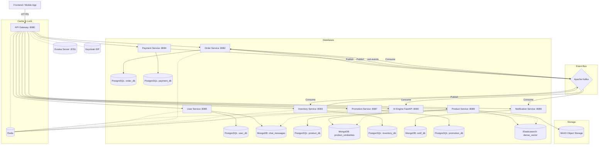

# 📚 INDEX — TÀI LIỆU THIẾT KẾ KIẾN TRÚC MICROSERVICES
## Hệ thống E-Commerce — Thiết kế Phân tích & Kiến trúc từng Service

> **Phiên bản:** 1.0.0 | **Cập nhật:** 2026-06-01
> **Nhóm:** Nhóm 2 — Kiến trúc & Kỹ thuật chuyên sâu

---

## 📂 Danh sách Tài liệu

| # | Service | File | Port | Database |
|---|---|---|---|---|
| 1 | **Identity & User Service** | [01_IDENTITY_USER_SERVICE.md](./01_IDENTITY_USER_SERVICE.md) | 8085 | PostgreSQL (ecommerce_user_db) + MongoDB |
| 2 | **Product & Catalog Service** | [02_PRODUCT_CATALOG_SERVICE.md](./02_PRODUCT_CATALOG_SERVICE.md) | 8089 | PostgreSQL (ecommerce_product_db) + Elasticsearch + MongoDB |
| 3 | **Cart & Order Service** | [03_CART_ORDER_SERVICE.md](./03_CART_ORDER_SERVICE.md) | 8082 | PostgreSQL (ecommerce_order_db) + Redis |
| 4 | **Inventory Service** | [04_INVENTORY_SERVICE.md](./04_INVENTORY_SERVICE.md) | 8093 | PostgreSQL (ecommerce_inventory_db) + Redis |
| 5 | **Payment Service** | [05_PAYMENT_SERVICE.md](./05_PAYMENT_SERVICE.md) | 8084 | PostgreSQL (ecommerce_payment_db) |
| 6 | **Notification Service** | [06_NOTIFICATION_SERVICE.md](./06_NOTIFICATION_SERVICE.md) | 8086 | MongoDB (notif_db) |
| 7 | **Promotion Service** | [07_PROMOTION_SERVICE.md](./07_PROMOTION_SERVICE.md) | 8087 | PostgreSQL (ecommerce_promotion_db) + Redis + Camunda |
| 8 | **API Gateway & Discovery** | [08_API_GATEWAY_DISCOVERY.md](./08_API_GATEWAY_DISCOVERY.md) | 8080 / 8761 | Redis (Rate limiting) |
| 9 | **AI Engine Service** | [09_AI_ENGINE_SERVICE.md](./09_AI_ENGINE_SERVICE.md) | 8000 | Python FastAPI + PyTorch |

---

## 🏗️ Kiến trúc Tổng thể



---

## 🔄 Luồng Nghiệp vụ Chính

### Luồng Đặt hàng & Đánh giá phân khúc AI (Happy Path)

```
1. [User] Thêm sản phẩm vào giỏ hàng
   → Cart Service lưu vào Redis Hash "cart:{userId}"
   → Cart Service publish CartUpdatedEvent lên Kafka topic "cart-events"
   → [Async] AI Engine consume "cart-events" lưu vào Feature Store

2. [User] Checkout đơn hàng
   → Order Service: Idempotency Check (Redis SET NX)
   → Order Service: DECRBY product:stock:{id} (giữ chỗ kho - Redis)
   → Order Service: Lưu Order PENDING + OutboxEvent (1 ACID Transaction)
   → Response 201 cho User ngay (~50ms)

3. [Async - Outbox Scheduler]
   → Order Service → Kafka: OrderCreatedEvent

4. [Async - Inventory Service]
   → Consume OrderCreatedEvent
   → Redisson Lock + SELECT FOR UPDATE
   → Trừ kho vật lý DB
   → Lấy snapshot lưu vào inventory_daily_snapshots
   → Kafka: InventoryDeductedEvent (CONFIRMED)

5. [Async - Order Service]
   → Consume InventoryDeductedEvent
   → UPDATE order status = CONFIRMED

6. [Async - Notification Service]
   → Consume OrderCreatedEvent
   → Gửi email xác nhận đơn hàng + Push Notification
```

### Luồng Thanh toán & Định giá Động AI

```
7. [User] Chọn phương thức thanh toán (VNPAY)
   → Camunda DMN gọi GetAIScoreDelegate
   → [GetAIScoreDelegate] gọi User Service lấy customerTier & segmentationLabel
   → [GetAIScoreDelegate] gọi AI Engine lấy priceSensitivity score (XGBoost)
   → Camunda DMN tính toán discount phù hợp, áp CostPriceGuard
   → Payment Service: Tạo payment record PENDING và sinh URL VNPAY
   → Redirect User đến VNPAY

8. [VNPAY Webhook - Async]
   → Payment Service: Verify HMAC signature & Idempotency Check
   → Payment Service: UPDATE payment COMPLETED
   → Kafka: PaymentSuccessEvent

9. [Async - Order Service]
   → Consume PaymentSuccessEvent
   → UPDATE order status = PAID

10. [Async - Notification Service]
    → Consume PaymentSuccessEvent → Gửi email xác nhận thanh toán
```

---

## 🛠️ Công nghệ Stack Toàn hệ thống

| Tầng | Công nghệ | Mục đích |
|---|---|---|
| **API Gateway** | Spring Cloud Gateway | Routing, Keycloak OAuth2 Verification, Header Injection, Redis Rate Limiting |
| **Service Discovery** | Netflix Eureka Server | Đăng ký & phát hiện dịch vụ tự động |
| **Identity Provider** | Keycloak | Quản lý định danh, sinh JWT token, phân quyền |
| **Services** | Spring Boot 3.x | Các microservices nghiệp vụ |
| **AI Backend** | FastAPI (Python) | LLM RAG, XGBoost dynamic pricing, K-Means clustering, LightGBM forecasting |
| **ORM** | Spring Data JPA + Hibernate | Tương tác PostgreSQL |
| **NoSQL ORM** | Spring Data MongoDB | Tương tác MongoDB |
| **Relational DB** | PostgreSQL 15.x | Dữ liệu giao dịch (ACID) |
| **Document DB** | MongoDB 6.x | Chat messages, similar products, notifications, logs |
| **Cache** | Redis 7.x (Lettuce) | Cache, Blacklist, Stock, Cart, Rate limiting |
| **Distributed Lock** | Redisson | Khóa phân tán trừ kho |
| **Message Queue** | Apache Kafka 3.x | Event-driven async communication |
| **Search** | Elasticsearch 8.x | Keyword search + k-NN Dense Vector search (Visual / Semantic) |
| **Object Storage** | MinIO | Lưu trữ ảnh sản phẩm |

---

## 📊 Tổng hợp Database Design

| Service | Database | Bảng/Collection chính |
|---|---|---|
| User | PostgreSQL: `ecommerce_user_db` + MongoDB | users, user_devices, addresses, chat_sessions (Postgres), chat_messages (MongoDB) |
| Product | PostgreSQL: `ecommerce_product_db` + MongoDB | categories, products, product_variants, product_images, product_tags (Postgres), product_similarities (MongoDB) |
| Order | PostgreSQL: `ecommerce_order_db` | orders, order_items, outbox_events, coupons |
| Inventory | PostgreSQL: `ecommerce_inventory_db` | inventories, inventory_transactions, restock_requests, inventory_daily_snapshots |
| Payment | PostgreSQL: `ecommerce_payment_db` | payments, refunds, webhook_logs |
| Notification | MongoDB: `notif_db` | notifications, fcm_tokens, notification_templates |

---

## 🔑 Redis Key Convention

| Key Pattern | Service | Mô tả |
|---|---|---|
| `blacklist:{jti}` | User | JWT đã logout |
| `user:profile:{userId}` | User | Cache thông tin user |
| `product:{id}` | Product | Cache chi tiết sản phẩm |
| `product:similar:{id}` | Product | Cache danh sách 20 ID sản phẩm tương tự |
| `category:tree` | Product | Cache cây danh mục |
| `cart:{userId}` | Order | Giỏ hàng (Redis Hash) |
| `checkout:lock:{userId}:{key}` | Order | Idempotency key |
| `product:stock:{productId}` | Order/Inventory | Tồn kho giữ chỗ |
| `lock:product:{productId}` | Inventory | Redisson Distributed Lock |
| `campaign:budget:{campaignId}` | Promotion | Redis Atomic Counter ngân sách khuyến mãi |

---

## 📡 Kafka Topics & Events

| Topic | Producer | Consumer | Events |
|---|---|---|---|
| `order-events` | Order Service | Inventory, Notification, AI Engine | OrderCreated, OrderCancelled, OrderShipped, OrderDelivered |
| `cart-events` | Cart Service | AI Engine | CartUpdatedEvent (Add, Update, Remove, Clear) |
| `inventory-events` | Inventory Service | Order Service | InventoryDeducted, InventoryFailed, StockUpdated |
| `payment-events` | Payment Service | Order, Notification | PaymentSuccess, PaymentFailed, RefundCompleted |
| `user-events` | User Service | Notification | UserRegistered, PasswordReset |

---

## ✅ Checklist Thiết kế (Design Review)

### Resilience (Khả năng chịu lỗi)
- [x] Outbox Pattern — đảm bảo event không bị mất khi Kafka gặp sự cố
- [x] Idempotent Consumer — chống xử lý event trùng lặp
- [x] Retry Mechanism — tự động thử lại khi gửi notification thất bại
- [x] Circuit Breaker — ngăn cascading failure khi email provider chết

### Performance (Hiệu năng)
- [x] Redis Cache — giảm 95% query xuống DB cho đọc sản phẩm & sản phẩm tương đồng
- [x] Redis DECRBY — lọc sớm 99.9% request hết hàng tại RAM
- [x] Async Event-Driven — không block response của user
- [x] Elasticsearch k-NN — tìm kiếm ảnh/ngữ nghĩa thời gian thực không block PostgreSQL

### Security (Bảo mật)
- [x] API Gateway centralized auth — Verify JWT tại Gateway, inject X-User-Id header
- [x] Keycloak OAuth2 IDP — Quản lý tập trung tài khoản, session và phân quyền
- [x] Webhook Signature Verify — chống giả mạo callback từ cổng thanh toán
- [x] Redis Rate Limiter — chống brute-force và spam API AI

### Consistency (Nhất quán dữ liệu)
- [x] Redisson Distributed Lock — chống race condition khi trừ kho
- [x] Pessimistic Lock (SELECT FOR UPDATE) — bảo vệ DB vật lý
- [x] Self-Healing Redis Sync — tự phục hồi khi Redis bị lệch với DB
- [x] Logical FK (No Physical FK) — giữ độc lập giữa các DB của service

---
*Tài liệu này là bản tổng hợp — Tham chiếu từng file cụ thể để xem chi tiết.*
