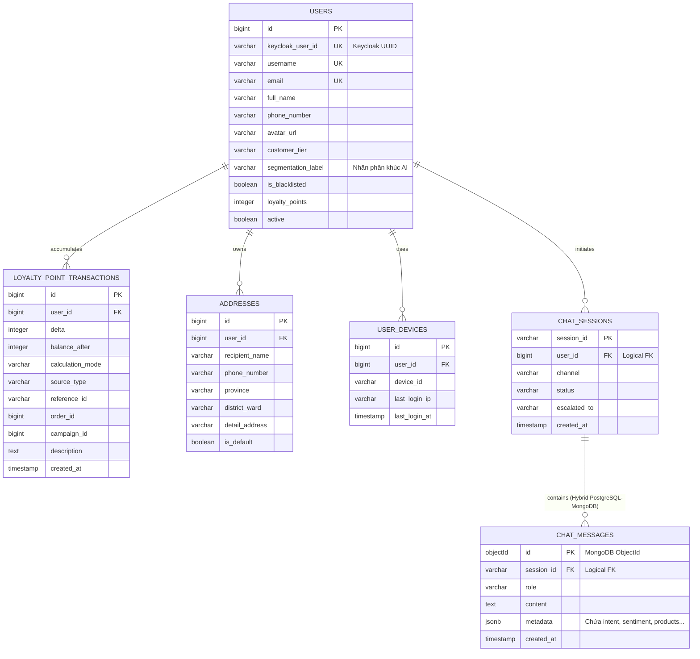

# TÀI LIỆU THIẾT KẾ: IDENTITY & USER SERVICE (KEYCLOAK INTEGRATION)
## (Dịch vụ Xác thực & Người dùng)

> **Port:** `8085` | **DB:** `ecommerce_user_db` (PostgreSQL) | **Auth Server:** Keycloak 24.x | **Version:** 2.0.0

---

## I. TỔNG QUAN VÀ NHIỆM VỤ

### 1.1. Mô tả nghiệp vụ

| Nhóm chức năng | Chi tiết |
|---|---|
| **Quản lý Xác thực (IAM)** | Ủy quyền toàn bộ việc Đăng ký, Đăng nhập, Đổi mật khẩu, MFA cho **Keycloak** qua chuẩn OpenID Connect (OIDC) |
| **Bảo mật Token (JWKS)** | API Gateway xác thực chữ ký JWT của client bằng tập khóa công khai JWKS tải từ Keycloak, không gọi DB |
| **Phân quyền (RBAC)** | Sử dụng Keycloak Realm Roles/Client Roles (`ROLE_USER`, `ROLE_ADMIN`, `ROLE_SELLER`) nhúng trong JWT |
| **Đồng bộ hóa User Profile** | Lắng nghe Kafka Event (`keycloak-user-events`) từ Keycloak SPI để tự động đồng bộ tài khoản về `user_db` |
| **Quản lý thông tin mở rộng** | CRUD địa chỉ giao hàng, phân hạng khách hàng (`customer_tier`), trạng thái blacklist (`is_blacklisted`) |
| **Kiểm soát thiết bị (Anti-Fraud)** | Lưu trữ và đối chiếu thông tin thiết bị (`user_devices`) cho bài toán chống gian lận khuyến mãi |

### 1.2. Vị trí trong kiến trúc OIDC

```
                             [ Client / Mobile ]
                                      │
                         (1) Đăng nhập / Nhận JWT
                                      ▼
                            [ Keycloak :8080 ]
                                      │
                          (2) Request + Bearer JWT
                                      ▼
┌────────────────────────────────────────────────────────────────────────┐
│                        API Gateway (:8080)                             │
│   - Tự động verify signature JWT bằng JWKS cached từ Keycloak          │
│   - Giải mã JWT, inject header X-User-Id (Keycloak UUID) & X-Roles     │
└─────────────────────────────────────┬──────────────────────────────────┘
                                      │
                           (3) Forward Authorized Req
                                      ▼
                           [ User Service :8085 ]
                        (Lưu profile mở rộng & DB local)
```

---

## II. THIẾT KẾ CHỊU TẢI & BẢO MẬT & ĐIỂM THƯỞNG (JWKS, KAFKA & LOYALTY)

### 2.1. Kiến trúc Stateless Authentication với JWKS
Để tránh việc API Gateway bị nghẽn (bottleneck) khi phải gọi REST API của Keycloak liên tục để kiểm tra Token hợp lệ:
1.  **JWKS (JSON Web Key Set):** Khi khởi động, API Gateway gọi Keycloak `/realms/{realm}/protocol/openid-connect/certs` để tải các khóa công khai (Public Keys) của Keycloak và cache lại vào RAM.
2.  **Local Verification:** Khi Client gửi request kèm JWT, Gateway tự dùng khóa công khai để verify thuật toán mã hóa (RS256) của Token. Thời gian xử lý `< 1ms`, không phát sinh truy vấn mạng hay DB.
3.  **Key Rotation:** Cấu hình Gateway tự động refresh JWKS cache sau mỗi 24 giờ hoặc khi phát hiện Token sử dụng `kid` (Key ID) mới.

### 2.2. Đồng bộ hóa User bất đồng bộ (Kafka Event Sync)
Để đảm bảo tính độc lập giữa Keycloak và Database của hệ thống E-commerce, chúng ta cấu hình một **Keycloak Event Listener SPI** để đẩy event lên Kafka mỗi khi có tài khoản mới được đăng ký hoặc cập nhật:

```
[ Keycloak Đăng ký / Update ] ──► (Event Listener SPI) ──► Kafka Topic: "keycloak-user-events"
                                                                   │
                                                                   ▼ (Consume)
                                                        [ User Service :8085 ]
                                                   (Đồng bộ sang PostgreSQL local)
```

### 2.3. Quy tắc tính Điểm thưởng & Hạng thành viên (Loyalty Point Policy)
Để khuyến khích khách hàng mua sắm, hệ thống thiết lập chính sách tích điểm và nâng hạng tự động:
1. **Tích lũy điểm (Earn points):** Mặc định mỗi **10,000 VND** chi tiêu thực tế (sau giảm giá) = **1 điểm cơ bản**.
2. **Hệ số nhân theo hạng (Tier Multipliers):**
   * `SILVER`: nhân **1.2** lần điểm cơ bản.
   * `GOLD`: nhân **1.5** lần điểm cơ bản.
   * `VIP`: nhân **2.0** lần điểm cơ bản.
   * `DIAMOND`: nhân **2.5** lần điểm cơ bản.
   * `MEMBER` / `BRONZE` / Khác: mặc định nhân **1.0**.
   * *Công thức tính:* `Points = floor((OrderAmount / 10,000) * Multiplier) + BonusPoints`
3. **Quy đổi điểm (Redeem points):** Khi thanh toán, 1 điểm tích lũy được quy đổi tương đương **1,000 VND** để khấu trừ vào hóa đơn.
4. **Cập nhật hạng thành viên:** Thực hiện nâng/hạ hạng tự động dựa trên tổng chi tiêu hoặc số đơn hàng hoàn thành (thông qua `Order Service` gọi API nội bộ).

---

## III. CÔNG NGHỆ SỬ DỤNG

| Thành phần | Công nghệ | Lý do lựa chọn |
|---|---|---|
| **Auth Server** | Keycloak 24.x (Quarkus-based) | Chuẩn công nghiệp OIDC, tích hợp sẵn MFA, Social Login, quản lý phiên |
| **Framework** | Spring Boot 3.2.x | Hệ sinh thái ổn định, bảo mật tốt |
| **Security Client** | `spring-boot-starter-oauth2-resource-server` | Tích hợp giải mã JWT từ OIDC Server tự động |
| **Database** | PostgreSQL | ACID, dùng chung hạ tầng microservices |
| **Event Bus** | Apache Kafka | Đảm bảo đồng bộ dữ liệu người dùng bất đồng bộ và tin cậy |

---

## IV. THIẾT KẾ DATABASE

Khi tích hợp Keycloak, chúng ta loại bỏ các bảng quản lý mật khẩu (`password`), quyền (`roles`, `user_roles`), và session (`refresh_tokens`) khỏi DB `ecommerce_user_db` để tránh trùng lặp dữ liệu.

### 4.1. Schema `ecommerce_user_db` (PostgreSQL)

#### Bảng `users` (Chỉ lưu thông tin hồ sơ & nghiệp vụ thương mại)
```sql
CREATE TABLE users (
    id                  BIGSERIAL       PRIMARY KEY,
    keycloak_user_id    VARCHAR(50)     NOT NULL UNIQUE COMMENT 'UUID được sinh bởi Keycloak',
    username            VARCHAR(50)     NOT NULL UNIQUE,
    email               VARCHAR(100)    NOT NULL UNIQUE,
    full_name           VARCHAR(100),
    phone_number        VARCHAR(15),
    avatar_url          VARCHAR(500)    COMMENT 'Đường dẫn ảnh đại diện',
    customer_tier       VARCHAR(20)     NOT NULL DEFAULT 'MEMBER' COMMENT 'VIP, GOLD, SILVER, BRONZE, MEMBER',
    segmentation_label  VARCHAR(50)     COMMENT 'Phân khúc AI RFM K-Means (VIP Champions, Tiềm năng, Nguy cơ rời bỏ, Khách mới)',
    is_blacklisted      BOOLEAN         NOT NULL DEFAULT FALSE COMMENT 'Bị khóa/chặn ưu đãi do gian lận',
    loyalty_points      INT             NOT NULL DEFAULT 0 COMMENT 'Số dư điểm thưởng tích lũy hiện tại',
    active              BOOLEAN         NOT NULL DEFAULT TRUE COMMENT 'Soft delete',
    created_at          TIMESTAMP       NOT NULL DEFAULT CURRENT_TIMESTAMP,
    updated_at          TIMESTAMP       NOT NULL DEFAULT CURRENT_TIMESTAMP
);
CREATE INDEX idx_keycloak_id ON users(keycloak_user_id);

#### Bảng `loyalty_point_transactions` (Lịch sử biến động điểm tích lũy)
```sql
CREATE TABLE loyalty_point_transactions (
    id                  BIGSERIAL       PRIMARY KEY,
    user_id             BIGINT          NOT NULL COMMENT 'Logical FK -> users.id',
    delta               INT             NOT NULL COMMENT 'Số điểm thay đổi (+ cộng, - trừ)',
    balance_after       INT             NOT NULL COMMENT 'Số dư điểm sau giao dịch',
    calculation_mode    VARCHAR(30)     COMMENT 'Chế độ tính toán: FIXED, ORDER_SPEND',
    source_type         VARCHAR(30)     NOT NULL DEFAULT 'CAMPAIGN' COMMENT 'Nguồn phát sinh: CAMPAIGN, ORDER,...',
    reference_id        VARCHAR(100)    COMMENT 'Mã tham chiếu (ví dụ campaign:id hoặc order:id)',
    order_id            BIGINT          COMMENT 'ID đơn hàng liên quan',
    campaign_id         BIGINT          COMMENT 'ID chiến dịch liên quan',
    description         TEXT            COMMENT 'Mô tả chi tiết lý do cộng/trừ điểm',
    created_at          TIMESTAMP       NOT NULL DEFAULT CURRENT_TIMESTAMP
);
CREATE INDEX idx_loyalty_tx_user_id ON loyalty_point_transactions(user_id);
CREATE INDEX idx_loyalty_tx_created_at ON loyalty_point_transactions(created_at);
```
```

#### Bảng `chat_sessions` (Phiên trò chuyện - Điều phối Bot & Tư vấn viên)
```sql
CREATE TABLE chat_sessions (
    session_id          VARCHAR(64)     PRIMARY KEY,
    user_id             BIGINT          COMMENT 'Logical FK -> users.id (NULL nếu khách vãng lai)',
    channel             VARCHAR(16)     NOT NULL COMMENT 'Kênh: web, app, zalo',
    status              VARCHAR(20)     NOT NULL DEFAULT 'BOT_ACTIVE' COMMENT 'BOT_ACTIVE, WAITING_AGENT, AGENT_ACTIVE, CLOSED',
    escalated_to        VARCHAR(64)     COMMENT 'Mã nhân viên (agent) tiếp nhận hỗ trợ',
    created_at          TIMESTAMP       NOT NULL DEFAULT CURRENT_TIMESTAMP,
    last_message_at     TIMESTAMP       NOT NULL DEFAULT CURRENT_TIMESTAMP
);
CREATE INDEX idx_chat_sess_user ON chat_sessions(user_id);
CREATE INDEX idx_chat_sess_last ON chat_sessions(last_message_at);
```

#### Bảng `user_devices` (Vân tay thiết bị chống gian lận)
```sql
CREATE TABLE user_devices (
    id              BIGSERIAL          PRIMARY KEY,
    user_id         BIGINT             NOT NULL COMMENT 'Logical FK -> users.id',
    device_id       VARCHAR(100)       NOT NULL COMMENT 'Vân tay thiết bị (FCM Token, WebGL Fingerprint...)',
    last_login_ip   VARCHAR(45)        NOT NULL,
    last_login_at   TIMESTAMP          NOT NULL DEFAULT CURRENT_TIMESTAMP,
    UNIQUE (user_id, device_id)
);
CREATE INDEX idx_device_id ON user_devices(device_id);
```

#### Bảng `addresses` (Địa chỉ giao hàng)
```sql
CREATE TABLE addresses (
    id              BIGSERIAL    PRIMARY KEY,
    user_id         BIGINT       NOT NULL COMMENT 'Logical FK → users.id',
    recipient_name  VARCHAR(100) NOT NULL  COMMENT 'Tên người nhận',
    phone_number    VARCHAR(15)  NOT NULL  COMMENT 'SĐT người nhận',
    province        VARCHAR(100) NOT NULL  COMMENT 'Tỉnh/Thành phố',
    district_ward   VARCHAR(200) NOT NULL  COMMENT 'Quận/Huyện, Phường/Xã',
    detail_address  VARCHAR(255) NOT NULL  COMMENT 'Số nhà, ngõ ngách...',
    is_default      BOOLEAN      NOT NULL DEFAULT FALSE,
    created_at      TIMESTAMP     NOT NULL DEFAULT CURRENT_TIMESTAMP,
    updated_at      TIMESTAMP     NOT NULL DEFAULT CURRENT_TIMESTAMP
);
CREATE INDEX idx_addr_user ON addresses(user_id);
```

### 4.2. Schema MongoDB (Lịch sử tin nhắn chi tiết — Write-Heavy & Dynamic Meta)

Để tối ưu hóa hiệu năng ghi tải cao và lưu trữ các cấu trúc siêu dữ liệu động từ AI Chatbot (như danh sách sản phẩm gợi ý, tài liệu RAG nguồn), các tin nhắn chi tiết được lưu trữ tại MongoDB.

#### Collection: `chat_messages`
```json
{
  "_id": "ObjectId",
  "sessionId": "String (Index)",
  "role": "String (user / bot / agent)",
  "content": "String (Nội dung tin nhắn)",
  "metadata": {
    "intent": "String (AI Predicted: product_search, price_inquiry, etc.)",
    "sentiment": "String (AI Predicted: positive, negative, neutral)",
    "sentimentScore": "Decimal (Chỉ số tức giận/tiêu cực)",
    "ragReferences": [
      {
        "documentId": "String",
        "title": "String",
        "score": "Float"
      }
    ],
    "suggestedProducts": ["Long (Mảng Product ID giới thiệu cho user)"]
  },
  "createdAt": "ISODate (Index)"
}
```

---

## V. ĐẶC TẢ API

### 5.1. Luồng Xác Thực (Đi trực tiếp qua Keycloak Server)
Client ứng dụng gọi trực tiếp các Endpoint của Keycloak hoặc qua Gateway Proxy:
*   `POST /realms/{realm}/protocol/openid-connect/token` -> Đăng nhập lấy JWT (grant_type=password / refresh_token).
*   `POST /realms/{realm}/protocol/openid-connect/logout` -> Đăng xuất thu hồi token.

### 5.2. User Profile API tại User Service (Cần JWT)

API Gateway sau khi verify JWT thành công sẽ trích xuất `sub` (Keycloak User ID) của JWT và inject vào HTTP Header `X-User-Id` trước khi forward xuống User Service.

| Method | Endpoint | Quyền hạn | Mô tả |
|---|---|---|---|
| GET | `/api/v1/users/me` | `ROLE_USER` | Lấy thông tin cá nhân hiện tại (của user đang đăng nhập) |
| PUT | `/api/v1/users/me` | `ROLE_USER` | Cập nhật thông tin profile |
| POST | `/api/v1/users/me/avatar` | `ROLE_USER` | Cập nhật ảnh đại diện (Multipart File) |
| GET | `/api/v1/users/me/addresses` | `ROLE_USER` | Danh sách địa chỉ giao hàng |
| POST | `/api/v1/users/me/addresses` | `ROLE_USER` | Thêm địa chỉ mới |
| DELETE | `/api/v1/users/me/addresses/{id}` | `ROLE_USER` | Xóa địa chỉ giao hàng |
| GET | `/api/v1/users/me/loyalty/points` | `ROLE_USER` | Lấy số dư điểm tích lũy của tôi |
| GET | `/api/v1/users/me/loyalty/history` | `ROLE_USER` | Lấy lịch sử biến động điểm tích lũy (phân trang) |

#### `GET /api/v1/users/me`
*   **Request Headers:** `X-User-Id: e143d2c8-8fc2-4017-8051-fb05cf781a5c`
*   **Response 200 OK:**
```json
{
  "keycloakUserId": "e143d2c8-8fc2-4017-8051-fb05cf781a5c",
  "username": "nguyenvana",
  "email": "vana@example.com",
  "fullName": "Nguyễn Văn A",
  "phoneNumber": "0909123456",
  "avatarUrl": "https://example.com/avatar/vana.png",
  "customerTier": "GOLD",
  "segmentationLabel": "VIP Champions",
  "loyaltyPoints": 1500,
  "isBlacklisted": false
}
```

### 5.3. Chatbot AI & Handover Endpoints (Cần JWT)

| Method | Endpoint | Quyền hạn | Mô tả |
|---|---|---|---|
| POST | `/api/chat` | `ROLE_USER` | Gửi tin nhắn chat, nhận response stream (SSE) từ RAG Chatbot |
| GET | `/api/chat/sessions` | `ROLE_USER` | Lấy danh sách phiên chat lịch sử của user |
| GET | `/api/chat/sessions/{id}/history` | `ROLE_USER` | Xem toàn bộ tin nhắn của 1 phiên chat (từ MongoDB) |
| POST | `/api/chat/sessions/{id}/escalate` | `ROLE_USER` | Yêu cầu chuyển tiếp cuộc hội thoại cho CSKH (người thật) |

#### `POST /api/chat`
*   **Request Body:**
```json
{
  "sessionId": "sess_123456789",
  "message": "Tôi muốn tìm áo khoác phao màu xanh cho trẻ em khoảng 5 tuổi",
  "channel": "web"
}
```
*   **Response Headers:** `Content-Type: text/event-stream`, `Cache-Control: no-cache`, `Connection: keep-alive`
*   **Response Stream (SSE Chunks):**
```
data: {"text": "Chào"}
data: {"text": " bạn,"}
data: {"text": " bên"}
data: {"text": " shop"}
data: {"text": " đang"}
data: {"text": " có"}
data: {"text": " Áo"}
data: {"text": " phao"}
data: {"text": " Uniqlo"}
data: {"text": " cho"}
data: {"text": " bé"}
data: {"text": " 5"}
data: {"text": " tuổi..."}
```

### 5.4. Internal APIs & AI Sync (REST nội bộ)

| Method | Endpoint | Quyền hạn | Mô tả |
|---|---|---|---|
| PUT | `/api/internal/users/{userId}/segmentation` | Internal | Cập nhật nhãn phân khúc khách hàng (từ AI K-Means weekly job) |
| GET | `/api/internal/users/{userId}/profile-ai` | Internal | Lấy thông tin user phục vụ RAG và Dynamic Pricing |
| GET | `/api/internal/users/keycloak/{keycloakUserId}` | Internal | Lấy thông tin user theo Keycloak UUID |
| PUT | `/api/internal/users/{userId}/tier` | Internal | Cập nhật hạng thành viên sau khi đơn hàng hoàn thành |
| PUT | `/api/internal/users/{userId}/points` | Internal | Cộng/trừ/điều chỉnh điểm thưởng tích lũy |
| GET | `/api/internal/users/{userId}/points` | Internal | Lấy số dư điểm tích lũy |

#### `PUT /api/internal/users/{userId}/segmentation`
*   **Request Body:**
```json
{
  "segmentationLabel": "Nguy cơ rời bỏ"
}
```
*   **Response 200 OK:**
```json
{
  "status": "SUCCESS",
  "message": "Segmentation label updated successfully"
}
```

#### `PUT /api/internal/users/{userId}/points` (Ví dụ tăng/giảm điểm)
*   **Request Body (ORDER_SPEND):**
```json
{
  "calculationMode": "ORDER_SPEND",
  "orderAmount": 150000.00,
  "pointAmount": 10,
  "sourceType": "ORDER",
  "orderId": 456,
  "reason": "Tích lũy từ đơn hàng #456"
}
```
*   **Response 200 OK:**
```json
{
  "status": "SUCCESS",
  "data": {
    "userId": 1,
    "pointsApplied": 25,
    "newPointBalance": 1525,
    "calculationMode": "ORDER_SPEND",
    "calculationDetail": "ORDER_SPEND: 150000.00 VND → 15 điểm (×1.5 GOLD) + bonus 10"
  }
}
```

---

## VI. SƠ ĐỒ THỰC THỂ (ERD)



---

## VII. CẤU HÌNH DOCKER COMPOSE TÍCH HỢP

Cấu hình khởi chạy song song **User Service** và **Keycloak Server** sử dụng PostgreSQL làm DB:

```yaml
version: '3.8'

services:
  keycloak-db:
    image: postgres:15
    environment:
      POSTGRES_DB: keycloak_db
      POSTGRES_USER: keycloak
      POSTGRES_PASSWORD: keycloakpassword
    volumes:
      - keycloak_data:/var/lib/postgresql/data
    networks:
      - ecommerce-network

  keycloak:
    image: quay.io/keycloak/keycloak:24.0.2
    command: start-dev
    environment:
      KC_DB: postgres
      KC_DB_URL: jdbc:postgresql://keycloak-db:5432/keycloak_db
      KC_DB_USERNAME: keycloak
      KC_DB_PASSWORD: keycloakpassword
      KEYCLOAK_ADMIN: admin
      KEYCLOAK_ADMIN_PASSWORD: adminpassword
    ports:
      - "8080:8080"
    depends_on:
      - keycloak-db
    networks:
      - ecommerce-network

  user-service:
    image: ecommerce/user-service:latest
    ports:
      - "8085:8085"
    environment:
      SPRING_DATASOURCE_URL: jdbc:postgresql://postgres:5432/ecommerce_user_db
      SPRING_SECURITY_OAUTH2_RESOURCESERVER_JWT_ISSUER-URI: http://keycloak:8080/realms/ecommerce-realm
      SPRING_SECURITY_OAUTH2_RESOURCESERVER_JWT_JWK-SET-URI: http://keycloak:8080/realms/ecommerce-realm/protocol/openid-connect/certs
      SPRING_KAFKA_BOOTSTRAP_SERVERS: kafka:9092
    depends_on:
      - postgres
      - keycloak
      - kafka
    networks:
      - ecommerce-network

volumes:
  keycloak_data:
networks:
  ecommerce-network:
    external: true
```

---
*Tài liệu thuộc nhóm 2 — Kiến trúc & Kỹ thuật chuyên sâu.*
