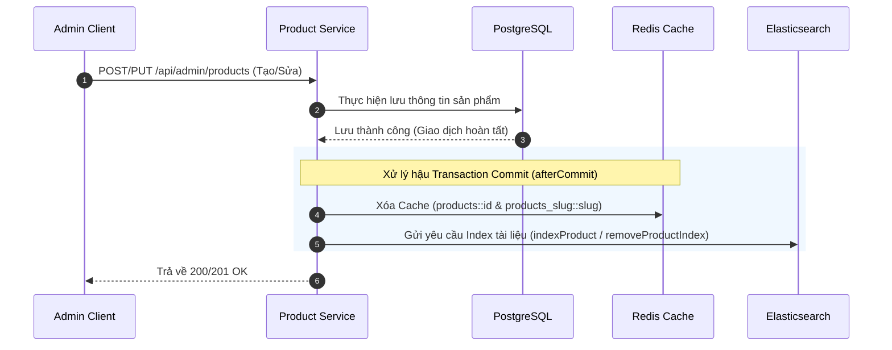
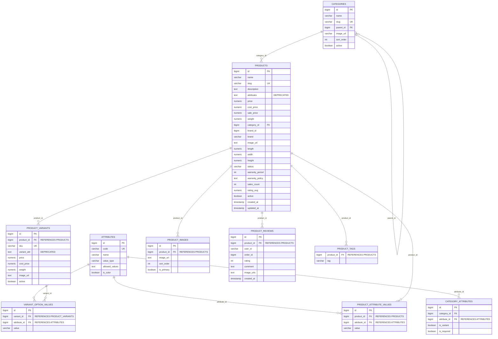

# TÀI LIỆU THIẾT KẾ: PRODUCT & CATALOG SERVICE
## (Dịch vụ Sản phẩm & Danh mục)

> **Port (REST):** `8089` | **Port (gRPC):** `9090` | **DB:** `ecommerce_product_db` (PostgreSQL) | **Version:** 1.1.0

---

## I. TỔNG QUAN VÀ NHIỆM VỤ

### 1.1. Mô tả nghiệp vụ

| Nhóm chức năng | Chi tiết |
|---|---|
| **Danh mục (Catalog)** | Quản lý cây danh mục phân cấp nhiều tầng (Category Tree) dạng đệ quy cha-con. |
| **Sản phẩm (Product)** | Quản lý thông tin cốt lõi của sản phẩm và biến thể động (Màu sắc, kích thước, SKU, ảnh riêng biệt). |
| **Đặc tính động (EAV)** | Quản lý các thuộc tính động của sản phẩm và cấu hình biến thể thông qua cơ sở dữ liệu quan hệ chuẩn EAV (Entity-Attribute-Value). |
| **Hình ảnh** | Upload/Xóa ảnh sản phẩm thông qua MinIO Object Storage tích hợp. |
| **Đánh giá (Review)** | Khách hàng đánh giá sản phẩm (Rating, Comment, Upload ảnh) dựa trên xác thực lịch sử mua hàng từ Order Service. |
| **Tìm kiếm nâng cao** | Tích hợp Elasticsearch phục vụ tìm kiếm từ khóa thông minh, hỗ trợ fallback tìm kiếm PostgreSQL khi ES ngoại tuyến. |
| **Caching** | Sử dụng Redis Cache-Aside để giảm tải cho DB trong các tác vụ đọc thông tin sản phẩm và danh mục. |
| **gRPC Server** | Giao tiếp nội bộ độ trễ thấp với các microservices khác (như Order Service) để xác thực giá, cân nặng, thông số biến thể mà không cần qua REST API. |

### 1.2. Đặc điểm tải — Read-Heavy (99:1)

> [!NOTE]
> **Tỷ lệ Đọc/Ghi = 99:1**: Khách hàng thực hiện xem sản phẩm, duyệt danh mục liên tục, trong khi Admin rất ít khi thêm mới hoặc chỉnh sửa.

*   **Không có cache**: 10.000 lượt GET/phút truy vấn trực tiếp DB $\rightarrow$ Quá tải kết nối DB (Connection Pool Exhaustion) $\rightarrow$ Hệ thống bị chậm/sập.
*   **Có Redis Cache**: 95% request được đáp ứng trực tiếp từ bộ nhớ RAM trong thời gian $< 1\text{ms}$. Chỉ khoảng 5% request (Cache Miss / Cold Start) đi xuống PostgreSQL.

---

## II. CHIẾN LƯỢC CACHE-ASIDE VỚI REDIS

### 2.1. Luồng hoạt động (Cache-Aside Pattern)

```
┌─────────────────────────────────────────────────────────────┐
│  GET /api/v1/public/products/{id}                           │
│                                                             │
│  1. Service kiểm tra Redis:                                 │
│     GET "products::{id}"                                    │
│                                                             │
│  2a. Cache HIT → Trả về dữ liệu Redis ngay (< 1ms) ✅      │
│                                                             │
│  2b. Cache MISS (Cold Start):                               │
│      → Query dữ liệu từ PostgreSQL                          │
│      → Lưu vào Redis: SET "products::{id}" {json}           │
│      → Trả về cho client                                    │
│                                                             │
│  3. Khi Admin cập nhật hoặc xóa sản phẩm:                   │
│      → Cập nhật PostgreSQL                                  │
│      → Xóa cache tương ứng sau khi DB transaction commit:   │
│        DEL "products::{id}"                                 │
│        DEL "products_slug::{slug}"                          │
└─────────────────────────────────────────────────────────────┘
```

### 2.2. Nhất quán dữ liệu bằng Transaction Synchronization
Để tránh lỗi đọc dữ liệu rác (Dirty Read) hoặc Cache bị lệch khi Database Rollback, cơ chế xoá cache được tích hợp chặt chẽ với trạng thái Transaction DB:
*   Nếu `TransactionSynchronizationManager.isSynchronizationActive()` trả về `true`, hệ thống đăng ký một `TransactionSynchronization` và chỉ tiến hành xóa Cache Redis ở sự kiện `afterCommit()`.
*   Nếu không có Transaction nào đang kích hoạt, Cache sẽ được xóa ngay lập tức.

### 2.3. Cấu hình Cache Redis
*   **Sản phẩm theo ID**: Cache Name `products`, Key `#id`, kích hoạt đồng bộ để tránh Cache Stampede (`sync = true`).
*   **Sản phẩm theo Slug**: Cache Name `products_slug`, Key `#slug`, `sync = true`.

---

## III. ELASTICSEARCH & CƠ CHẾ TÌM KIẾM

### 3.1. Luồng đồng bộ PostgreSQL $\rightarrow$ Elasticsearch

Khi có sự thay đổi dữ liệu sản phẩm, việc đồng bộ sang Elasticsearch Index được thực hiện bất đồng bộ sau khi giao dịch cơ sở dữ liệu đã commit thành công:



### 3.2. Cơ chế Dự phòng Tìm kiếm (Resilience Fallback)
Nếu Elasticsearch bị lỗi hoặc mất kết nối:
1.  Hệ thống bắt ngoại lệ (`Exception`) và ghi log chi tiết.
2.  Tự động kích hoạt **luồng dự phòng**: Tìm kiếm trực tiếp trên PostgreSQL bằng cách sử dụng các câu lệnh truy vấn mẫu `LIKE` thông qua `productRepository.findByNameContainingOrDescriptionContaining`.
3.  Kết quả trả về vẫn được ánh xạ chuẩn sang DTO `ProductDocument` để Frontend tiếp tục hoạt động mà không bị gián đoạn.

---

## IV. GIAO TIẾP NỘI BỘ QUA gRPC (PRODUCT gRPC SERVER)

Để tối ưu hóa giao tiếp dịch vụ và bảo mật dữ liệu nhạy cảm, **Order Service** giao tiếp trực tiếp với **Product Service** thông qua kết nối gRPC trên cổng `9090` (thay thế cho REST API truyền thống).

### 4.1. Protobuf Interface (ProductGrpcService)

*   **Phương thức gRPC:** `getPriceInfo`
*   **Request:** `GetPriceInfoRequest` (Chứa danh sách `productIds`).
*   **Response:** `GetPriceInfoResponse` (Chứa danh sách `ProductPriceInfoGrpc` kèm thông tin các biến thể sản phẩm).

> [!IMPORTANT]
> **Độ chính xác số thực (BigDecimal):** Protobuf không hỗ trợ kiểu dữ liệu `BigDecimal` mặc định. Để tránh mất mát độ chính xác số học (như làm tròn sai số khi nhân với số lượng đơn hàng lớn), hệ thống serialize các trường **giá bán, giá vốn, cân nặng** thành định dạng `String` (sử dụng phương thức `toPlainString()`) khi truyền tải qua mạng và parse ngược lại tại bên nhận.

### 4.2. Cấu trúc dữ liệu phản hồi qua gRPC
```protobuf
message GetPriceInfoRequest {
  repeated int64 productIds = 1;
}

message GetPriceInfoResponse {
  repeated ProductPriceInfoGrpc products = 1;
}

message ProductPriceInfoGrpc {
  int64 id = 1;
  string name = 2;
  string price = 3;       // Chuyển từ BigDecimal.toPlainString()
  string costPrice = 4;   // Chuyển từ BigDecimal.toPlainString()
  string weight = 5;      // Chuyển từ BigDecimal.toPlainString()
  string imageUrl = 6;
  repeated ProductVariantInfoGrpc variants = 7;
}

message ProductVariantInfoGrpc {
  int64 id = 1;
  int64 productId = 2;
  string sku = 3;
  string variantAttrJson = 4; // Map đặc tính của biến thể dạng JSON String
  string price = 5;
  string costPrice = 6;
  string weight = 7;
  string imageUrl = 8;
  bool active = 9;
}
```

---

## V. THIẾT KẾ CƠ SỞ DỮ LIỆU RELATIONAL EAV

### 5.1. Kiến trúc Entity-Attribute-Value (EAV)
Nhằm loại bỏ các cột dữ liệu JSON cồng kềnh khó index trong SQL truyền thống và giảm thiểu thiết kế bảng quá rộng, hệ thống đã chuyển dịch toàn bộ thuộc tính động sang cấu trúc bảng quan hệ chuẩn EAV:

1.  **`attributes`**: Định nghĩa danh mục các thuộc tính (Mã thuộc tính `code`, tên gọi hiển thị `name`, kiểu giá trị `valueType` như `text/select`, danh sách giá trị cho phép `allowedValues`, cờ màu sắc `isColor`).
2.  **`category_attributes`**: Liên kết các thuộc tính tương ứng với danh mục cụ thể, đồng thời xác định xem thuộc tính đó có được dùng làm biến thể cấu hình sản phẩm hay không (`isVariant = true` ví dụ: Ram, Dung lượng, Màu sắc) hay chỉ là đặc tả tĩnh (`isVariant = false` ví dụ: Chất liệu, Xuất xứ).
3.  **`product_attribute_values`**: Lưu trữ giá trị thuộc tính tĩnh của từng sản phẩm cụ thể.
4.  **`variant_option_values`**: Lưu trữ giá trị thuộc tính biến thể của từng biến thể cụ thể (`ProductVariant`).

> [!NOTE]
> Cột `attributes` trong bảng `products` và cột `variant_attr` trong bảng `product_variants` đã được cấu hình **Deprecated** (luôn lưu giá trị `null`) và được thay thế hoàn toàn bởi các bảng quan hệ EAV nêu trên.

### 5.2. Schema Database PostgreSQL

```sql
-- 1. Bảng danh mục
CREATE TABLE categories (
    id          BIGSERIAL    PRIMARY KEY,
    name        VARCHAR(100) NOT NULL,
    slug        VARCHAR(100) NOT NULL UNIQUE,
    parent_id   BIGINT       REFERENCES categories(id),
    image_url   VARCHAR(500),
    sort_order  INT          NOT NULL DEFAULT 0,
    active      BOOLEAN      NOT NULL DEFAULT TRUE
);

-- 2. Bảng sản phẩm chính
CREATE TABLE products (
    id              BIGSERIAL       PRIMARY KEY,
    name            VARCHAR(200)    NOT NULL,
    slug            VARCHAR(200)    NOT NULL UNIQUE,
    description     TEXT,
    attributes      TEXT            DEFAULT NULL, -- DEPRECATED (Không dùng)
    price           NUMERIC(19,2)   NOT NULL,
    cost_price      NUMERIC(19,2)   NOT NULL DEFAULT 0.0,
    sale_price      NUMERIC(19,2),
    weight          NUMERIC(10,3),
    category_id     BIGINT          NOT NULL,
    brand_id        BIGINT,
    brand           VARCHAR(100),
    image_url       TEXT,
    length          NUMERIC(10,2)   NOT NULL DEFAULT 0.0,
    width           NUMERIC(10,2)   NOT NULL DEFAULT 0.0,
    height          NUMERIC(10,2)   NOT NULL DEFAULT 0.0,
    status          VARCHAR(50)     NOT NULL DEFAULT 'DRAFT',
    warranty_period INT,
    warranty_policy TEXT,
    sales_count     INT             NOT NULL DEFAULT 0,
    rating_avg      NUMERIC(3,2)    NOT NULL DEFAULT 0.0,
    active          BOOLEAN         NOT NULL DEFAULT TRUE,
    created_at      TIMESTAMP       DEFAULT CURRENT_TIMESTAMP,
    updated_at      TIMESTAMP       DEFAULT CURRENT_TIMESTAMP
);

-- 3. Bảng biến thể sản phẩm
CREATE TABLE product_variants (
    id           BIGSERIAL       PRIMARY KEY,
    product_id   BIGINT          NOT NULL REFERENCES products(id),
    sku          VARCHAR(100)    NOT NULL UNIQUE,
    variant_attr TEXT            DEFAULT NULL, -- DEPRECATED (Không dùng)
    price        NUMERIC(19,2),
    cost_price   NUMERIC(19,2),
    weight       NUMERIC(10,3),
    image_url    TEXT,
    active       BOOLEAN         NOT NULL DEFAULT TRUE
);

-- 4. Bảng định nghĩa thuộc tính (EAV)
CREATE TABLE attributes (
    id             BIGSERIAL    PRIMARY KEY,
    code           VARCHAR(100) NOT NULL UNIQUE,
    name           VARCHAR(200) NOT NULL,
    value_type     VARCHAR(50)  NOT NULL, -- 'text', 'select', 'boolean'
    allowed_values TEXT,                  -- 'Đỏ,Vàng,Xanh' hoặc '8GB,16GB'
    is_color       BOOLEAN      DEFAULT FALSE
);

-- 5. Bảng liên kết Thuộc tính - Danh mục (EAV)
CREATE TABLE category_attributes (
    id           BIGSERIAL PRIMARY KEY,
    category_id  BIGINT    NOT NULL,
    attribute_id BIGINT    NOT NULL REFERENCES attributes(id),
    is_variant   BOOLEAN   NOT NULL DEFAULT FALSE,
    is_required  BOOLEAN   NOT NULL DEFAULT FALSE,
    CONSTRAINT uq_category_attribute UNIQUE (category_id, attribute_id)
);

-- 6. Bảng lưu giá trị thuộc tính tĩnh của sản phẩm (EAV)
CREATE TABLE product_attribute_values (
    id           BIGSERIAL PRIMARY KEY,
    product_id   BIGINT    NOT NULL REFERENCES products(id),
    attribute_id BIGINT    NOT NULL REFERENCES attributes(id),
    value        VARCHAR(255) NOT NULL,
    CONSTRAINT uq_product_attribute UNIQUE (product_id, attribute_id)
);

-- 7. Bảng lưu giá trị cấu hình biến thể (EAV)
CREATE TABLE variant_option_values (
    id           BIGSERIAL PRIMARY KEY,
    variant_id   BIGINT    NOT NULL REFERENCES product_variants(id),
    attribute_id BIGINT    NOT NULL REFERENCES attributes(id),
    value        VARCHAR(255) NOT NULL,
    CONSTRAINT uq_variant_option UNIQUE (variant_id, attribute_id)
);

-- 8. Bảng hình ảnh phụ của sản phẩm
CREATE TABLE product_images (
    id          BIGSERIAL    PRIMARY KEY,
    product_id  BIGINT       NOT NULL REFERENCES products(id),
    image_url   TEXT         NOT NULL,
    sort_order  INT          NOT NULL DEFAULT 0,
    is_primary  BOOLEAN      NOT NULL DEFAULT FALSE
);

-- 9. Bảng đánh giá của khách hàng
CREATE TABLE product_reviews (
    id          BIGSERIAL    PRIMARY KEY,
    product_id  BIGINT       NOT NULL REFERENCES products(id),
    user_id     VARCHAR(255) NOT NULL, -- Logical FK tới User Service (Keycloak ID)
    order_id    BIGINT       NOT NULL, -- Xác thực đơn hàng từ Order Service
    rating      INT          NOT NULL CHECK (rating BETWEEN 1 AND 5),
    comment     TEXT,
    image_urls  TEXT,                  -- Danh sách ảnh ngăn cách bởi dấu phẩy ","
    created_at  TIMESTAMP    DEFAULT CURRENT_TIMESTAMP
);

-- 10. Bảng thẻ từ khóa
CREATE TABLE product_tags (
    product_id BIGINT      NOT NULL REFERENCES products(id),
    tag        VARCHAR(50) NOT NULL,
    PRIMARY KEY (product_id, tag)
);
```

### 5.3. Ánh xạ mô hình dữ liệu Đánh giá sản phẩm (ProductReview)
Tại lớp thực thể Java, các đường dẫn ảnh đính kèm nhận xét được lưu trữ dưới dạng một chuỗi phân tách bằng dấu phẩy (`imageUrls` với `columnDefinition = "TEXT"`). 
Khi chuyển đổi sang DTO (`ProductReviewDto`) phục vụ FE hiển thị:
*   Nếu trống: Ánh xạ thành mảng rỗng `Collections.emptyList()`.
*   Nếu có dữ liệu: Sử dụng `Arrays.asList(review.getImageUrls().split(","))` để chuyển thành mảng URL rõ ràng.

---

## VI. KIẾN TRÚC UPLOAD ẢNH VỚI MINIO

Hình ảnh sản phẩm được tải trực tiếp lên MinIO bucket `product-images` để lưu trữ đối tượng dạng WebP tĩnh:

```
[Admin Web Portal] ──(Upload File WebP/PNG)──> [Product Service REST]
                                                    │
                                             (putObject API)
                                                    ▼
                                            [MinIO Object Storage]
                                                    │
                                           (Trả về CDN/Public URL)
                                                    ▼
                                          [Lưu URL vào PostgreSQL]
```

---

## VII. ĐẶC TẢ REST API

### 7.1. API Công khai (Không yêu cầu đăng nhập)

| Method | Endpoint | Tham số | Mô tả |
|---|---|---|---|
| GET | `/api/v1/public/products` | `active` (bool), `page`, `size` | Danh sách sản phẩm (phân trang). |
| GET | `/api/v1/public/products/{id}` | Không | Chi tiết sản phẩm theo ID. |
| GET | `/api/v1/public/products/slug/{slug}` | Không | Chi tiết sản phẩm theo đường dẫn thân thiện (slug). |
| GET | `/api/v1/public/products/category/{categoryId}` | `page`, `size` | Danh sách sản phẩm theo ID danh mục. |
| GET | `/api/v1/public/products/search` | `q` (từ khóa), `page`, `size` | Tìm kiếm sản phẩm qua Elasticsearch (fallback DB). |
| GET | `/api/v1/public/products/{productId}/reviews` | Không | Lấy danh sách đánh giá của sản phẩm. |
| GET | `/api/v1/public/categories/tree` | Không | Lấy toàn bộ cây danh mục đa cấp. |

#### Ví dụ phản hồi: `GET /api/v1/public/products/search?q=nike&page=0&size=1`
```json
{
  "code": 200,
  "status": "SUCCESS",
  "message": "Operation completed successfully",
  "data": {
    "content": [
      {
        "id": 1,
        "name": "Giày Chạy Bộ Nike Pegasus 40",
        "description": "Giày chạy bộ chuyên nghiệp chính hãng Nike...",
        "price": 3200000.0,
        "salePrice": 2900000.0,
        "imageUrl": "http://minio:9000/product-images/pegasus40.webp",
        "brand": "Nike",
        "categoryId": 5,
        "slug": "giay-chay-bo-nike-pegasus-40",
        "status": "PUBLISHED",
        "active": true
      }
    ],
    "pageable": {
      "pageNumber": 0,
      "pageSize": 1,
      "sort": {
        "sorted": false,
        "unsorted": true,
        "empty": true
      },
      "offset": 0,
      "paged": true,
      "unpaged": false
    },
    "totalPages": 10,
    "totalElements": 10,
    "last": false,
    "size": 1,
    "number": 0,
    "sort": {
      "sorted": false,
      "unsorted": true,
      "empty": true
    },
    "numberOfElements": 1,
    "first": true,
    "empty": false
  }
}
```

### 7.2. API Bảo mật (Yêu cầu JWT Token & Phân quyền)

#### Client / Khách hàng (Cần đăng nhập)
*   **POST** `/api/v1/products/reviews`
    *   *Mục đích:* Tạo đánh giá mới cho sản phẩm.
    *   *Headers:* `X-User-Id` (được Gateway tự động điền từ Keycloak).
    *   *Body:*
    ```json
    {
      "productId": 1,
      "orderId": 120938,
      "rating": 5,
      "comment": "Sản phẩm đi rất êm và ôm chân!",
      "imageUrls": ["http://minio:9000/reviews/user_pic_1.webp"]
    }
    ```

#### Admin / Staff (Yêu cầu ROLE_ADMIN)
*   **POST** `/api/v1/admin/products` : Tạo sản phẩm mới kèm danh sách biến thể EAV và ảnh.
*   **PUT** `/api/v1/admin/products/{id}` : Cập nhật thông số sản phẩm và biến thể.
*   **DELETE** `/api/v1/admin/products/{id}` : Xóa sản phẩm.
*   **POST** `/api/v1/admin/products/images/upload` : Upload ảnh lên MinIO.
*   **POST** `/api/v1/admin/attributes` : Tạo định nghĩa thuộc tính mới.
*   **POST** `/api/v1/admin/categories` : Tạo danh mục sản phẩm mới.

---

## VIII. SƠ ĐỒ THỰC THỂ (ERD)



---

## IX. CẤU HÌNH DOCKER & DEPLOYMENT

```yaml
product-service:
  image: ecommerce/product-service:latest
  ports:
    - "8089:8089"
    - "9090:9090"
  environment:
    SPRING_DATASOURCE_URL: jdbc:postgresql://postgres:5432/ecommerce_product_db
    SPRING_DATA_REDIS_HOST: redis
    SPRING_ELASTICSEARCH_URIS: http://elasticsearch:9200
    MINIO_ENDPOINT: http://minio:9000
    MINIO_ACCESS_KEY: ${MINIO_ACCESS_KEY}
    MINIO_SECRET_KEY: ${MINIO_SECRET_KEY}
    SPRING_KAFKA_BOOTSTRAP_SERVERS: kafka:9092
  depends_on:
    - postgres
    - redis
    - kafka
    - elasticsearch
    - minio
  networks:
    - ecommerce-network
```

---

## X. ĐIỂM TỐI ƯU HÓA HIỆU NĂNG ĐÃ THỰC HIỆN

1.  **Batch Fetching trong DTO Conversion**: Loại bỏ hoàn toàn truy vấn N+1 khi gọi danh sách sản phẩm. Các bảng liên kết như `ProductVariant`, `ProductTag`, `ProductImage`, `ProductAttributeValue`, `VariantOptionValue` đều được gom ID sản phẩm truy vấn 1 lần bằng từ khóa `IN` trong JPA, sau đó dùng Java Stream Map để phân nhóm lại.
2.  **Đồng bộ ES/Cache sau Giao dịch (Post-Commit)**: Chỉ kích hoạt đồng bộ Elasticsearch và xóa Cache Redis sau khi chắc chắn PostgreSQL đã Commit giao dịch thành công nhờ `TransactionSynchronizationManager`, phòng ngừa hoàn toàn lỗi không đồng bộ dữ liệu khi xảy ra Rollback.
3.  **Tách biệt gRPC và REST**: Các thao tác checkout/đơn hàng lấy thông số giá và cân nặng sản phẩm liên tục được chuyển qua kênh gRPC, giúp giảm tải serialize JSON và băng thông HTTP, cải thiện tốc độ xử lý đơn hàng đáng kể.
4.  **Dự phòng Sự cố (Resilience)**: Cơ chế Fallback sang DB SQL khi Elasticsearch bị ngắt kết nối giúp hệ thống luôn hoạt động ổn định và có khả năng tự phục hồi.

---
*Tài liệu thuộc nhóm 2 — Kiến trúc & Kỹ thuật chuyên sâu.*