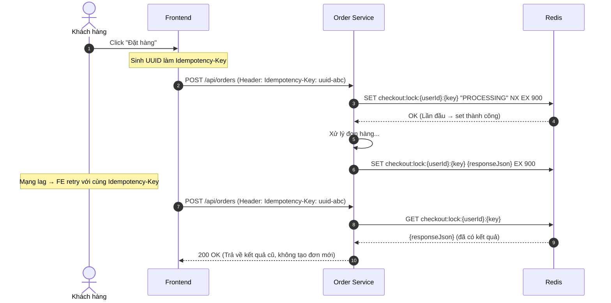
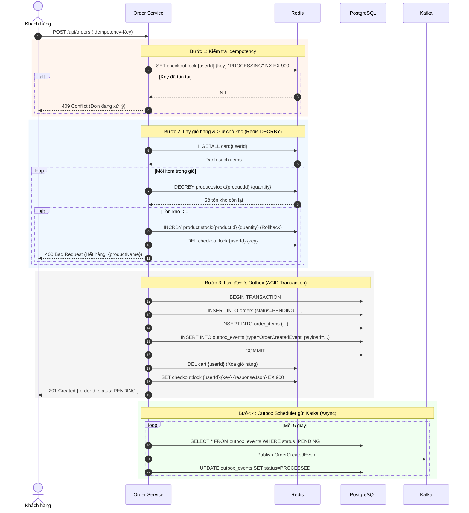
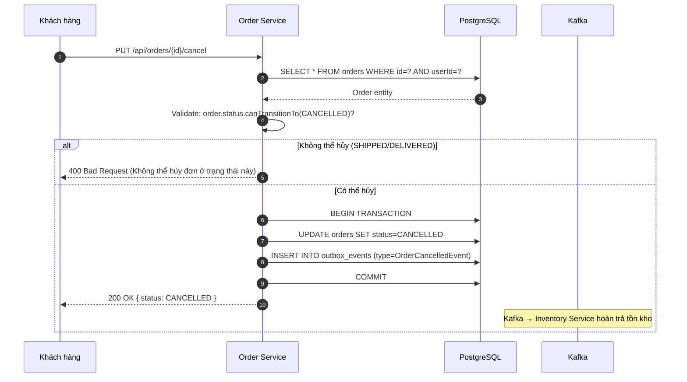
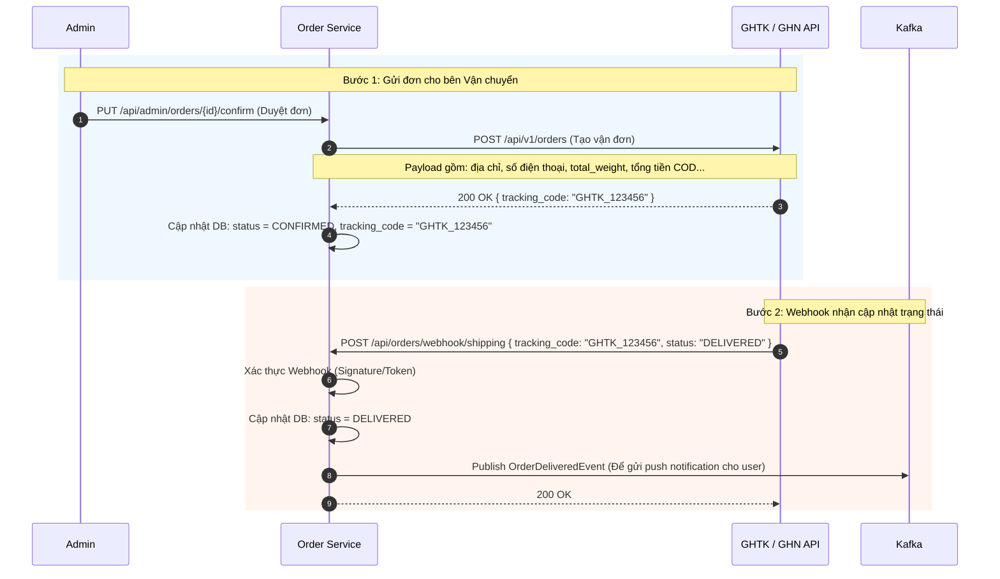
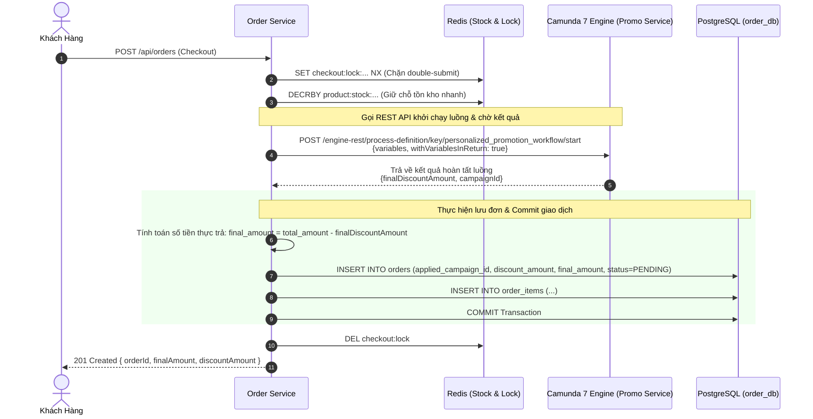
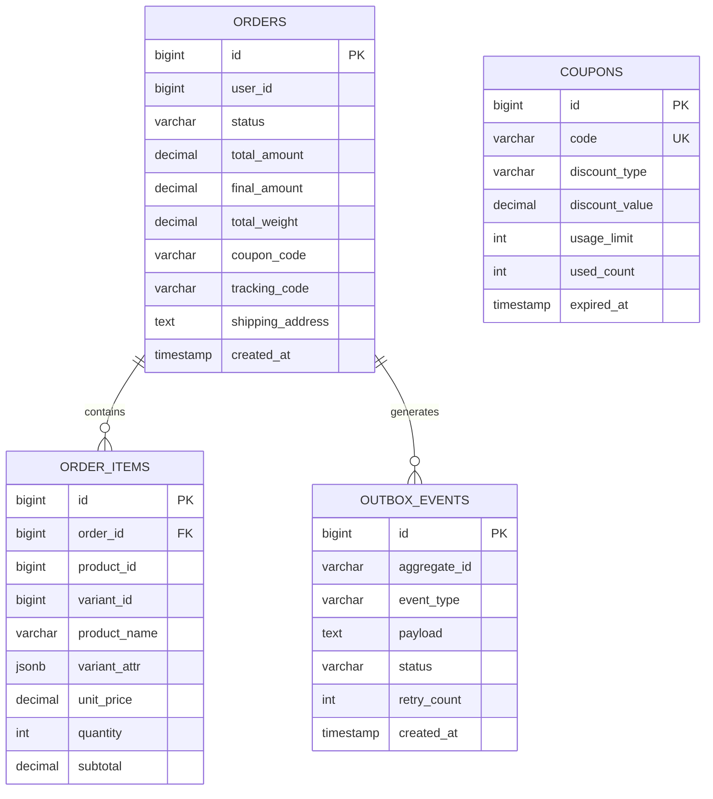

 # TÀI LIỆU THIẾT KẾ: CART & ORDER SERVICE
## (Dịch vụ Giỏ hàng & Đơn hàng)

> **Port:** `8082` | **DB:** `ecommerce_order_db` (PostgreSQL) | **Version:** 1.0.0

---

## I. TỔNG QUAN VÀ NHIỆM VỤ

### 1.1. Mô tả nghiệp vụ

| Nhóm chức năng | Chi tiết |
|---|---|
| **Giỏ hàng (Cart)** | Thêm/Sửa/Xóa sản phẩm, tính tổng tiền, áp mã giảm giá |
| **Thanh toán (Checkout)** | Chuyển đổi giỏ hàng thành đơn hàng, kiểm tra tồn kho |
| **Đơn hàng (Order)** | Tạo, xem, hủy đơn hàng, lịch sử mua hàng |
| **Trạng thái đơn** | Quản lý vòng đời: PENDING → CONFIRMED → SHIPPED → DELIVERED |
| **Chống trùng lặp** | Idempotency Key ngăn tạo đơn 2 lần khi double-click |

### 1.2. Lý do gộp Cart & Order vào 1 Service

> **Nguyên tắc thiết kế:** Gộp 2 service để **giảm API cross-service calls**, vì giỏ hàng là tiền đề trực tiếp tạo đơn.

**Nếu tách:**
```
Client → Order Service → [HTTP REST] → Cart Service (lấy items)
      → Order Service → [HTTP REST] → Product Service (lấy giá)
→ Latency tích lũy + Cascading Failure risk
```

**Khi gộp:**
```
Client → Cart&Order Service → Redis (giỏ hàng) → tạo đơn ngay
→ Giảm 1 network hop, tăng tốc độ checkout
```

---

## II. THIẾT KẾ GIỎ HÀNG TRÊN REDIS

### 2.1. Lưu giỏ hàng bằng Redis Hash

```
Key:   "cart:{userId}"
Type:  Redis Hash
Field: "{productId}:{variantId}"
Value: JSON { quantity, price, productName, imageUrl }
TTL:   7 ngày (kể từ lần thao tác cuối)

Ví dụ:
HSET cart:1  "101:5"  '{"quantity":2,"price":299000,"productName":"Giày Nike","imageUrl":"..."}'
HSET cart:1  "202:0"  '{"quantity":1,"price":150000,"productName":"Áo Polo","imageUrl":"..."}'
EXPIRE cart:1 604800
```

**Lý do dùng Redis Hash:**
- `HSET` / `HGET` / `HDEL` theo field cực nhanh (O(1))
- Không cần serialize/deserialize toàn bộ giỏ hàng khi thêm/xóa 1 item
- Redis Hash hiệu quả bộ nhớ hơn lưu nhiều key riêng lẻ

### 2.2. So sánh: Redis vs DB cho giỏ hàng

| Tiêu chí | Redis (Chọn) | MySQL |
|---|---|---|
| **Tốc độ read/write** | < 1ms | 5-50ms |
| **Tính linh hoạt** | Cao (TTL, atomic ops) | Thấp |
| **Dữ liệu persistent** | Có (AOF) | Có |
| **Phù hợp với tạm thời** | Rất phù hợp | Quá mức cần thiết |

---

## III. XỬ LÝ CONCURRENCY — IDEMPOTENCY & STATE MACHINE

### 3.1. Idempotency Key — Chống tạo đơn 2 lần

**Bài toán:** Khách click "Đặt hàng" 2 lần do mạng chậm → 2 đơn hàng được tạo.



### 3.2. State Machine — Vòng đời đơn hàng

```
                    ┌─────────────────────────────────┐
                    │           ORDER STATES           │
                    └─────────────────────────────────┘

                         [Tạo đơn thành công]
                               │
                               ▼
                         ┌─────────┐
                         │ PENDING │ ◄── Trạng thái ban đầu
                         └─────────┘
                        /           \
         [Inventory OK]              [Timeout/Hủy]
              │                           │
              ▼                           ▼
        ┌───────────┐              ┌───────────┐
        │ CONFIRMED │              │ CANCELLED │
        └───────────┘              └───────────┘
              │
     [Bàn giao vận chuyển]
              │
              ▼
        ┌─────────┐
        │ SHIPPED │
        └─────────┘
              │
       [Giao thành công]
              │
              ▼
       ┌───────────┐
       │ DELIVERED │
       └───────────┘

Chuyển đổi hợp lệ:
- PENDING → CONFIRMED (Inventory báo OK)
- PENDING → CANCELLED (User hủy / Inventory báo hết hàng)
- CONFIRMED → SHIPPED (Bên vận chuyển nhận hàng)
- CONFIRMED → CANCELLED (User hủy trước khi giao)
- SHIPPED → DELIVERED (Giao thành công)
```

**Triển khai State Machine trong Java:**
```java
public enum OrderStatus {
    PENDING, CONFIRMED, SHIPPED, DELIVERED, CANCELLED;

    private static final Map<OrderStatus, Set<OrderStatus>> VALID_TRANSITIONS = Map.of(
        PENDING,    Set.of(CONFIRMED, CANCELLED),
        CONFIRMED,  Set.of(SHIPPED, CANCELLED),
        SHIPPED,    Set.of(DELIVERED),
        DELIVERED,  Set.of(),
        CANCELLED,  Set.of()
    );

    public boolean canTransitionTo(OrderStatus next) {
        return VALID_TRANSITIONS.getOrDefault(this, Set.of()).contains(next);
    }
}
```

### 3.3. Xử lý giá tiền và khối lượng động theo Biến thể (Variants)

> **❓ Câu hỏi:** Một sản phẩm có nhiều Size/Màu, mỗi Size lại có Giá tiền và Khối lượng (để tính phí ship) khác nhau thì Order Service xử lý thế nào?

**Giải pháp:**
Order Service **luôn phụ thuộc vào `variant_id`**. Trong Database của Product Service (Bảng `product_variants`), ta đã thiết kế để mỗi `variant_id` có thể ghi đè `price` và `weight` mặc định của sản phẩm cha.
Quy trình tính toán lúc Checkout:
1. Client gửi `variant_id` lên Order Service.
2. Order Service gọi cache/API sang Product Service lấy cục dữ liệu của `variant_id` đó.
3. **Ưu tiên lấy Giá/Khối lượng của biến thể:**
   - Giá áp dụng = `variant.price != null ? variant.price : product.price`
   - Khối lượng áp dụng = `variant.weight != null ? variant.weight : product.weight`
4. Tính tổng tiền (`unit_price * quantity`) và lưu vào bảng `order_items`.
5. Tính tổng khối lượng (`total_weight = sum(weight * quantity)`) và lưu vào bảng `orders` để gọi API đơn vị vận chuyển (GHTK, ViettelPost) tính phí ship.
6. Lưu `variant_attr` (dạng JSONB: `{"size": "42", "color": "Đỏ"}`) vào `order_items` làm **Snapshot**, đảm bảo sau này Admin có đổi tên Màu/Size thì lịch sử đơn hàng của user cũng không bị thay đổi.

---

## IV. LUỒNG NGHIỆP VỤ CHÍNH

### 4.1. Luồng Checkout (Tạo đơn hàng)



### 4.2. Luồng Hủy đơn hàng



### 4.3. Luồng Giao hàng (Shipping & Logistics Integration)

> **❓ Câu hỏi:** Hệ thống xử lý vận chuyển (Shipping) như thế nào? Cập nhật trạng thái SHIPPED, DELIVERED ra sao?

**Giải pháp:** Trong kiến trúc này, ta không xây dựng một "Shipping Service" riêng (tránh over-engineering). Toàn bộ logic giao tiếp với đơn vị vận chuyển (ĐVVC) như Giao Hàng Nhanh (GHN), Giao Hàng Tiết Kiệm (GHTK) hoặc Viettel Post được nhúng vào **Order Service**.



**Chi tiết luồng hoạt động:**
1. **Tính phí ship lúc mua hàng:** Dựa vào `total_weight` (tổng khối lượng) và `shipping_address`, Client hoặc Order Service có thể gọi trước API của GHN/GHTK để tính ra phí ship dự kiến và cộng vào hóa đơn khách hàng.
2. **Tạo vận đơn:** Khi Admin hoặc hệ thống duyệt đơn (`CONFIRMED`), Order Service gọi API ĐVVC để đẩy thông tin đơn hàng sang hệ thống của họ. Lấy về `tracking_code` (Mã vận đơn) lưu vào bảng `orders`.
3. **Tracking tự động (Webhook):** Không cần dùng cronjob quét trạng thái liên tục. Ta cung cấp một API Webhook (VD: `/api/orders/webhook/shipping`). Khi bưu tá lấy hàng thành công, hoặc giao hàng thành công, hệ thống của GHTK/GHN sẽ tự động gọi vào API này để đẩy trạng thái mới nhất cho chúng ta.
4. **Trigger Event:** Khi Webhook cập nhật đơn thành `SHIPPED` hoặc `DELIVERED`, Order Service tự động bắn event lên Kafka. Notification Service sẽ bắt event này và gửi Push Notification "Đơn hàng của bạn đã đến nơi!".

### 4.4. Tích Hợp Camunda 7 Cho Checkout & Khuyến Mãi Động

Trong luồng checkout thông thường, hệ thống tính toán giá và lưu đơn trực tiếp. Để áp dụng **Khuyến Mãi Động Phân Tích Bởi AI**, luồng checkout tại `Order Service` được tích hợp chặt chẽ với Camunda 7 Engine như sau:



#### Chi tiết cuộc gọi API đến Camunda 7
*   **Endpoint:** `POST http://promotion-service:8087/engine-rest/process-definition/key/personalized_promotion_workflow/start`
*   **Request Body:**
    ```json
    {
      "variables": {
        "userId": { "value": 123, "type": "Long" },
        "deviceId": { "value": "dev_abc123456", "type": "String" },
        "ipAddress": { "value": "192.168.1.5", "type": "String" },
        "orderValue": { "value": 3000000.0, "type": "Double" },
        "costPrice": { "value": 2150000.0, "type": "Double" }
      },
      "withVariablesInReturn": true
    }
    ```
*   **Response Body (200 OK):**
    ```json
    {
      "id": "inst_987654321",
      "definitionId": "personalized_promotion_workflow:1:12345",
      "variables": {
        "finalDiscountAmount": { "value": 300000.0, "type": "Double" },
        "finalDiscountPercent": { "value": 10.0, "type": "Double" },
        "campaignId": { "value": "holiday_sales_2026", "type": "String" }
      }
    }
    ```

#### Cơ chế xử lý Timeout & Dự phòng (Fallback Mechanism)
Để đảm bảo trải nghiệm mua sắm không bị ảnh hưởng khi Camunda 7 Engine gặp sự cố quá tải hoặc mất kết nối:
*   HTTP Client của `Order Service` được cấu hình **Timeout tối đa là 3 giây**.
*   Nếu xảy ra lỗi Timeout hoặc HTTP 5xx, hệ thống tự động kích hoạt **Fallback Handler**:
    *   Ghi log cảnh báo `PROMOTION_FALLBACK_TRIGGERED` kèm theo lý do lỗi.
    *   Gán giá trị giảm giá mặc định `finalDiscountAmount = 0.0`.
    *   Tiếp tục luồng tạo đơn hàng để khách hàng tiến hành thanh toán bình thường.

---

## V. THIẾT KẾ DATABASE

### 5.1. Schema `ecommerce_order_db`

#### Bảng `orders`
```sql
CREATE TABLE orders (
    id                  BIGSERIAL          PRIMARY KEY,
    user_id             BIGINT          NOT NULL COMMENT 'Logical FK → user_db.users.id',
    status              VARCHAR(20)     NOT NULL DEFAULT 'PENDING'
                        COMMENT 'PENDING,CONFIRMED,SHIPPED,DELIVERED,CANCELLED',
    total_amount        DECIMAL(15,2)   NOT NULL COMMENT 'Tổng tiền đã chốt tại lúc mua',
    discount_amount     DECIMAL(15,2)   NOT NULL DEFAULT 0 COMMENT 'Tổng giảm giá',
    final_amount        DECIMAL(15,2)   NOT NULL COMMENT 'Số tiền thực thanh toán',
    total_weight        DECIMAL(10,2)   NOT NULL DEFAULT 0 COMMENT 'Tổng khối lượng (gram) để tính phí ship',
    coupon_code         VARCHAR(50)     COMMENT 'Mã giảm giá đã áp dụng',
    applied_campaign_id VARCHAR(50)     COMMENT 'ID chiến dịch Camunda áp dụng',
    tracking_code       VARCHAR(100)    COMMENT 'Mã vận đơn từ bên giao hàng (GHTK, GHN...)',
    shipping_address    TEXT            NOT NULL,
    phone_number        VARCHAR(15)     NOT NULL,
    note                TEXT,
    created_at          TIMESTAMP        NOT NULL DEFAULT CURRENT_TIMESTAMP,
    updated_at          TIMESTAMP        NOT NULL DEFAULT CURRENT_TIMESTAMP,
    INDEX idx_user_id (user_id),
    INDEX idx_status (status),
    INDEX idx_created_at (created_at),
    INDEX idx_rfm_calculation (user_id, created_at, total_amount, status) COMMENT 'Optimized index for AI RFM Customer Segmentation K-Means queries'
);
```

#### Bảng `order_items`
```sql
CREATE TABLE order_items (
    id              BIGSERIAL          PRIMARY KEY,
    order_id        BIGINT          NOT NULL COMMENT 'FK → orders.id',
    product_id      BIGINT          NOT NULL COMMENT 'Logical FK → product_db',
    variant_id      BIGINT          COMMENT 'Logical FK → product_variants',
    product_name    VARCHAR(200)    NOT NULL COMMENT 'Snapshot tên SP tại lúc mua',
    product_image   VARCHAR(500)    COMMENT 'Snapshot ảnh tại lúc mua',
    variant_attr    JSONB           COMMENT 'Snapshot thuộc tính biến thể (size, màu, độ phân giải...)',
    unit_price      DECIMAL(15,2)   NOT NULL COMMENT 'Đơn giá (của biến thể hoặc mặc định) snapshot',
    quantity        INT             NOT NULL,
    subtotal        DECIMAL(15,2)   NOT NULL COMMENT 'unit_price × quantity',
    INDEX idx_order_id (order_id)
);
```

#### Bảng `cart_items` (Dự phòng DB — Chính là Redis)
```sql
CREATE TABLE cart_items (
    id          BIGSERIAL          PRIMARY KEY,
    user_id     BIGINT          NOT NULL,
    product_id  BIGINT          NOT NULL,
    variant_id  BIGINT,
    quantity    INT             NOT NULL DEFAULT 1,
    added_at    TIMESTAMP        NOT NULL DEFAULT CURRENT_TIMESTAMP,
    UNIQUE KEY uk_cart_item (user_id, product_id, variant_id),
    INDEX idx_user_id (user_id)
);
```
> **Lưu ý:** `cart_items` trong DB chỉ là bản sao dự phòng. Giỏ hàng chính hoạt động **hoàn toàn trên Redis**. DB table này được dùng để khôi phục dữ liệu khi Redis restart.

#### Bảng `outbox_events`
```sql
CREATE TABLE outbox_events (
    id              BIGSERIAL       PRIMARY KEY,
    aggregate_id    VARCHAR(100) NOT NULL COMMENT 'Order ID',
    aggregate_type  VARCHAR(50)  NOT NULL COMMENT 'Order',
    event_type      VARCHAR(100) NOT NULL COMMENT 'OrderCreatedEvent, OrderCancelledEvent',
    payload         TEXT         NOT NULL COMMENT 'JSON payload',
    status          VARCHAR(20)  NOT NULL DEFAULT 'PENDING',
    retry_count     INT          NOT NULL DEFAULT 0,
    created_at      TIMESTAMP     NOT NULL DEFAULT CURRENT_TIMESTAMP,
    processed_at    TIMESTAMP,
    INDEX idx_status (status),
    INDEX idx_created_at (created_at)
);
```

#### Bảng `coupons` (Mã giảm giá)
```sql
CREATE TABLE coupons (
    id              BIGSERIAL          PRIMARY KEY,
    code            VARCHAR(50)     NOT NULL UNIQUE,
    discount_type   VARCHAR(20)     NOT NULL COMMENT 'PERCENTAGE hoặc FIXED_AMOUNT',
    discount_value  DECIMAL(10,2)   NOT NULL,
    min_order_value DECIMAL(15,2)   NOT NULL DEFAULT 0,
    max_discount    DECIMAL(15,2)   COMMENT 'Giới hạn giảm tối đa (cho PERCENTAGE)',
    usage_limit     INT             NOT NULL DEFAULT 1 COMMENT 'Số lần dùng tối đa',
    used_count      INT             NOT NULL DEFAULT 0,
    expired_at      TIMESTAMP        NOT NULL,
    active          BOOLEAN         NOT NULL DEFAULT TRUE,
    INDEX idx_code (code)
);
```

### 5.2. Redis Key Design

| Key Pattern | Type | TTL | Mô tả |
|---|---|---|---|
| `cart:{userId}` | Hash | 7 ngày | Giỏ hàng của người dùng |
| `checkout:lock:{userId}:{key}` | String | 15 phút | Idempotency key chống đơn trùng |
| `product:stock:{productId}` | String | - | Tồn kho giữ chỗ trên RAM |
| `coupon:{code}` | Hash | 1 giờ | Cache thông tin mã giảm giá |

---

## VI. ĐẶC TẢ API

Toàn bộ các API đều trả về định dạng bọc chung là `ApiResponse<T>`.

### 6.1. Cart Endpoints (Giỏ hàng - `/api/v1/cart`)
Tất cả các API này yêu cầu Header định danh người dùng:
*   `X-User-Id`: ID của người dùng đăng nhập (Mặc định nếu không truyền sẽ là `anonymous`).

| Method | Endpoint | Mô tả |
| :--- | :--- | :--- |
| **GET** | `/api/v1/cart` | Lấy chi tiết giỏ hàng hiện tại (bao gồm tên, ảnh, giá từ `product-service`) |
| **POST** | `/api/v1/cart` | Thêm sản phẩm/biến thể vào giỏ hàng |
| **PUT** | `/api/v1/cart/items/{productId}` | Cập nhật số lượng của một mặt hàng trong giỏ |
| **DELETE** | `/api/v1/cart/items/{productId}` | Xóa một mặt hàng (hoặc biến thể) ra khỏi giỏ hàng |
| **DELETE** | `/api/v1/cart` | Xóa toàn bộ giỏ hàng (Clear) |

#### 1. Lấy chi tiết giỏ hàng (`GET /api/v1/cart`)
*   **Headers:**
    ```http
    X-User-Id: user_123456
    ```
*   **Response (200 OK):**
    ```json
    {
      "success": true,
      "message": "Success",
      "data": {
        "userId": "user_123456",
        "items": [
          {
            "productId": 101,
            "variantId": 5,
            "productName": "Giày Nike Air Max 270",
            "size": "42",
            "color": "Đỏ",
            "imageUrl": "http://minio/products/nike-air-red.png",
            "variantAttr": "{\"size\":\"42\",\"color\":\"Đỏ\"}",
            "unitPrice": 1990000.00,
            "quantity": 2,
            "subtotal": 3980000.00,
            "weight": 450.00
          }
        ],
        "totalAmount": 3980000.00,
        "discountAmount": 0.00,
        "finalAmount": 3980000.00,
        "appliedCoupon": null
      }
    }
    ```

#### 2. Thêm sản phẩm vào giỏ (`POST /api/v1/cart`)
*   **Headers:**
    ```http
    X-User-Id: user_123456
    Content-Type: application/json
    ```
*   **Request Body (`CartItemRequest`):**
    ```json
    {
      "productId": 101,
      "variantId": 5,
      "quantity": 1
    }
    ```
*   **Response (200 OK):** Trả về toàn bộ giỏ hàng sau khi thêm thành công tương tự như API `GET /api/v1/cart`.

#### 3. Cập nhật số lượng mặt hàng (`PUT /api/v1/cart/items/{productId}`)
*   **Path Variable:** `productId` (ID của sản phẩm cần sửa).
*   **Query Parameters:**
    *   `variantId` (Long, Optional): ID biến thể (nếu có).
    *   `quantity` (Integer, Required, Min = 1): Số lượng mới muốn thay đổi.
*   **Response (200 OK):** Trả về giỏ hàng mới cập nhật.

#### 4. Xóa mặt hàng khỏi giỏ (`DELETE /api/v1/cart/items/{productId}`)
*   **Path Variable:** `productId`
*   **Query Parameters:**
    *   `variantId` (Long, Optional): ID biến thể cần xóa.
*   **Response (200 OK):** Trả về giỏ hàng còn lại.

#### 5. Xóa toàn bộ giỏ hàng (`DELETE /api/v1/cart`)
*   **Response (200 OK):**
    ```json
    {
      "success": true,
      "message": "Success",
      "data": null
    }
    ```

---

### 6.2. Customer Order Endpoints (Đơn hàng - `/api/v1/orders`)

| Method | Endpoint | Quyền hạn | Mô tả |
| :--- | :--- | :--- | :--- |
| **POST** | `/api/v1/orders/checkout` | User | Tạo đơn hàng mới từ giỏ hàng hiện tại |
| **GET** | `/api/v1/orders/{id}` | User/Admin/Staff | Lấy thông tin chi tiết một đơn hàng |
| **GET** | `/api/v1/orders` | User/Admin/Staff | Xem danh sách đơn hàng (User chỉ xem đơn của mình, Admin/Staff xem toàn bộ hệ thống) |
| **POST** | `/api/v1/orders/{id}/cancel` | User/Admin/Staff | Thực hiện hủy đơn hàng |
| **PUT** | `/api/v1/orders/{id}/ship` | Admin/Staff | Chuyển đơn sang trạng thái đang giao hàng và sinh mã vận đơn |
| **PUT** | `/api/v1/orders/{id}/delivery-status` | Admin/Staff | Cập nhật trạng thái giao hàng thủ công |
| **POST** | `/api/v1/orders/public/webhook/shipping` | Public | Webhook từ đối tác vận chuyển cập nhật trạng thái đơn hàng |

#### 1. Tạo đơn hàng (Checkout) (`POST /api/v1/orders/checkout`)
*   **Headers:**
    ```http
    X-User-Id: user_123456
    X-User-Email: customer@gmail.com
    Idempotency-Key: check-999aa-bbb22
    Content-Type: application/json
    ```
*   **Request Body (`CheckoutRequest`):**
    ```json
    {
      "shippingAddress": "123 Đường Ba Tháng Hai, Quận 10, TP.HCM",
      "phoneNumber": "0987654321",
      "couponCode": "SALE10PERCENT",
      "shippingFee": 30000.00,
      "note": "Xin giao hàng ngoài giờ hành chính."
    }
    ```
*   **Response (201 Created):**
    ```json
    {
      "success": true,
      "message": "Success",
      "data": {
        "id": 15,
        "userId": "user_123456",
        "status": "PENDING",
        "totalAmount": 3980000.00,
        "discountAmount": 398000.00,
        "finalAmount": 3612000.00,
        "couponCode": "SALE10PERCENT",
        "appliedCampaignId": null,
        "trackingCode": null,
        "shippingAddress": "123 Đường Ba Tháng Hai, Quận 10, TP.HCM",
        "phoneNumber": "0987654321",
        "note": "Xin giao hàng ngoài giờ hành chính.",
        "items": [
          {
            "id": 42,
            "productId": 101,
            "variantId": 5,
            "productName": "Giày Nike Air Max 270",
            "productImage": "http://minio/products/nike-air-red.png",
            "variantAttr": "{\"size\":\"42\",\"color\":\"Đỏ\"}",
            "unitPrice": 1990000.00,
            "quantity": 2,
            "subtotal": 3980000.00
          }
        ],
        "createdAt": "2026-07-01T22:30:15",
        "updatedAt": "2026-07-01T22:30:15"
      }
    }
    ```

#### 2. Lấy chi tiết đơn hàng (`GET /api/v1/orders/{id}`)
*   **Headers:**
    ```http
    X-User-Id: user_123456
    X-User-Roles: ROLE_USER
    ```
*   **Response (200 OK):** Trả về cấu trúc `OrderResponse` chi tiết tương tự như lúc tạo đơn thành công.

#### 3. Xem danh sách đơn hàng (`GET /api/v1/orders`)
*   **Headers:**
    ```http
    X-User-Id: user_123456
    X-User-Roles: ROLE_USER
    ```
*   **Response (200 OK):** Trả về danh sách `List<OrderResponse>`.

#### 4. Hủy đơn hàng (`POST /api/v1/orders/{id}/cancel`)
*   **Headers:**
    ```http
    X-User-Id: user_123456
    X-User-Email: customer@gmail.com
    X-User-Roles: ROLE_USER
    ```
*   **Response (200 OK):**
    ```json
    {
      "success": true,
      "message": "Success",
      "data": null
    }
    ```

#### 5. Chuyển trạng thái giao hàng (`PUT /api/v1/orders/{id}/ship`)
*   **Headers:**
    ```http
    X-User-Roles: ROLE_ADMIN
    ```
*   **Response (200 OK):**
    ```json
    {
      "success": true,
      "message": "Success",
      "data": {
        "id": 15,
        "status": "SHIPPED",
        "trackingCode": "MOCK-GHTK-A4B7D2EF",
        ...
      }
    }
    ```

#### 6. Cập nhật trạng thái thủ công (`PUT /api/v1/orders/{id}/delivery-status`)
*   **Headers:**
    ```http
    X-User-Roles: ROLE_ADMIN
    ```
*   **Query Parameters:**
    *   `status` (String, Required): Trạng thái muốn đổi (Ví dụ: `DELIVERED`, `CANCELLED`).
*   **Response (200 OK):** Trả về `OrderResponse` chứa trạng thái mới.

#### 7. Webhook Giao hàng từ đối tác (`POST /api/v1/orders/public/webhook/shipping`)
*   **Request Body:**
    ```json
    {
      "trackingCode": "MOCK-GHTK-A4B7D2EF",
      "status": "DELIVERED"
    }
    ```
*   **Response (200 OK):**
    ```json
    {
      "success": true,
      "message": "Success",
      "data": null
    }
    ```

---

### 6.3. Internal Service Endpoints (API nội bộ - `/api/internal/orders`)
Các API này dành riêng cho các microservice khác gọi chéo (Ví dụ: `product-service` gọi để kiểm tra quyền review, `user-service` gọi lấy tổng chi tiêu để phân hạng thành viên). Không yêu cầu JWT hay Roles Header.

| Method | Endpoint | Mô tả |
| :--- | :--- | :--- |
| **GET** | `/api/internal/orders/check-eligible` | Kiểm tra User có đủ điều kiện đánh giá sản phẩm hay không |
| **GET** | `/api/internal/orders/total-spending` | Tính tổng số tiền User đã chi tiêu trong N ngày qua |
| **GET** | `/api/internal/orders/{orderId}/summary` | Lấy thông tin tóm tắt nhanh của một đơn hàng |

#### 1. Kiểm tra điều kiện đánh giá (`GET /api/internal/orders/check-eligible`)
*   **Query Parameters:**
    *   `userId` (String, Required): ID khách hàng.
    *   `productId` (Long, Required): ID sản phẩm.
    *   `orderId` (Long, Required): ID đơn hàng đã mua.
*   **Response (200 OK):**
    ```json
    {
      "success": true,
      "message": "Success",
      "data": true
    }
    ```

#### 2. Tính tổng chi tiêu khách hàng (`GET /api/internal/orders/total-spending`)
*   **Query Parameters:**
    *   `userId` (String, Required): ID khách hàng.
    *   `days` (Integer, Optional, Default = 30): Số ngày gần nhất để tính.
*   **Response (200 OK):**
    ```json
    {
      "success": true,
      "message": "Success",
      "data": 12500000.00
    }
    ```

#### 3. Lấy tóm tắt đơn hàng (`GET /api/internal/orders/{orderId}/summary`)
*   **Path Variable:** `orderId`
*   **Response (200 OK):**
    ```json
    {
      "success": true,
      "message": "Success",
      "data": {
        "orderId": 15,
        "userId": "user_123456",
        "status": "CONFIRMED",
        "totalAmount": 3980000.00,
        "finalAmount": 3612000.00,
        "shippingAddress": "123 Đường Ba Tháng Hai, Quận 10, TP.HCM",
        "phoneNumber": "0987654321",
        "productIds": [101]
      }
    }
    ```

---

## VII. OUTBOX PATTERN — ĐẢM BẢO EXACTLY-ONCE DELIVERY

### 7.1. Tại sao cần Outbox Pattern?

**Vấn đề với cách thông thường:**
```
// NGUY HIỂM: Không đảm bảo atomicity
orderRepository.save(order);   // DB thành công
kafkaTemplate.send(event);     // Kafka CRASH → mất event!
// → Inventory không biết để trừ kho → Đơn PENDING mãi
```

**Giải pháp Outbox:**
```
// TRONG CÙNG 1 TRANSACTION:
orderRepository.save(order);         // Lưu đơn hàng
outboxRepository.save(outboxEvent);  // Lưu event vào cùng DB
// → Cả 2 commit hoặc cả 2 rollback → Atomic!

// Scheduler đọc outbox và gửi Kafka (tách biệt, có retry)
```

### 7.2. Outbox Scheduler Implementation

```java
@Scheduled(fixedDelay = 5000) // Chạy mỗi 5 giây
@Transactional
public void processOutboxEvents() {
    List<OutboxEvent> pendingEvents = outboxRepository
        .findTop100ByStatusOrderByCreatedAtAsc(OutboxStatus.PENDING);

    for (OutboxEvent event : pendingEvents) {
        CompletableFuture<SendResult<String, String>> future =
            kafkaTemplate.send("order-events", event.getAggregateId(), event.getPayload());

        future.orTimeout(2, TimeUnit.SECONDS)
            .thenAccept(result -> {
                event.setStatus(OutboxStatus.PROCESSED);
                event.setProcessedAt(LocalDateTime.now());
                outboxRepository.save(event);
            })
            .exceptionally(ex -> {
                event.setRetryCount(event.getRetryCount() + 1);
                if (event.getRetryCount() >= 5) {
                    event.setStatus(OutboxStatus.FAILED);
                }
                outboxRepository.save(event);
                return null;
            });
    }
}
```

---

## VIII. KAFKA TOPICS & AI EVENT TRACKING

Để phục vụ các mô hình học máy (như SASRec Gợi ý sản phẩm, LightGBM Dự báo nhu cầu, và phát hiện bất thường Anomaly Detection), Cart & Order Service publish các event tương tác lên Kafka để bộ thu thập dữ liệu AI (AI feature store / event logger) tiêu thụ.

### 8.1. Danh sách Topics

| Topic | Event Type | Producer / Consumer | Mô tả |
|---|---|---|---|
| `order-events` | `OrderCreatedEvent`, `OrderCancelledEvent` | Producer (via Outbox) | Báo trạng thái đơn hàng để trừ kho hoặc hoàn trả |
| `cart-events` | `CartUpdatedEvent` | Producer (Async Direct) | Bắn event ngay khi user thêm/sửa/xóa sản phẩm trong giỏ hàng để AI tính toán tỷ lệ bỏ giỏ (Cart Abandonment) |
| `inventory-events` | `InventoryDeductedEvent`, `InventoryFailedEvent` | Consumer | Nhận kết quả trừ kho từ Inventory Service để cập nhật trạng thái đơn |

### 8.2. Schema Event: `CartUpdatedEvent`
*   **Topic:** `cart-events`
*   **Payload:**
```json
{
  "eventType": "CartUpdatedEvent",
  "userId": 123,
  "sessionId": "sess_987654321",
  "productId": 101,
  "variantId": 5,
  "quantity": 2,
  "action": "ADD_ITEM", // ADD_ITEM, UPDATE_QTY, REMOVE_ITEM, CLEAR_CART
  "clientTimestamp": "2026-06-08T11:00:00Z"
}
```

---

## IX. SƠ ĐỒ THỰC THỂ (ERD)



---

## X. CẤU HÌNH DOCKER

```yaml
order-service:
  image: ecommerce/order-service:latest
  ports:
    - "8082:8082"
  environment:
    SPRING_DATASOURCE_URL: jdbc:postgresql://postgres:5432/ecommerce_order_db
    SPRING_DATA_REDIS_HOST: redis
    SPRING_KAFKA_BOOTSTRAP_SERVERS: kafka:9092
    KAFKA_TOPIC_ORDER_EVENTS: order-events
    KAFKA_TOPIC_INVENTORY_EVENTS: inventory-events
  depends_on:
    - postgres
    - redis
    - kafka
  networks:
    - ecommerce-network
```

---

## XI. ĐIỂM CẢI TIẾN TƯƠNG LAI

| Tính năng | Ưu tiên | Mô tả |
|---|---|---|
| **Payment Integration** | Cao | Tích hợp VNPAY/Momo sau khi tạo đơn |
| **Order Timeout** | Cao | Tự động hủy đơn PENDING sau 30 phút không thanh toán |
| **Flash Sale** | Cao | Hỗ trợ mua hàng số lượng giới hạn với countdown timer |
| **Multi-seller Cart** | Trung bình | Tách giỏ hàng thành nhiều đơn khi mua từ nhiều shop |
| **Return/Refund** | Trung bình | Quy trình hoàn trả hàng và hoàn tiền |

---
*Tài liệu thuộc nhóm 2 — Kiến trúc & Kỹ thuật chuyên sâu.*
