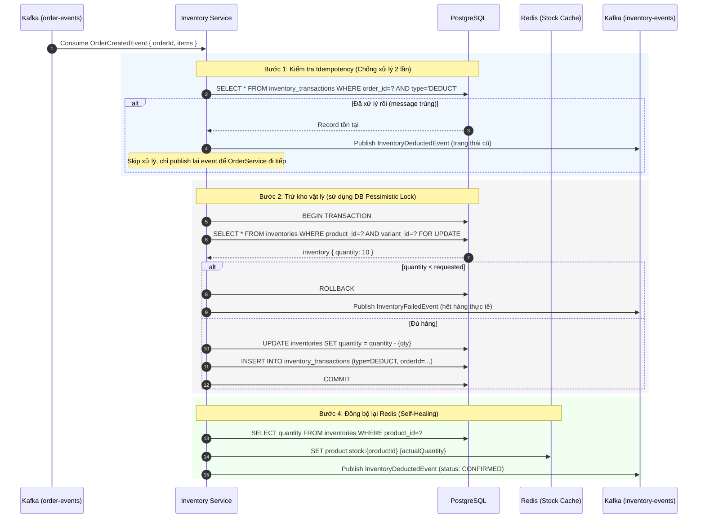
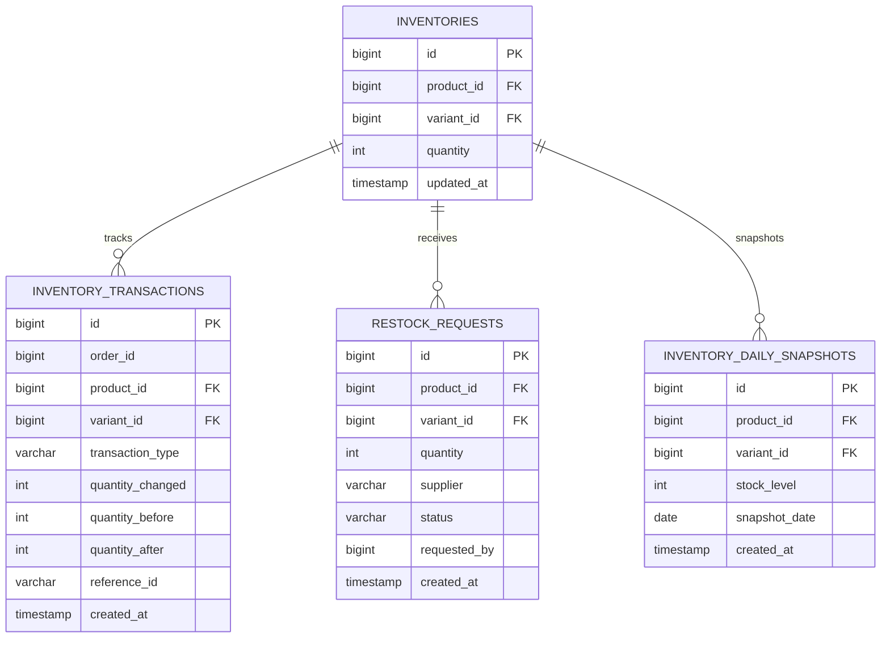

# TÀI LIỆU THIẾT KẾ: INVENTORY SERVICE
## (Dịch vụ Quản lý Kho hàng)

> **Port:** `8093` | **DB:** `ecommerce_inventory_db` (PostgreSQL) | **Version:** 1.0.0

---

## I. TỔNG QUAN VÀ NHIỆM VỤ

### 1.1. Mô tả nghiệp vụ

| Nhóm chức năng | Chi tiết |
|---|---|
| **Quản lý tồn kho** | Xem, nhập kho, cập nhật số lượng sản phẩm |
| **Trừ kho (Deduct)** | Giảm tồn kho khi đơn hàng được xác nhận |
| **Hoàn trả kho (Release)** | Cộng lại tồn kho khi đơn hàng bị hủy |
| **Flash Sale** | Xử lý 10.000+ người tranh mua 10 món hàng đồng thời |
| **Đồng bộ Redis** | Cập nhật cache Redis sau mọi thay đổi tồn kho DB |
| **Idempotent Consumer** | Chống trừ kho 2 lần khi Kafka gửi message trùng |

### 1.2. Bài toán trọng tâm: Flash Sale Concurrency

```
Tình huống thực tế:
  - 10.000 người click "Mua ngay" cùng lúc
  - Chỉ còn 10 sản phẩm trong kho
  - Yêu cầu: Chính xác tuyệt đối — Không bán 1 sản phẩm cho 2 người

Nếu dùng cách thông thường:
  Thread 1: SELECT quantity = 5 → quantity - 1 = 4 → UPDATE quantity = 4
  Thread 2: SELECT quantity = 5 → quantity - 1 = 4 → UPDATE quantity = 4
  → Cả 2 thread đọc cùng giá trị cũ → mất cập nhật (Lost Update)
  → Bán 2 lần cho 1 sản phẩm → Oversell!
```

---

## II. GIẢI PHÁP: HỆ THỐNG KHÓA BI QUAN (PESSIMISTIC LOCKING)

### 2.1. Lớp 1: Redis DECRBY tại Order Service (Ngăn chặn sớm — Early Rejection)

```
Bước 1 (tại Order Service):
  DECRBY product:stock:{productId}:{variantId} {quantity}
  → Lệnh atomic của Redis, thực thi < 1ms
  → 9.990 request hết hàng bị từ chối ngay tại RAM, KHÔNG xuống DB

Chỉ có ~10 request "may mắn" với kết quả DECRBY >= 0 mới đi tiếp
→ Giảm 99.9% tải cho Inventory DB
```

### 2.2. Lớp 2: Khóa bi quan Database (Pessimistic Locking - SELECT FOR UPDATE)

```
Bước 2 (tại Inventory Service — khi nhận Kafka event):

  1. Thực hiện truy vấn khóa dòng sản phẩm với khóa ghi bi quan (Pessimistic Write Lock):
     SELECT * FROM inventories WHERE product_id = ? AND variant_id = ? FOR UPDATE
     (Ngăn chặn bất kỳ tiến trình nào khác đọc hoặc sửa đổi dòng này cho đến khi transaction kết thúc)
  
  2. Kiểm tra tồn kho và cập nhật:
     - UPDATE inventories SET quantity = quantity - {qty} WHERE product_id = ? AND variant_id = ?
     - INSERT INTO inventory_transactions (...)
     - COMMIT
  
  3. Cập nhật số lượng mới đè lên Redis Cache (Self-Healing).

→ Kết hợp 2 lớp: Lớp Redis lọc sớm tại Order Service + Lớp DB khóa bi quan chắc chắn bảo vệ tính toàn vẹn dữ liệu
```

### 2.3. Sơ đồ Luồng Trừ Kho Vật Lý



---

## III. CƠ CHẾ TỰ PHỤC HỒI REDIS (SELF-HEALING)

### 3.1. Vấn đề drift giữa Redis và DB

```
Tình huống drift (lệch):
  DB: product_id=1, quantity=50 (thực tế)
  Redis: product:stock:1 = 47 (bị lệch do network error khi rollback)

→ Khách hàng thấy "hết hàng" nhưng thực tế còn 50 cái
→ Mất doanh thu!
```

### 3.2. Giải pháp Self-Healing

Sau **mọi thao tác** ghi vào DB (deduct/release/restock), Inventory Service luôn:
```java
// Sau khi update DB
long actualQuantity = inventoryRepository.getQuantityByProductId(productId);
redisTemplate.opsForValue().set(
    "product:stock:" + productId,
    String.valueOf(actualQuantity)
);
// → Redis luôn phản chiếu giá trị THỰC TẾ từ DB sau mỗi operation
```

**Cơ chế định kỳ (Scheduled Sync):**
Để tránh ghi đè dữ liệu cũ lên Redis trong lúc có Flash Sale hoặc lượng truy cập cao ban ngày (do độ trễ hàng đợi Kafka), cơ chế đồng bộ định kỳ được thiết lập chạy vào lúc **2:00 sáng hàng ngày (thời điểm thấp điểm)**. Đồng thời, để tránh lỗi tràn bộ nhớ JVM OOM và quá tải Database khi số lượng sản phẩm lớn, luồng xử lý được phân trang và sử dụng Redis Pipelining:
```java
// Chạy vào lúc 2:00 sáng hàng ngày để sửa drift tích lũy an toàn
@Scheduled(cron = "0 0 2 * * ?")
public void syncRedisWithDatabase() {
    int pageSize = 1000;
    int pageNum = 0;
    Page<Inventory> page;
    do {
        Pageable pageable = PageRequest.of(pageNum, pageSize);
        page = inventoryRepository.findAll(pageable);
        
        // Thực hiện ghi hàng loạt sang Redis bằng Pipelining
        redisTemplate.executePipelined((RedisCallback<Object>) connection -> {
            for (Inventory inv : page.getContent()) {
                String key = "product:stock:" + inv.getProductId() + ":" + inv.getVariantId();
                connection.stringCommands().set(
                    key.getBytes(), 
                    String.valueOf(inv.getQuantity()).getBytes()
                );
            }
            return null;
        });
        pageNum++;
    } while (page.hasNext());
}
```

---

## IV. KAFKA INTEGRATION

### 4.1. Topics và Events

| Topic | Consume | Produce | Mô tả |
|---|---|---|---|
| `order-events` | ✅ | | Nhận lệnh trừ/hoàn kho từ Order Service |
| `inventory-events` | | ✅ | Gửi kết quả xử lý về Order/Notification |

### 4.2. Events Schema

#### Consume: `OrderCreatedEvent` (từ Order Service)
```json
{
  "eventType": "OrderCreatedEvent",
  "orderId": 100,
  "userId": 1,
  "timestamp": "2026-06-01T10:00:00",
  "items": [
    { "productId": 101, "variantId": 5, "quantity": 2 },
    { "productId": 202, "variantId": 0, "quantity": 1 }
  ]
}
```

#### Consume: `OrderCancelledEvent` (từ Order Service)
```json
{
  "eventType": "OrderCancelledEvent",
  "orderId": 100,
  "timestamp": "2026-06-01T11:00:00"
}
```

#### Produce: `InventoryDeductedEvent` (gửi về Order & Notification Service)
```json
{
  "eventType": "InventoryDeductedEvent",
  "orderId": 100,
  "status": "CONFIRMED",   // hoặc "FAILED"
  "failReason": null,       // Lý do thất bại nếu FAILED
  "timestamp": "2026-06-01T10:00:01"
}
```

### 4.3. Cấu hình Kafka Consumer

```yaml
spring:
  kafka:
    consumer:
      group-id: inventory-service-group
      auto-offset-reset: earliest
      enable-auto-commit: false    # Manual commit để kiểm soát offset
      max-poll-records: 50         # Xử lý 50 message mỗi lần poll
      properties:
        isolation.level: read_committed  # Chỉ đọc message đã commit
    listener:
      ack-mode: MANUAL_IMMEDIATE   # Commit offset sau khi xử lý thành công
      concurrency: 3               # 3 consumer threads song song
```

---

## V. THIẾT KẾ DATABASE

### 5.1. Schema `ecommerce_inventory_db`

#### Bảng `inventories` (Tồn kho hiện tại)
```sql
CREATE TABLE inventories (
    id          BIGINT  PRIMARY KEY AUTO_INCREMENT,
    product_id  BIGINT  NOT NULL COMMENT 'Logical FK → product_db.products.id',
    variant_id  BIGINT  NOT NULL DEFAULT 0 COMMENT 'Logical FK → product_db.product_variants.id',
    quantity    INT     NOT NULL DEFAULT 0 CHECK (quantity >= 0)
                        COMMENT 'Tổng tồn kho vật lý thực tế (không bao giờ âm)',
    updated_at  TIMESTAMP NOT NULL DEFAULT CURRENT_TIMESTAMP ON UPDATE CURRENT_TIMESTAMP,
    UNIQUE (product_id, variant_id),
    INDEX idx_product_variant (product_id, variant_id)
);
```

#### Bảng `inventory_transactions` (Lịch sử biến động kho)
```sql
CREATE TABLE inventory_transactions (
    id                  BIGSERIAL       PRIMARY KEY,
    order_id            BIGINT      COMMENT 'Logical FK → order_db.orders.id (NULL nếu nhập kho)',
    product_id          BIGINT      NOT NULL,
    variant_id          BIGINT      NOT NULL DEFAULT 0,
    transaction_type    VARCHAR(20) NOT NULL COMMENT 'DEDUCT (trừ), RELEASE (hoàn), RESTOCK (nhập)',
    quantity_changed    INT         NOT NULL COMMENT 'Số lượng thay đổi (luôn dương)',
    quantity_before     INT         NOT NULL COMMENT 'Tồn kho trước biến động',
    quantity_after      INT         NOT NULL COMMENT 'Tồn kho sau biến động',
    reference_id        VARCHAR(100) COMMENT 'Mã tham chiếu (orderId, PO number...)',
    note                TEXT,
    created_at          TIMESTAMP    NOT NULL DEFAULT CURRENT_TIMESTAMP,
    INDEX idx_order_id (order_id),
    INDEX idx_product_variant (product_id, variant_id),
    INDEX idx_type_order (transaction_type, order_id) COMMENT 'Idempotency check index'
);
```

#### Bảng `restock_requests` (Yêu cầu nhập kho)
```sql
CREATE TABLE restock_requests (
    id              BIGSERIAL          PRIMARY KEY,
    product_id      BIGINT          NOT NULL,
    variant_id      BIGINT          NOT NULL DEFAULT 0,
    quantity        INT             NOT NULL,
    supplier        VARCHAR(100),
    status          VARCHAR(20)     NOT NULL DEFAULT 'PENDING'
                    COMMENT 'PENDING, APPROVED, COMPLETED, REJECTED',
    requested_by    BIGINT          NOT NULL COMMENT 'Admin user ID',
    completed_at    TIMESTAMP,
    created_at      TIMESTAMP        NOT NULL DEFAULT CURRENT_TIMESTAMP
);
```

#### Bảng `inventory_daily_snapshots` (Ảnh chụp tồn kho hàng ngày phục vụ AI dự báo nhu cầu)
```sql
CREATE TABLE inventory_daily_snapshots (
    id              BIGSERIAL       PRIMARY KEY,
    product_id      BIGINT          NOT NULL,
    variant_id      BIGINT          NOT NULL DEFAULT 0,
    stock_level     INT             NOT NULL COMMENT 'Số lượng tồn kho tại thời điểm snapshot',
    snapshot_date   DATE            NOT NULL COMMENT 'Ngày ghi nhận snapshot',
    created_at      TIMESTAMP       NOT NULL DEFAULT CURRENT_TIMESTAMP,
    UNIQUE (product_id, variant_id, snapshot_date)
);
CREATE INDEX idx_inv_snap_date ON inventory_daily_snapshots(snapshot_date, product_id, variant_id);
```

### 5.2. Redis Key Design

| Key Pattern | Type | TTL | Mô tả |
|---|---|---|---|
| `product:stock:{productId}:{variantId}` | String | Không có TTL | Tồn kho khả dụng (luôn in sync với DB) |
| `inventory:reserved:{orderId}` | Hash | 15 phút | Tracking các items đã giữ chỗ |

---

## VI. ĐẶC TẢ API

### 6.1. Internal Endpoints (Gọi từ các service khác)

| Method | Endpoint | Mô tả |
|---|---|---|
| GET | `/api/inventories/{productId}` | Lấy tồn kho của sản phẩm |
| GET | `/api/inventories/batch` | Lấy tồn kho nhiều sản phẩm |

#### `GET /api/inventories/{productId}`
```json
// Response 200 OK
{
  "productId": 101,
  "quantity": 50,
  "redisStock": 47,
  "lastUpdated": "2026-06-01T09:55:00"
}
```

#### `GET /api/inventories/batch?productIds=101,202,303`
```json
// Response 200 OK
[
  { "productId": 101, "quantity": 50 },
  { "productId": 202, "quantity": 0  },
  { "productId": 303, "quantity": 120 }
]
```

### 6.2. Admin Endpoints (Cần ROLE_ADMIN)

| Method | Endpoint | Mô tả |
|---|---|---|
| PUT | `/api/admin/inventories/{productId}` | Cập nhật tồn kho trực tiếp |
| POST | `/api/admin/inventories/{productId}/restock` | Nhập kho |
| GET | `/api/admin/inventories/{productId}/transactions` | Lịch sử biến động kho |
| GET | `/api/admin/inventories/low-stock` | Danh sách sản phẩm sắp hết hàng |
| POST | `/api/admin/inventories/sync-redis` | Đồng bộ lại Redis từ DB (Manual trigger) |

#### `POST /api/admin/inventories/{productId}/restock`
```json
// Request Body
{
  "quantity": 100,
  "supplier": "Công ty Nike Vietnam",
  "note": "Nhập hàng tháng 6/2026"
}

// Response 200 OK
{
  "productId": 101,
  "previousQuantity": 50,
  "addedQuantity": 100,
  "currentQuantity": 150,
  "transactionId": 500
}
```

---

## VII. SO SÁNH CÁC PHƯƠNG PHÁP CONCURRENCY CONTROL

| Phương pháp | Throughput | Độ chính xác | Phức tạp | Phù hợp cho Flash Sale? |
|---|---|---|---|---|
| **Optimistic Lock** (`@Version`) | Cao | Trung bình (có conflict retry) | Thấp | ❌ Nhiều conflict khi tải cao |
| **Pessimistic Lock** (`SELECT FOR UPDATE`) | Thấp | Cao | Trung bình | ❌ Nghẽn cổ chai khi 10k req |
| **Redis DECRBY** (Lớp 1) | Cực cao (< 1ms) | Cao (atomic) | Thấp | ✅ Lọc sớm tại biên |
| **Pessimistic Lock** (`SELECT FOR UPDATE`) (Lớp 2) | Trung bình | Cực cao (tuần tự hóa) | Thấp | ✅ Bảo vệ DB vật lý an toàn |
| **Redis Lua Script** | Cực cao | Cao | Trung bình | ✅ Có thể dùng cho các nghiệp vụ phức tạp khác |

**Kiến trúc của hệ thống này = Lớp 1 (Redis DECRBY tại Order Service) + Lớp 2 (DB Pessimistic Lock tại Inventory Service)**

---

## VIII. SƠ ĐỒ THỰC THỂ (ERD)



---

## IX. CẤU HÌNH DOCKER

```yaml
inventory-service:
  image: ecommerce/inventory-service:latest
  ports:
    - "8093:8093"
  environment:
    SPRING_DATASOURCE_URL: jdbc:postgresql://postgres:5432/ecommerce_inventory_db
    SPRING_DATA_REDIS_HOST: redis
    SPRING_KAFKA_BOOTSTRAP_SERVERS: kafka:9092
    KAFKA_TOPIC_ORDER_EVENTS: order-events
    KAFKA_TOPIC_INVENTORY_EVENTS: inventory-events
  depends_on:
    - postgres
    - redis
    - kafka
  networks:
    - ecommerce-network
```

---

## X. ĐIỂM CẢI TIẾN TƯƠNG LAI

| Tính năng | Ưu tiên | Mô tả |
|---|---|---|
| **Redis Lua Script** | Cao | Thay thế Redisson Lock bằng Lua Script cho atomic operation gọn hơn |
| **Multi-warehouse** | Thấp | Hỗ trợ nhiều kho hàng theo vị trí địa lý |
| **Low Stock Alert** | Trung bình | Cảnh báo admin khi tồn kho < ngưỡng tối thiểu |
| **Forecast** | Thấp | Dự báo nhu cầu tồn kho dựa trên lịch sử bán hàng |
| **Reserved Stock** | Trung bình | Tách biệt "tồn kho giữ chỗ" và "tồn kho khả dụng" |

---
*Tài liệu thuộc nhóm 2 — Kiến trúc & Kỹ thuật chuyên sâu.*
