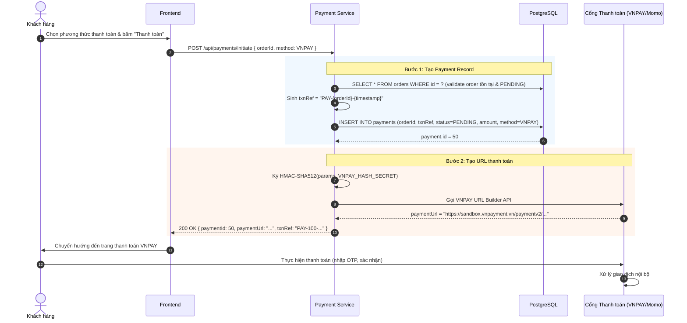
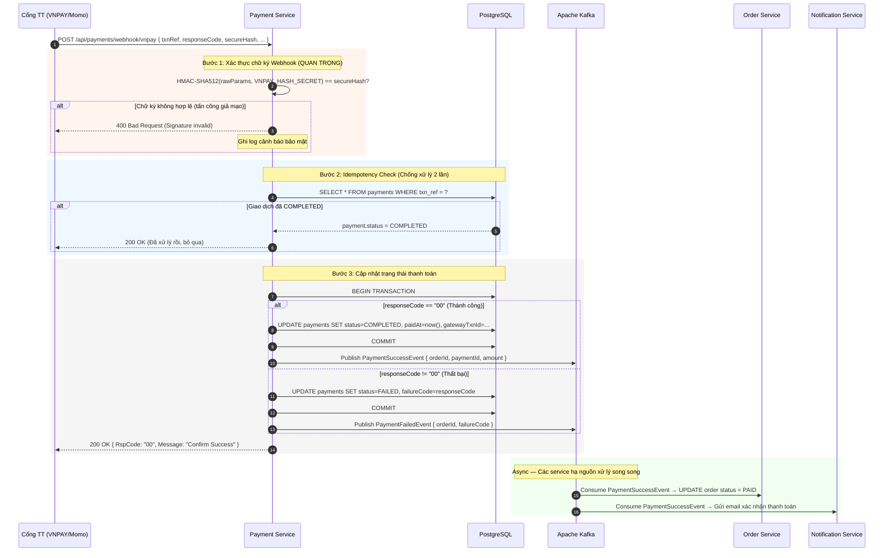
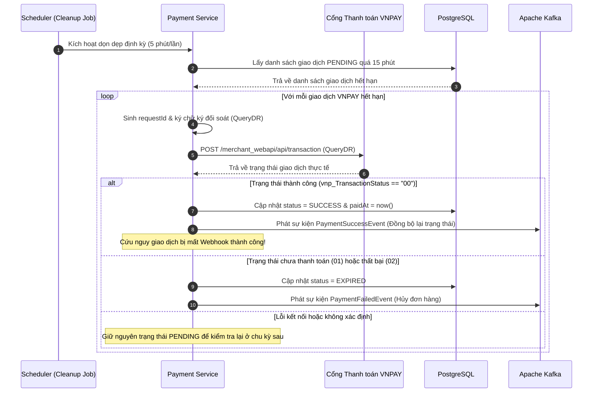
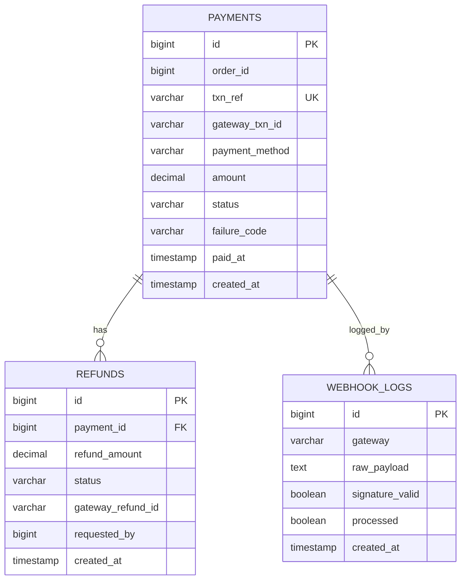

# TÀI LIỆU THIẾT KẾ: PAYMENT SERVICE
## (Dịch vụ Thanh toán)

> **Port:** `8084` | **DB:** `ecommerce_payment_db` (PostgreSQL) | **Version:** 1.0.0

---

## I. TỔNG QUAN VÀ NHIỆM VỤ

### 1.1. Mô tả nghiệp vụ

| Nhóm chức năng | Chi tiết |
|---|---|
| **Khởi tạo thanh toán** | Tạo URL thanh toán chuyển hướng sang cổng (VNPAY, Momo, Stripe) |
| **Xử lý Webhook** | Nhận kết quả thanh toán bất đồng bộ từ cổng thanh toán |
| **Idempotency** | Chống xử lý cùng một giao dịch 2 lần (đặc biệt quan trọng với Webhook) |
| **Lịch sử giao dịch** | Ghi nhận và truy vấn lịch sử thanh toán của đơn hàng |
| **Hoàn tiền (Refund)** | Khởi tạo yêu cầu hoàn tiền khi đơn bị hủy |

### 1.2. Kiến trúc tổng thể Payment Flow

```
[Client] → [API Gateway] → [Payment Service]
                                  │
                    ┌─────────────┼─────────────┐
                    ▼             ▼              ▼
                [VNPAY]        [Momo]        [Stripe]
                    │             │              │
                    └─────────────┴──────────────┘
                                  │
                    [Webhook Callback → Payment Service]
                                  │
                                Kafka
                          (payment-events)
                                  │
                    ┌─────────────┴─────────────┐
                    ▼                           ▼
              [Order Service]         [Notification Service]
             (Cập nhật trạng thái)    (Gửi email xác nhận)
```

---

## II. LUỒNG THANH TOÁN CHI TIẾT

### 2.1. Luồng Khởi tạo Thanh toán



### 2.2. Luồng Webhook — Nhận kết quả thanh toán (Async)



### 2.3. Luồng Đối soát Giao dịch Hết hạn (VNPAY QueryDR)

Để hạn chế tình trạng Webhook bị lỗi (do hạ tầng mạng, sập server tạm thời) dẫn đến việc đơn hàng đã thanh toán thành công trên VNPAY nhưng hệ thống tự động hủy đơn sau 15 phút, Payment Service thực hiện quy trình đối soát chủ động qua VNPAY QueryDR API trước khi đánh dấu hết hạn:



---

## III. TÍCH HỢP ĐA CỔNG THANH TOÁN

### 3.1. Payment Gateway Abstraction (Strategy Pattern)

```java
// Interface chung cho mọi cổng thanh toán
public interface PaymentGateway {
    PaymentUrlResponse createPaymentUrl(PaymentRequest request);
    WebhookVerifyResult verifyWebhook(Map<String, String> params);
    RefundResponse refund(RefundRequest request);
    String getGatewayName();
}

// VNPAY Implementation
@Component
public class VNPayGateway implements PaymentGateway { ... }

// Momo Implementation
@Component
public class MomoGateway implements PaymentGateway { ... }

// Stripe Implementation
@Component
public class StripeGateway implements PaymentGateway { ... }

// Factory để lấy gateway theo method
@Service
public class PaymentGatewayFactory {
    private final Map<String, PaymentGateway> gateways;

    public PaymentGateway getGateway(PaymentMethod method) {
        return gateways.get(method.name().toLowerCase());
    }
}
```

### 3.2. So sánh Cổng Thanh toán

| Cổng | Thị trường | Phí giao dịch | Webhook | Sandbox |
|---|---|---|---|---|
| **VNPAY** | Việt Nam | ~1.1-1.5% | ✅ | ✅ |
| **Momo** | Việt Nam | ~1.5% | ✅ | ✅ |
| **ZaloPay** | Việt Nam | ~1.5% | ✅ | ✅ |
| **Stripe** | Quốc tế | 2.9% + $0.30 | ✅ | ✅ |

### 3.3. VNPAY Integration Chi tiết

**Cấu hình:**
```yaml
payment:
  vnpay:
    tmn-code: ${VNPAY_TMN_CODE}
    hash-secret: ${VNPAY_HASH_SECRET}
    payment-url: https://sandbox.vnpayment.vn/paymentv2/vpcpay.html
    return-url: https://myapp.com/payment/vnpay-return
    webhook-url: https://myapp.com/api/payments/webhook/vnpay
    api-url: https://sandbox.vnpayment.vn/merchant_webapi/api/transaction
```

**Tạo URL thanh toán:**
```java
Map<String, String> vnpParams = new TreeMap<>();
vnpParams.put("vnp_Version", "2.1.0");
vnpParams.put("vnp_Command", "pay");
vnpParams.put("vnp_TmnCode", tmnCode);
vnpParams.put("vnp_Amount", String.valueOf(amount * 100)); // VNPAY nhân 100
vnpParams.put("vnp_CurrCode", "VND");
vnpParams.put("vnp_TxnRef", txnRef);
vnpParams.put("vnp_OrderInfo", "Thanh toan don hang " + orderId);
vnpParams.put("vnp_ReturnUrl", returnUrl);
vnpParams.put("vnp_IpAddr", clientIp);
vnpParams.put("vnp_CreateDate", DateTimeFormatter.ofPattern("yyyyMMddHHmmss").format(now));

String queryString = vnpParams.entrySet().stream()
    .map(e -> e.getKey() + "=" + URLEncoder.encode(e.getValue(), StandardCharsets.US_ASCII))
    .collect(Collectors.joining("&"));

String secureHash = HmacSHA512(hashSecret, queryString);
return paymentUrl + "?" + queryString + "&vnp_SecureHash=" + secureHash;
```

---

## IV. BẢO MẬT WEBHOOK

### 4.1. Tại sao phải xác thực chữ ký Webhook?

```
Nếu không verify chữ ký:
  Hacker gửi POST /api/payments/webhook/vnpay với responseCode="00"
  → Payment Service nghĩ giao dịch thành công
  → Order được CONFIRMED
  → Hàng bị giao mà không có tiền thật!
```

### 4.2. Quy trình xác thực HMAC

```java
public boolean verifyVNPaySignature(Map<String, String> params, String receivedHash) {
    // Loại bỏ field chữ ký khỏi params
    params.remove("vnp_SecureHash");
    params.remove("vnp_SecureHashType");

    // Sắp xếp theo thứ tự alphabet và tạo query string
    String queryString = new TreeMap<>(params).entrySet().stream()
        .map(e -> e.getKey() + "=" + e.getValue())
        .collect(Collectors.joining("&"));

    // Tính toán chữ ký từ phía server
    String computedHash = HmacSHA512(hashSecret, queryString);

    // So sánh constant-time để tránh timing attack
    return MessageDigest.isEqual(
        computedHash.getBytes(StandardCharsets.UTF_8),
        receivedHash.getBytes(StandardCharsets.UTF_8)
    );
}
```

### 4.3. Idempotency cho Webhook

```
Vấn đề: VNPAY có thể gửi cùng 1 webhook nhiều lần (retry) nếu server trả về lỗi.
Giải pháp:
  1. Trước khi xử lý: SELECT status FROM payments WHERE txn_ref = ?
  2. Nếu status đã là COMPLETED → Trả về 200 OK ngay, KHÔNG xử lý lại
  3. Nếu PENDING → Cập nhật và publish event
```

---

## V. THIẾT KẾ DATABASE

### 5.1. Schema `ecommerce_payment_db`

#### Bảng `payments` (Giao dịch thanh toán)
```sql
CREATE TABLE payments (
    id                  BIGSERIAL          PRIMARY KEY,
    order_id            BIGINT          NOT NULL COMMENT 'Logical FK → order_db.orders.id',
    txn_ref             VARCHAR(100)    NOT NULL UNIQUE COMMENT 'Mã giao dịch nội bộ (PAY-orderId-timestamp)',
    gateway_txn_id      VARCHAR(200)    COMMENT 'Mã giao dịch từ cổng TT (VNPAY/Momo)',
    payment_method      VARCHAR(30)     NOT NULL COMMENT 'VNPAY, MOMO, STRIPE, COD',
    amount              DECIMAL(15,2)   NOT NULL COMMENT 'Số tiền thanh toán',
    currency            VARCHAR(10)     NOT NULL DEFAULT 'VND',
    status              VARCHAR(20)     NOT NULL DEFAULT 'PENDING'
                        COMMENT 'PENDING, COMPLETED, FAILED, REFUNDED',
    failure_code        VARCHAR(10)     COMMENT 'Mã lỗi từ cổng TT khi thất bại',
    failure_message     VARCHAR(200),
    gateway_response    TEXT            COMMENT 'Raw JSON response từ cổng TT',
    paid_at             TIMESTAMP        COMMENT 'Thời điểm thanh toán thành công',
    created_at          TIMESTAMP        NOT NULL DEFAULT CURRENT_TIMESTAMP,
    updated_at          TIMESTAMP        NOT NULL DEFAULT CURRENT_TIMESTAMP ON UPDATE CURRENT_TIMESTAMP,
    INDEX idx_order_id (order_id),
    INDEX idx_txn_ref (txn_ref),
    INDEX idx_status (status),
    INDEX idx_gateway_txn_id (gateway_txn_id)
);
```

#### Bảng `refunds` (Hoàn tiền)
```sql
CREATE TABLE refunds (
    id              BIGSERIAL          PRIMARY KEY,
    payment_id      BIGINT          NOT NULL COMMENT 'FK → payments.id',
    refund_amount   DECIMAL(15,2)   NOT NULL,
    reason          TEXT,
    status          VARCHAR(20)     NOT NULL DEFAULT 'PENDING'
                    COMMENT 'PENDING, COMPLETED, FAILED',
    gateway_refund_id VARCHAR(200)  COMMENT 'Mã hoàn tiền từ cổng TT',
    requested_by    BIGINT          NOT NULL COMMENT 'User/Admin ID',
    created_at      TIMESTAMP        NOT NULL DEFAULT CURRENT_TIMESTAMP,
    completed_at    TIMESTAMP,
    INDEX idx_payment_id (payment_id)
);
```

#### Bảng `webhook_logs` (Log Webhook nhận được)
```sql
CREATE TABLE webhook_logs (
    id              BIGSERIAL       PRIMARY KEY,
    gateway         VARCHAR(30) NOT NULL,
    raw_payload     TEXT        NOT NULL,
    signature_valid BOOLEAN     NOT NULL,
    processed       BOOLEAN     NOT NULL DEFAULT FALSE,
    created_at      TIMESTAMP    NOT NULL DEFAULT CURRENT_TIMESTAMP
);
```

---

## VI. ĐẶC TẢ API

### 6.1. Payment Endpoints (Yêu cầu X-User-Id / JWT từ Gateway)

| Method | Endpoint | Mô tả |
|---|---|---|
| POST | `/api/v1/payments/initiate` | Khởi tạo thanh toán, tạo bản ghi PENDING & sinh URL VNPAY |
| GET | `/api/v1/payments/order/{orderId}` | Lấy thông tin thanh toán chi tiết của đơn hàng |

#### `POST /api/v1/payments/initiate`
```json
// Request Body
{
  "orderId": 100,
  "paymentMethod": "VNPAY",
  "returnUrl": "http://localhost:5173/order/success",
  "ipAddress": "127.0.0.1"
}

// Response 200 OK
{
  "code": "SUCCESS",
  "message": "Success",
  "data": {
    "paymentId": 50,
    "txnRef": "PAY-100-1688137350000",
    "paymentUrl": "https://sandbox.vnpayment.vn/paymentv2/vpcpay.html?...",
    "expiresAt": "2026-06-01T10:15:00",
    "method": "VNPAY"
  }
}
```

#### `GET /api/v1/payments/order/{orderId}`
```json
// Response 200 OK
{
  "code": "SUCCESS",
  "message": "Success",
  "data": {
    "id": 50,
    "orderId": 100,
    "amount": 3582000.00,
    "paymentMethod": "VNPAY",
    "status": "COMPLETED",
    "transactionNo": "PAY-100-1688137350000",
    "gatewayResponse": "{...}",
    "paidAt": "2026-06-01T10:02:35",
    "createdAt": "2026-06-01T10:00:00"
  }
}
```

### 6.2. Webhook / Callback Endpoints (Public - Gọi từ VNPAY hoặc Client)

| Method | Endpoint | Mô tả |
|---|---|---|
| GET | `/api/v1/public/payments/vnpay-callback` | Nhận IPN từ VNPAY hoặc nhận Redirect của Client trình duyệt (Dựa vào `Accept: text/html` để chuyển hướng về Frontend) |

> **Lưu ý bảo mật:** Callback endpoint KHÔNG yêu cầu JWT token từ gateway (để cổng VNPAY có thể gọi trực tiếp), nhưng **BẮT BUỘC** phải xác thực chữ ký HMAC-SHA512.

#### `GET /api/v1/public/payments/vnpay-callback`
```
// Params nhận được từ VNPAY:
vnp_TxnRef=PAY-100-1688137350000
vnp_ResponseCode=00
vnp_Amount=358200000
vnp_BankCode=NCB
vnp_TransactionNo=14065233
vnp_SecureHash=abc123...

// Response 200 OK (đối với VNPAY Background IPN):
{
  "RspCode": "00",
  "Message": "Confirm Success"
}

// Đối với yêu cầu từ trình duyệt của khách hàng (Accept: text/html):
// HTTP/1.1 302 Found
// Location: http://localhost:5173/order/100?paymentStatus=00
```

### 6.3. Admin Endpoints (Yêu cầu ROLE_ADMIN / ROLE_STAFF)

| Method | Endpoint | Quyền hạn | Mô tả |
|---|---|---|---|
| GET | `/api/v1/admin/payments` | ADMIN, STAFF | Liệt kê tất cả giao dịch thanh toán (Phân trang) |
| POST | `/api/v1/admin/payments/refund` | ADMIN | Thực hiện hoàn tiền cho giao dịch thanh toán |

#### `GET /api/v1/admin/payments`
```json
// Response 200 OK
{
  "code": "SUCCESS",
  "message": "Success",
  "data": {
    "content": [
      {
        "id": 50,
        "orderId": 100,
        "amount": 3582000.00,
        "paymentMethod": "VNPAY",
        "status": "COMPLETED",
        "transactionNo": "PAY-100-1688137350000",
        "gatewayResponse": "{...}",
        "paidAt": "2026-06-01T10:02:35",
        "createdAt": "2026-06-01T10:00:00"
      }
    ],
    "pageable": { ... },
    "totalPages": 1,
    "totalElements": 1
  }
}
```

#### `POST /api/v1/admin/payments/refund`
```json
// Request Body
{
  "paymentId": 50,
  "amount": 3582000.00,
  "reason": "Khách hàng yêu cầu hủy đơn hàng"
}

// Response 200 OK
{
  "code": "SUCCESS",
  "message": "Success",
  "data": null
}
```

---

## VII. KAFKA INTEGRATION

### 7.1. Events Produce

| Topic | Event | Khi nào |
|---|---|---|
| `payment-events` | `PaymentSuccessEvent` | Webhook xác nhận thanh toán thành công |
| `payment-events` | `PaymentFailedEvent` | Webhook báo thanh toán thất bại |
| `payment-events` | `RefundCompletedEvent` | Hoàn tiền thành công |

### 7.2. PaymentSuccessEvent Schema

```json
{
  "eventType": "PaymentSuccessEvent",
  "paymentId": 50,
  "orderId": 100,
  "userId": 1,
  "amount": 3582000,
  "currency": "VND",
  "method": "VNPAY",
  "gatewayTxnId": "VNP-20260601-100235",
  "timestamp": "2026-06-01T10:02:35"
}
```

---

## VIII. SƠ ĐỒ THỰC THỂ (ERD)



---

## IX. CẤU HÌNH DOCKER

```yaml
payment-service:
  image: ecommerce/payment-service:latest
  ports:
    - "8084:8084"
  environment:
    SPRING_DATASOURCE_URL: jdbc:postgresql://postgres:5432/ecommerce_payment_db
    SPRING_KAFKA_BOOTSTRAP_SERVERS: kafka:9092
    VNPAY_TMN_CODE: ${VNPAY_TMN_CODE}
    VNPAY_HASH_SECRET: ${VNPAY_HASH_SECRET}
    MOMO_PARTNER_CODE: ${MOMO_PARTNER_CODE}
    MOMO_ACCESS_KEY: ${MOMO_ACCESS_KEY}
    STRIPE_SECRET_KEY: ${STRIPE_SECRET_KEY}
  depends_on:
    - postgres
    - kafka
  networks:
    - ecommerce-network
```

---

## X. ĐIỂM CẢI TIẾN TƯƠNG LAI

| Tính năng | Ưu tiên | Mô tả |
|---|---|---|
| **COD (Cash on Delivery)** | Cao | Thanh toán khi nhận hàng |
| **Saved Cards** | Trung bình | Lưu thẻ để thanh toán nhanh lần sau |
| **Payment Analytics** | Thấp | Báo cáo doanh thu theo ngày/tháng/cổng TT |
| **Fraud Detection** | Cao | Phát hiện giao dịch đáng ngờ (nhiều lần thất bại) |
| **Multi-currency** | Thấp | Hỗ trợ thanh toán USD cho khách quốc tế |

---
*Tài liệu thuộc nhóm 2 — Kiến trúc & Kỹ thuật chuyên sâu.*
