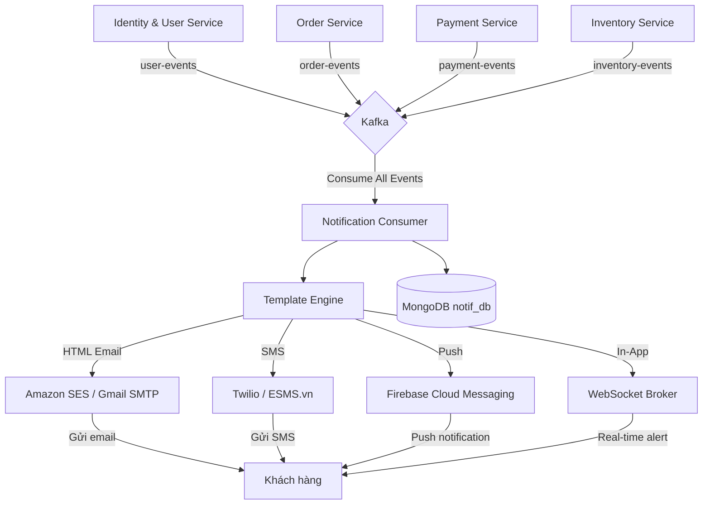
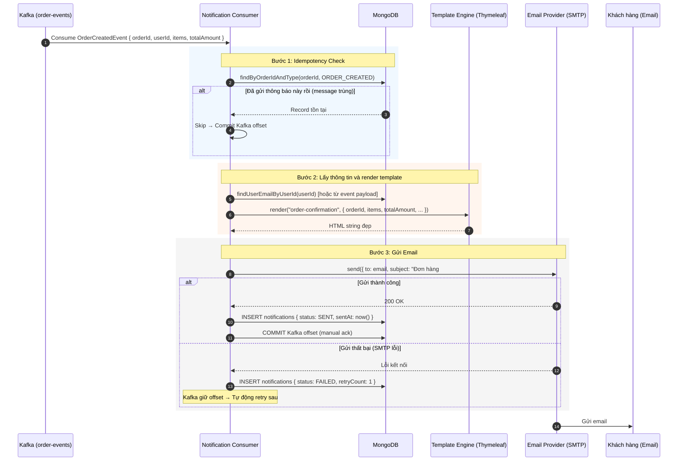
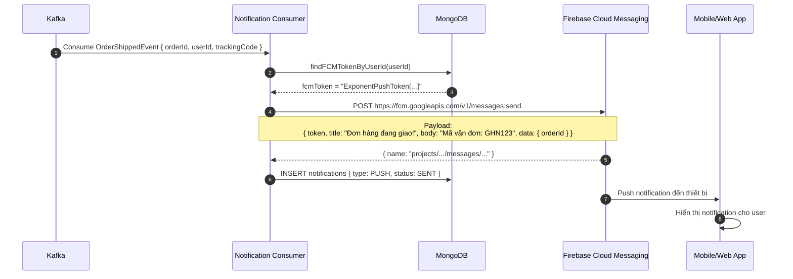
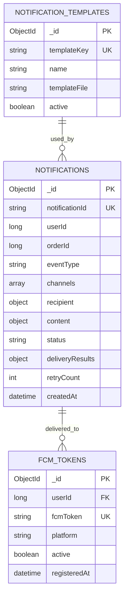

# TÀI LIỆU THIẾT KẾ: NOTIFICATION SERVICE
## (Dịch vụ Thông báo)

> **Port:** `8086` | **DB:** `notif_db` (MongoDB) | **Version:** 1.0.0

---

## I. TỔNG QUAN VÀ NHIỆM VỤ

### 1.1. Mô tả nghiệp vụ

| Nhóm chức năng | Chi tiết |
|---|---|
| **Email** | Gửi email xác nhận đơn hàng, OTP, thông báo thanh toán |
| **Push Notification** | Gửi thông báo đẩy Web/App khi trạng thái đơn thay đổi |
| **SMS** | Gửi SMS OTP, trạng thái giao hàng (tích hợp Twilio/ESMS) |
| **In-App Notification** | Lưu và hiển thị thông báo trong ứng dụng (real-time qua WebSocket) |
| **Template Engine** | Quản lý và render template thông báo đẹp, đa ngôn ngữ |

### 1.2. Nguyên tắc thiết kế cốt lõi: FULLY ASYNCHRONOUS

> **Notification Service không bao giờ bị gọi đồng bộ (HTTP REST)**
> Mọi thông báo đều được kích hoạt bởi **Event từ Kafka**.
> Service khác chỉ cần publish event → response ngay cho khách → Notification xử lý nền.

**Tại sao quan trọng?**
```
Nếu gửi email đồng bộ trong luồng đặt hàng:
  POST /api/orders
    → Tạo đơn DB: 50ms
    → Gửi email SMTP: 800-2000ms  ← Block response!
    → Tổng: 850-2050ms (User chờ đợi)

Nếu dùng Kafka async:
  POST /api/orders
    → Tạo đơn DB + Outbox: 50ms
    → Response cho User: 50ms  ← Nhanh!
    → [Background] Kafka → Email: 800ms (User không biết, không quan tâm)
```

---

## II. KIẾN TRÚC EVENT-DRIVEN

### 2.1. Sơ đồ luồng thông báo tổng thể



### 2.2. Kafka Topics được lắng nghe

| Topic | Event | Thông báo được gửi |
|---|---|---|
| `order-events` | `OrderCreatedEvent` | Email xác nhận đơn hàng mới |
| `order-events` | `OrderCancelledEvent` | Email thông báo hủy đơn |
| `order-events` | `OrderShippedEvent` | Email + SMS + Push: Đơn đang giao |
| `order-events` | `OrderDeliveredEvent` | Email + Push: Giao hàng thành công |
| `payment-events` | `PaymentSuccessEvent` | Email xác nhận thanh toán |
| `payment-events` | `PaymentFailedEvent` | Email thông báo thanh toán thất bại |
| `payment-events` | `RefundCompletedEvent` | Email xác nhận hoàn tiền |
| `user-events` | `UserRegisteredEvent` | Email chào mừng + xác thực tài khoản |
| `user-events` | `PasswordResetEvent` | Email OTP đặt lại mật khẩu |

---

## III. LUỒNG XỬ LÝ THÔNG BÁO CHI TIẾT

### 3.1. Luồng gửi Email xác nhận đơn hàng



### 3.2. Luồng gửi Push Notification (FCM)



---

## IV. TEMPLATE ENGINE

### 4.1. Thymeleaf Email Template

```html
<!-- templates/email/order-confirmation.html -->
<!DOCTYPE html>
<html xmlns:th="http://www.thymeleaf.org">
<head>
  <meta charset="UTF-8">
  <style>
    body { font-family: 'Segoe UI', sans-serif; background: #f5f5f5; }
    .container { max-width: 600px; margin: 20px auto; background: white; border-radius: 8px; }
    .header { background: #FF6B35; color: white; padding: 24px; border-radius: 8px 8px 0 0; }
    .item-row { display: flex; justify-content: space-between; padding: 12px 0; border-bottom: 1px solid #eee; }
    .total { font-size: 18px; font-weight: bold; color: #FF6B35; }
  </style>
</head>
<body>
  <div class="container">
    <div class="header">
      <h1>🎉 Đơn hàng của bạn đã được xác nhận!</h1>
    </div>
    <div style="padding: 24px;">
      <p>Xin chào <strong th:text="${customerName}">Khách hàng</strong>,</p>
      <p>Đơn hàng <strong th:text="'#' + ${orderId}">#{orderId}</strong> đã được đặt thành công!</p>

      <h3>Chi tiết đơn hàng:</h3>
      <div th:each="item : ${items}" class="item-row">
        <span th:text="${item.productName}">Tên sản phẩm</span>
        <span th:text="${item.quantity} + ' x ' + ${#numbers.formatDecimal(item.unitPrice, 0, 'COMMA', 0, 'POINT')} + ' ₫'">1 x 100,000 ₫</span>
      </div>

      <div class="item-row">
        <span>Tổng cộng:</span>
        <span class="total" th:text="${#numbers.formatDecimal(totalAmount, 0, 'COMMA', 0, 'POINT')} + ' ₫'">1,000,000 ₫</span>
      </div>

      <p>Địa chỉ giao hàng: <strong th:text="${shippingAddress}">Địa chỉ</strong></p>
      <p>Chúng tôi sẽ thông báo khi đơn hàng được giao!</p>
    </div>
  </div>
</body>
</html>
```

### 4.2. Danh sách Templates

| Template | Kênh | Event kích hoạt |
|---|---|---|
| `order-confirmation` | Email | `OrderCreatedEvent` |
| `order-cancelled` | Email | `OrderCancelledEvent` |
| `order-shipped` | Email + SMS | `OrderShippedEvent` |
| `order-delivered` | Email + Push | `OrderDeliveredEvent` |
| `payment-success` | Email | `PaymentSuccessEvent` |
| `payment-failed` | Email | `PaymentFailedEvent` |
| `refund-completed` | Email | `RefundCompletedEvent` |
| `welcome` | Email | `UserRegisteredEvent` |
| `otp-reset-password` | Email + SMS | `PasswordResetEvent` |

---

## V. THIẾT KẾ DATABASE (MongoDB)

### 5.1. Tại sao dùng MongoDB?

| Tiêu chí | MongoDB (Chọn) | PostgreSQL |
|---|---|---|
| **Schema linh hoạt** | ✅ Mỗi loại notification có cấu trúc khác nhau | ❌ Cần thiết kế bảng cứng |
| **Lưu JSON payload** | ✅ Native JSON | ❌ TEXT column, khó query |
| **Write-heavy** | ✅ Tối ưu cho insert nhiều | Chậm hơn |
| **Aggregation** | ✅ Mạnh cho báo cáo thống kê | Phức tạp hơn |
| **Full-text search log** | ✅ Atlas Search | ❌ LIKE query chậm |

### 5.2. Collection `notifications`

```json
// Document mẫu
{
  "_id": ObjectId("..."),
  "notificationId": "uuid-string",
  "userId": 1,
  "orderId": 100,
  "eventType": "OrderCreatedEvent",
  "channels": ["EMAIL", "PUSH"],
  "recipient": {
    "email": "vana@example.com",
    "phoneNumber": "0909123456",
    "fcmToken": "ExponentPushToken[...]"
  },
  "content": {
    "subject": "Đơn hàng #100 đã được xác nhận!",
    "body": "Xin chào Nguyễn Văn A...",
    "htmlBody": "<html>...</html>"
  },
  "status": "SENT",            // PENDING, SENT, FAILED, PARTIAL
  "deliveryResults": {
    "email": { "status": "DELIVERED", "sentAt": ISODate("..."), "messageId": "smtp-msg-id" },
    "push":  { "status": "DELIVERED", "sentAt": ISODate("..."), "fcmMessageId": "..." }
  },
  "retryCount": 0,
  "lastRetryAt": null,
  "createdAt": ISODate("2026-06-01T10:00:00Z"),
  "updatedAt": ISODate("2026-06-01T10:00:02Z")
}
```

### 5.3. Collection `notification_templates`

```json
{
  "_id": ObjectId("..."),
  "templateKey": "order-confirmation",
  "name": "Xác nhận đơn hàng",
  "channels": ["EMAIL"],
  "subject": "Đơn hàng #{orderId} đã được xác nhận!",
  "templateFile": "email/order-confirmation.html",
  "variables": ["customerName", "orderId", "items", "totalAmount", "shippingAddress"],
  "active": true,
  "createdAt": ISODate("...")
}
```

### 5.4. Collection `fcm_tokens` (Device Registration)

```json
{
  "_id": ObjectId("..."),
  "userId": 1,
  "fcmToken": "ExponentPushToken[xxxxxx]",
  "platform": "ANDROID",  // ANDROID, IOS, WEB
  "deviceId": "device-uuid",
  "active": true,
  "registeredAt": ISODate("..."),
  "lastSeenAt": ISODate("...")
}
```

### 5.5. MongoDB Indexes

```javascript
// Index cho query thường xuyên
db.notifications.createIndex({ "userId": 1, "createdAt": -1 })
db.notifications.createIndex({ "orderId": 1, "eventType": 1 })  // Idempotency
db.notifications.createIndex({ "status": 1, "retryCount": 1 })  // Retry scheduler

db.fcm_tokens.createIndex({ "userId": 1, "active": 1 })
db.fcm_tokens.createIndex({ "fcmToken": 1 }, { unique: true })
```

---

## VI. ĐẶC TẢ API

### 6.1. Notification Endpoints (Cần JWT)

| Method | Endpoint | Mô tả |
|---|---|---|
| GET | `/api/notifications` | Lấy danh sách thông báo của tôi |
| GET | `/api/notifications/unread-count` | Số thông báo chưa đọc |
| PUT | `/api/notifications/{id}/read` | Đánh dấu đã đọc |
| PUT | `/api/notifications/read-all` | Đánh dấu tất cả đã đọc |
| POST | `/api/notifications/fcm-token` | Đăng ký FCM Token thiết bị |
| DELETE | `/api/notifications/fcm-token` | Xóa FCM Token khi đăng xuất |

#### `GET /api/notifications?page=0&size=20&unreadOnly=false`
```json
// Response 200 OK
{
  "content": [
    {
      "id": "uuid-1",
      "type": "ORDER_CREATED",
      "title": "Đơn hàng #100 đã đặt thành công!",
      "message": "Tổng tiền: 3,582,000 ₫. Chúng tôi sẽ xác nhận sớm.",
      "imageUrl": null,
      "actionUrl": "/orders/100",
      "read": false,
      "createdAt": "2026-06-01T10:00:00"
    }
  ],
  "unreadCount": 3,
  "totalElements": 15
}
```

#### `POST /api/notifications/fcm-token`
```json
// Request Body
{
  "fcmToken": "ExponentPushToken[xxxxxx]",
  "platform": "ANDROID",
  "deviceId": "samsung-galaxy-s24-uuid"
}
// Response 200 OK
{ "message": "FCM Token đã được đăng ký." }
```

### 6.2. Admin Endpoints

| Method | Endpoint | Mô tả |
|---|---|---|
| GET | `/api/admin/notifications/stats` | Thống kê gửi thông báo |
| POST | `/api/admin/notifications/broadcast` | Gửi thông báo hàng loạt |
| GET | `/api/admin/notifications/failed` | Danh sách thông báo gửi thất bại |
| POST | `/api/admin/notifications/{id}/retry` | Retry gửi lại |

---

## VII. CƠ CHẾ RETRY VÀ RESILIENCE

### 7.1. Retry Strategy

```java
@Service
public class NotificationRetryScheduler {

    @Scheduled(fixedDelay = 60000) // Mỗi 1 phút
    public void retryFailedNotifications() {
        List<Notification> failedNotifs = notificationRepository
            .findByStatusAndRetryCountLessThan("FAILED", 3);

        for (Notification notif : failedNotifs) {
            try {
                notificationSender.send(notif);
                notif.setStatus("SENT");
                notif.setSentAt(LocalDateTime.now());
            } catch (Exception e) {
                notif.setRetryCount(notif.getRetryCount() + 1);
                notif.setLastRetryAt(LocalDateTime.now());
                if (notif.getRetryCount() >= 3) {
                    notif.setStatus("PERMANENTLY_FAILED");
                    // Alert admin qua Slack/PagerDuty
                    alertService.sendAlert("Notification gửi thất bại: " + notif.getId());
                }
            }
            notificationRepository.save(notif);
        }
    }
}
```

### 7.2. Circuit Breaker cho Email Provider

```java
@CircuitBreaker(name = "emailProvider", fallbackMethod = "sendEmailFallback")
@Retry(name = "emailProvider", fallbackMethod = "sendEmailFallback")
public void sendEmail(EmailRequest request) {
    smtpClient.send(request);
}

// Fallback: Lưu vào DB queue để gửi sau
public void sendEmailFallback(EmailRequest request, Exception ex) {
    notificationRepository.saveWithStatus(request, "QUEUED_FOR_RETRY");
    log.warn("Email provider down, queued for retry: {}", request.getTo());
}
```

---

## VIII. REAL-TIME IN-APP NOTIFICATION (WebSocket)

### 8.1. Kiến trúc WebSocket

```
Client (Browser) ←──── WebSocket ────→ Notification Service
                  ws://host/ws/notifications

Khi có event mới:
  Kafka → Notification Consumer → MongoDB (lưu) → WebSocket → Client
```

### 8.2. WebSocket Configuration

```java
@Configuration
@EnableWebSocketMessageBroker
public class WebSocketConfig implements WebSocketMessageBrokerConfigurer {

    @Override
    public void configureMessageBroker(MessageBrokerRegistry config) {
        config.enableSimpleBroker("/topic", "/queue");
        config.setApplicationDestinationPrefixes("/app");
        config.setUserDestinationPrefix("/user");
    }

    @Override
    public void registerStompEndpoints(StompEndpointRegistry registry) {
        registry.addEndpoint("/ws/notifications")
                .setAllowedOriginPatterns("*")
                .withSockJS();  // Fallback cho browser cũ
    }
}
```

### 8.3. Gửi notification real-time

```java
// Trong NotificationConsumer, sau khi lưu MongoDB:
messagingTemplate.convertAndSendToUser(
    userId.toString(),               // Gửi đến user cụ thể
    "/queue/notifications",          // Destination
    NotificationDTO.from(notification)
);
```

---

## IX. SƠ ĐỒ THỰC THỂ (ERD — MongoDB Collections)



---

## X. CẤU HÌNH DOCKER

```yaml
notification-service:
  image: ecommerce/notification-service:latest
  ports:
    - "8086:8086"
  environment:
    SPRING_DATA_MONGODB_URI: mongodb://mongodb:27017/notif_db
    SPRING_KAFKA_BOOTSTRAP_SERVERS: kafka:9092
    # Email Config
    SPRING_MAIL_HOST: smtp.gmail.com
    SPRING_MAIL_PORT: 587
    SPRING_MAIL_USERNAME: ${SMTP_USERNAME}
    SPRING_MAIL_PASSWORD: ${SMTP_PASSWORD}
    MAIL_FROM: noreply@ecommerce.vn
    # Firebase
    FIREBASE_CREDENTIALS_PATH: /config/firebase-credentials.json
    # SMS
    TWILIO_ACCOUNT_SID: ${TWILIO_ACCOUNT_SID}
    TWILIO_AUTH_TOKEN: ${TWILIO_AUTH_TOKEN}
  volumes:
    - ./firebase-credentials.json:/config/firebase-credentials.json:ro
  depends_on:
    - mongodb
    - kafka
  networks:
    - ecommerce-network
```

---

## XI. ĐIỂM CẢI TIẾN TƯƠNG LAI

| Tính năng | Ưu tiên | Mô tả |
|---|---|---|
| **Preference Center** | Trung bình | User tự chọn kênh nhận thông báo (email/SMS/push) |
| **Unsubscribe** | Cao | Hủy đăng ký email marketing (bắt buộc theo GDPR/luật VN) |
| **Email Tracking** | Thấp | Theo dõi email open rate, click rate |
| **Multi-language** | Thấp | Template đa ngôn ngữ (VI/EN) |
| **Notification Scheduling** | Trung bình | Gửi thông báo theo lịch (flash sale countdown) |
| **Zalo OA Integration** | Cao | Gửi thông báo qua Zalo Official Account (phổ biến ở VN) |

---
*Tài liệu thuộc nhóm 2 — Kiến trúc & Kỹ thuật chuyên sâu.*
