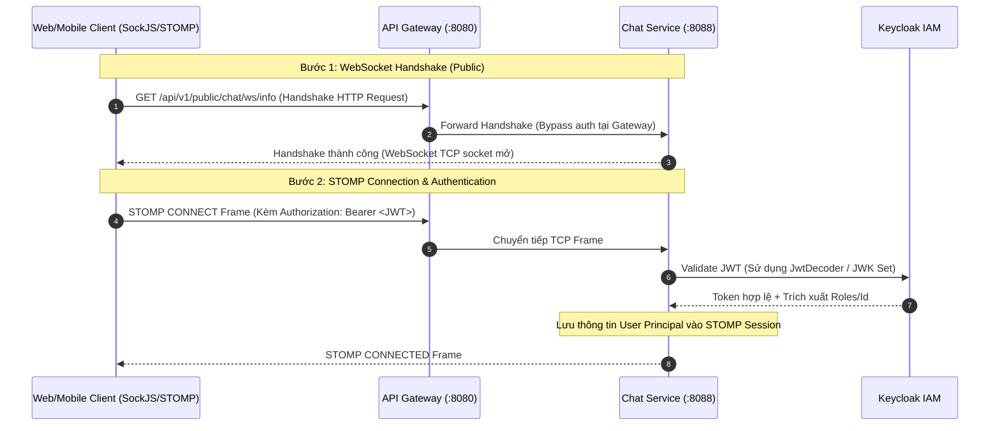
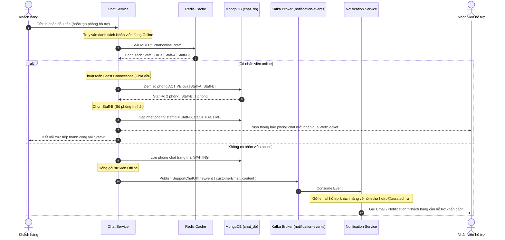

# TÀI LIỆU THIẾT KẾ: CHAT SERVICE
## (Dịch vụ Chat Hỗ trợ Khách hàng - Nhân viên)

> **Port:** `8088` | **DB:** `chat_db` (MongoDB) & Redis (Online tracking) | **Version:** 1.0.0

---

## I. TỔNG QUAN VÀ NHIỆM VỤ

### 1.1. Mô tả nghiệp vụ

Dịch vụ Chat Hỗ trợ (Chat Service) đảm nhận vai trò kết nối trực tiếp, thời gian thực (real-time) giữa Khách hàng (Customer) và Nhân viên chăm sóc khách hàng (Staff/Admin).

| Nhóm chức năng | Chi tiết nghiệp vụ |
|---|---|
| **Room Management** | Tạo phiên hỗ trợ của Khách hàng, cập nhật trạng thái (`AI_CHAT`, `WAITING`, `ACTIVE`, `CLOSED`), ghi nhận thông tin tin nhắn cuối cùng (`lastMessage`, `lastMessageAt`). |
| **Real-time Messaging** | Truyền và nhận tin nhắn thời gian thực qua giao thức WebSocket STOMP, hỗ trợ định dạng tin nhắn text, hình ảnh hoặc đính kèm file. |
| **Auto Distribution** | Tự động phân phối phòng chat (hội thoại) đều cho các nhân viên đang trực tuyến (Online) dựa trên thuật toán tải tối thiểu (Least Connections). |
| **Offline Notifications** | Phát hiện trạng thái không có nhân viên trực tuyến để tự động kích hoạt sự kiện Kafka gửi email thông báo khách hàng cần hỗ trợ về hòm thư support trung tâm. |

### 1.2. Trạng thái phòng chat (Lifecycle) và Tích Hợp AI Chatbot tương lai

Hội thoại chat của khách hàng với hệ thống chuyển dịch trạng thái theo sơ đồ sau:
```
[Bắt đầu] ──> Khách nhắn tin ──> AI_CHAT (Mặc định AI tự trả lời trước)
                                     │
                 ┌───────────────────┴───────────────────┐
                 ▼ (Khách bấm nút/phàn nàn cảm xúc xấu)  ▼ (Khách hài lòng)
              Handover (Yêu cầu nhân viên)             CLOSED (Đóng chat)
                 │
                 ├─── (Nếu có nhân viên online) ──> Tự động phân phối (Least Connections) ──> ACTIVE (Chat với Staff)
                 │                                                                                │
                 └─── (Không có nhân viên online) ──> WAITING ──> Bắn Kafka báo offline            ▼
                                                                                               CLOSED (Đóng chat)
```
> **Đặc điểm lưu trữ**: Vì cả tin nhắn của Khách hàng, AI Chatbot (senderRole = `AI`) và Nhân viên hỗ trợ (senderRole = `STAFF`) đều lưu chung trong collection `chatMessages` của một `roomId`, nên khi bàn giao sang cho Nhân viên, Nhân viên sẽ gọi API lịch sử để **đọc lại toàn bộ nội dung mà AI đã đối thoại với khách trước đó** một cách liền mạch.

---

## II. KIẾN TRÚC HỆ THỐNG VÀ EVENT-DRIVEN

### 2.1. Định tuyến WebSocket qua API Gateway

Do trình duyệt không hỗ trợ gửi Custom Headers trong WebSocket Handshake, quá trình thiết lập kết nối được thực hiện như sau:



### 2.2. Luồng tự động phân phối và xử lý Offline (Kafka Event)



---

## III. CẤU TRÚC DỮ LIỆU (MONGODB & REDIS)

### 3.1. MongoDB Collections

#### 1. Collection `chatRooms`
```json
{
  "_id": "ObjectId",
  "customerId": "String (Keycloak UUID, index)",
  "customerName": "String",
  "customerEmail": "String",
  "customerAvatar": "String",
  "staffId": "String (Keycloak UUID, index, null nếu WAITING/AI_CHAT)",
  "staffName": "String",
  "staffAvatar": "String",
  "status": "String (AI_CHAT, WAITING, ACTIVE, CLOSED)",
  "lastMessage": "String",
  "lastMessageAt": "Date",
  "lastMessageSenderId": "String",
  "createdAt": "Date",
  "updatedAt": "Date"
}
```

#### 2. Collection `chatMessages`
```json
{
  "_id": "ObjectId",
  "roomId": "String (index)",
  "senderId": "String (index)",
  "senderName": "String",
  "senderRole": "String (CUSTOMER, STAFF, AI)",
  "content": "String",
  "type": "String (TEXT, IMAGE, FILE)",
  "isRead": "Boolean",
  "createdAt": "Date"
}
```

### 3.2. Cấu trúc bộ nhớ đệm Redis
*   `chat:online_staff`: Cấu trúc **Set** lưu trữ danh sách UUID của nhân viên đang trực tuyến (Online).
    - Thêm vào Set khi Staff connect WebSocket: `SADD chat:online_staff <staff_id>`.
    - Xóa khỏi Set khi Staff disconnect: `SREM chat:online_staff <staff_id>`.
*   `chat:staff_names`: Cấu trúc **Hash** lưu trữ mapping giữa `staff_id` và `staffName` để truy xuất nhanh không cần gọi Database:
    - Lưu: `HSET chat:staff_names <staff_id> <staff_name>`.

---

## IV. API ENDPOINTS VÀ WEBSOCKET SPECIFICATION

### 4.1. REST API Endpoints

#### Dành cho Khách hàng (`/api/v1/chat/**`)
*   `POST /api/v1/chat/rooms`: Yêu cầu mở phòng hỗ trợ. (Mặc định tạo ở trạng thái `AI_CHAT` để AI xử lý trước, hoặc trả về phòng hiện tại nếu chưa đóng).
*   `GET /api/v1/chat/rooms/my`: Xem thông tin phòng hỗ trợ hiện tại của mình.
*   `GET /api/v1/chat/rooms/{roomId}/messages?page=0&size=20`: Xem lịch sử tin nhắn trong phòng (bao gồm cả tin nhắn của AI và khách hàng trước đó).
*   `PUT /api/v1/chat/rooms/{roomId}/close`: Khách hàng chủ động đóng phòng hỗ trợ.
*   `PUT /api/v1/chat/rooms/{roomId}/handover`: Yêu cầu chuyển giao phiên hỗ trợ sang Nhân viên (do khách nhấn nút yêu cầu, gõ lệnh đặc biệt, hoặc khi bot AI tự động nhận diện cảm xúc tiêu cực).

#### Dành cho Nhân viên (`/api/v1/admin/chat/**` - Yêu cầu quyền `ROLE_STAFF`/`ROLE_ADMIN`)
*   `GET /api/v1/admin/chat/rooms?status=WAITING&page=0&size=20`: Xem các phòng chat theo trạng thái.
*   `GET /api/v1/admin/chat/rooms/my-assigned`: Xem danh sách phòng mình đang phụ trách.
*   `PUT /api/v1/admin/chat/rooms/{roomId}/assign`: Tiếp nhận thủ công phòng chat (nếu có phòng nào bị sót).
*   `PUT /api/v1/admin/chat/rooms/{roomId}/close`: Kết thúc/Đóng phòng chat.
*   `GET /api/v1/admin/chat/rooms/{roomId}/messages`: Xem lịch sử chat của khách hàng trong phòng.

### 4.2. WebSocket STOMP Channels
*   **Điểm kết nối (Handshake)**: `ws://localhost:8080/api/v1/public/chat/ws`
*   **Kênh gửi tin nhắn (Destination)**: `/app/chat.sendMessage`
    *   *Payload*: `{"roomId": "string", "content": "string", "type": "TEXT"}`
*   **Kênh nhận tin nhắn thời gian thực**:
    *   *Customer/Staff subscribe*: `/topic/room/{roomId}` để nhận tin nhắn trong phòng đó.
*   **Kênh cập nhật danh sách phòng hỗ trợ (cho Nhân viên)**:
    *   *Staff subscribe*: `/topic/rooms.updates` để nhận sự kiện thay đổi tin nhắn cuối/trạng thái phòng real-time trên dashboard.

---

## V. CHI TIẾT TRIỂN KHAI CODE MẪU CHUẨN

Dưới đây là chi tiết mã nguồn triển khai các logic cốt lõi.

### 5.1. WebSocket Interceptor Xác thực JWT
[WebSocketConfig.java](file:///e:/CloneGithub/Graduation-Project/BE/chat-service/src/main/java/com/ecommerce/chatservice/config/WebSocketConfig.java)
```java
package com.ecommerce.chatservice.config;

import lombok.extern.slf4j.Slf4j;
import org.springframework.beans.factory.annotation.Autowired;
import org.springframework.context.annotation.Configuration;
import org.springframework.messaging.Message;
import org.springframework.messaging.MessageChannel;
import org.springframework.messaging.MessageDeliveryException;
import org.springframework.messaging.simp.config.ChannelRegistration;
import org.springframework.messaging.simp.config.MessageBrokerRegistry;
import org.springframework.messaging.simp.stomp.StompCommand;
import org.springframework.messaging.simp.stomp.StompHeaderAccessor;
import org.springframework.messaging.support.ChannelInterceptor;
import org.springframework.messaging.support.MessageHeaderAccessor;
import org.springframework.security.authentication.UsernamePasswordAuthenticationToken;
import org.springframework.security.core.GrantedAuthority;
import org.springframework.security.core.authority.SimpleGrantedAuthority;
import org.springframework.security.oauth2.jwt.Jwt;
import org.springframework.security.oauth2.jwt.JwtDecoder;
import org.springframework.web.socket.config.annotation.EnableWebSocketMessageBroker;
import org.springframework.web.socket.config.annotation.StompEndpointRegistry;
import org.springframework.web.socket.config.annotation.WebSocketMessageBrokerConfigurer;

import java.util.List;
import java.util.Map;
import java.util.stream.Collectors;

@Configuration
@EnableWebSocketMessageBroker
@Slf4j
public class WebSocketConfig implements WebSocketMessageBrokerConfigurer {

    @Autowired
    private JwtDecoder jwtDecoder;

    @Override
    public void registerStompEndpoints(StompEndpointRegistry registry) {
        registry.addEndpoint("/api/v1/public/chat/ws")
                .setAllowedOriginPatterns("*")
                .withSockJS();
    }

    @Override
    public void configureMessageBroker(MessageBrokerRegistry registry) {
        registry.enableSimpleBroker("/topic", "/queue");
        registry.setApplicationDestinationPrefixes("/app");
        registry.setUserDestinationPrefix("/user");
    }

    @Override
    public void configureClientInboundChannel(ChannelRegistration registration) {
        registration.interceptors(new ChannelInterceptor() {
            @Override
            public Message<?> preSend(Message<?> message, MessageChannel channel) {
                StompHeaderAccessor accessor = MessageHeaderAccessor.getAccessor(message, StompHeaderAccessor.class);
                if (accessor != null && StompCommand.CONNECT.equals(accessor.getCommand())) {
                    String authHeader = accessor.getFirstNativeHeader("Authorization");
                    if (authHeader != null && authHeader.startsWith("Bearer ")) {
                        String token = authHeader.substring(7);
                        try {
                            Jwt jwt = jwtDecoder.decode(token);
                            String userId = jwt.getSubject();
                            
                            Map<String, Object> realmAccess = jwt.getClaimAsMap("realm_access");
                            List<String> roles = List.of();
                            if (realmAccess != null && realmAccess.containsKey("roles")) {
                                roles = (List<String>) realmAccess.get("roles");
                            }

                            List<GrantedAuthority> authorities = roles.stream()
                                    .map(String::toUpperCase)
                                    .map(r -> r.startsWith("ROLE_") ? r : "ROLE_" + r)
                                    .map(SimpleGrantedAuthority::new)
                                    .collect(Collectors.toList());

                            UsernamePasswordAuthenticationToken auth =
                                    new UsernamePasswordAuthenticationToken(userId, null, authorities);
                            
                            accessor.setUser(auth);
                            
                            accessor.getSessionAttributes().put("userId", userId);
                            accessor.getSessionAttributes().put("roles", roles);
                            accessor.getSessionAttributes().put("email", jwt.getClaimAsString("email"));
                            accessor.getSessionAttributes().put("name", jwt.getClaimAsString("name"));
                            log.info("WebSocket Authenticated: User={}, Roles={}", userId, roles);
                        } catch (Exception e) {
                            log.error("WebSocket Authentication failed: {}", e.getMessage());
                            throw new MessageDeliveryException("Unauthorized: " + e.getMessage());
                        }
                    } else {
                        throw new MessageDeliveryException("Missing Authorization header");
                    }
                }
                return message;
            }
        });
    }
}
```

### 5.2. Quản lý trạng thái Online của Nhân viên qua Redis
[WebSocketEventListener.java](file:///e:/CloneGithub/Graduation-Project/BE/chat-service/src/main/java/com/ecommerce/chatservice/event/WebSocketEventListener.java)
```java
package com.ecommerce.chatservice.event;

import lombok.RequiredArgsConstructor;
import lombok.extern.slf4j.Slf4j;
import org.springframework.context.event.EventListener;
import org.springframework.data.redis.core.StringRedisTemplate;
import org.springframework.messaging.simp.stomp.StompHeaderAccessor;
import org.springframework.security.authentication.UsernamePasswordAuthenticationToken;
import org.springframework.stereotype.Component;
import org.springframework.web.socket.messaging.SessionConnectEvent;
import org.springframework.web.socket.messaging.SessionDisconnectEvent;

import java.security.Principal;
import java.util.Map;

@Component
@RequiredArgsConstructor
@Slf4j
public class WebSocketEventListener {

    private final StringRedisTemplate redisTemplate;

    @EventListener
    public void handleWebSocketConnectListener(SessionConnectEvent event) {
        StompHeaderAccessor headerAccessor = StompHeaderAccessor.wrap(event.getMessage());
        Principal principal = headerAccessor.getUser();
        if (principal instanceof UsernamePasswordAuthenticationToken) {
            UsernamePasswordAuthenticationToken auth = (UsernamePasswordAuthenticationToken) principal;
            String userId = auth.getName();
            
            boolean isStaff = auth.getAuthorities().stream()
                    .anyMatch(a -> a.getAuthority().equals("ROLE_STAFF") || a.getAuthority().equals("ROLE_ADMIN"));
            
            if (isStaff) {
                Map<String, Object> sessionAttributes = headerAccessor.getSessionAttributes();
                if (sessionAttributes != null) {
                    String name = (String) sessionAttributes.get("name");
                    redisTemplate.opsForSet().add("chat:online_staff", userId);
                    if (name != null) {
                        redisTemplate.opsForHash().put("chat:staff_names", userId, name);
                    }
                    log.info("Staff member {} ({}) connected and added to online registry", name, userId);
                }
            }
        }
    }

    @EventListener
    public void handleWebSocketDisconnectListener(SessionDisconnectEvent event) {
        StompHeaderAccessor headerAccessor = StompHeaderAccessor.wrap(event.getMessage());
        Principal principal = headerAccessor.getUser();
        if (principal != null) {
            String userId = principal.getName();
            
            Boolean isStaff = redisTemplate.opsForSet().isMember("chat:online_staff", userId);
            if (Boolean.TRUE.equals(isStaff)) {
                redisTemplate.opsForSet().remove("chat:online_staff", userId);
                log.info("Staff member {} disconnected and removed from online registry", userId);
            }
        }
    }
}
```

### 5.3. Thuật toán phân phối tải tối thiểu (Least Connections)
[ChatRoomServiceImpl.java](file:///e:/CloneGithub/Graduation-Project/BE/chat-service/src/main/java/com/ecommerce/chatservice/service/impl/ChatRoomServiceImpl.java)
```java
package com.ecommerce.chatservice.service.impl;

import com.ecommerce.chatservice.dto.response.ChatRoomResponse;
import com.ecommerce.chatservice.entity.ChatRoom;
import com.ecommerce.chatservice.repository.ChatRoomRepository;
import com.ecommerce.chatservice.service.ChatRoomService;
import lombok.RequiredArgsConstructor;
import lombok.extern.slf4j.Slf4j;
import org.springframework.data.domain.Page;
import org.springframework.data.domain.Pageable;
import org.springframework.data.redis.core.StringRedisTemplate;
import org.springframework.http.HttpStatus;
import org.springframework.stereotype.Service;
import org.springframework.web.server.ResponseStatusException;

import java.time.LocalDateTime;
import java.util.Set;

@Service
@RequiredArgsConstructor
@Slf4j
public class ChatRoomServiceImpl implements ChatRoomService {

    private final ChatRoomRepository chatRoomRepository;
    private final StringRedisTemplate redisTemplate;

    @Override
    public ChatRoomResponse getOrCreateRoom(String customerId, String name, String email, String avatar) {
        ChatRoom room = chatRoomRepository.findByCustomerIdAndStatusNot(customerId, "CLOSED")
                .orElseGet(() -> {
                    ChatRoom newRoom = ChatRoom.builder()
                            .customerId(customerId)
                            .customerName(name)
                            .customerEmail(email)
                            .customerAvatar(avatar)
                            .createdAt(LocalDateTime.now())
                            .updatedAt(LocalDateTime.now())
                            .build();
                    
                    autoAssignStaffIfPossible(newRoom);
                    return chatRoomRepository.save(newRoom);
                });
        return mapToResponse(room);
    }

    @Override
    public void autoAssignStaffIfPossible(ChatRoom room) {
        Set<String> onlineStaffIds = redisTemplate.opsForSet().members("chat:online_staff");
        if (onlineStaffIds != null && !onlineStaffIds.isEmpty()) {
            String assignedStaffId = null;
            long minRooms = Long.MAX_VALUE;
            
            // Tìm nhân viên online có số lượng phòng chat ACTIVE ít nhất để chia đều tải
            for (String staffId : onlineStaffIds) {
                long activeCount = chatRoomRepository.countByStaffIdAndStatus(staffId, "ACTIVE");
                if (activeCount < minRooms) {
                    minRooms = activeCount;
                    assignedStaffId = staffId;
                }
            }
            
            if (assignedStaffId != null) {
                String staffName = (String) redisTemplate.opsForHash().get("chat:staff_names", assignedStaffId);
                room.setStaffId(assignedStaffId);
                room.setStaffName(staffName != null ? staffName : "Nhân viên hỗ trợ");
                room.setStatus("ACTIVE");
                log.info("Auto-assigned ChatRoom {} to online staff member {} (Active chats count: {})", 
                        room.getId(), room.getStaffName(), minRooms);
            }
        } else {
            room.setStatus("WAITING");
            log.info("No staff online. Room ChatRoom created in WAITING status.");
        }
    }

    // Các hàm REST API khác (assignStaff, closeRoom, getRoomsByStatus) giữ nguyên
    // ...
}
```

### 5.4. Gửi sự kiện Offline lên Kafka khi không có nhân viên trực
[ChatMessageServiceImpl.java](file:///e:/CloneGithub/Graduation-Project/BE/chat-service/src/main/java/com/ecommerce/chatservice/service/impl/ChatMessageServiceImpl.java)
```java
package com.ecommerce.chatservice.service.impl;

import com.ecommerce.chatservice.dto.request.ChatMessageRequest;
import com.ecommerce.chatservice.dto.response.ChatMessageResponse;
import com.ecommerce.chatservice.entity.ChatMessage;
import com.ecommerce.chatservice.entity.ChatRoom;
import com.ecommerce.chatservice.repository.ChatMessageRepository;
import com.ecommerce.chatservice.repository.ChatRoomRepository;
import com.ecommerce.chatservice.service.ChatMessageService;
import com.ecommerce.chatservice.service.ChatRoomService;
import com.fasterxml.jackson.databind.ObjectMapper;
import lombok.RequiredArgsConstructor;
import lombok.extern.slf4j.Slf4j;
import org.springframework.data.domain.Page;
import org.springframework.data.domain.Pageable;
import org.springframework.http.HttpStatus;
import org.springframework.kafka.core.KafkaTemplate;
import org.springframework.stereotype.Service;
import org.springframework.transaction.annotation.Transactional;
import org.springframework.web.server.ResponseStatusException;

import java.time.LocalDateTime;
import java.util.Map;
import java.util.UUID;

@Service
@RequiredArgsConstructor
@Slf4j
public class ChatMessageServiceImpl implements ChatMessageService {

    private final ChatMessageRepository chatMessageRepository;
    private final ChatRoomRepository chatRoomRepository;
    private final ChatRoomService chatRoomService;
    private final KafkaTemplate<String, String> kafkaTemplate;
    private final ObjectMapper objectMapper;

    @Override
    @Transactional
    public ChatMessageResponse saveMessage(ChatMessageRequest request, String senderId, String senderName, String senderRole) {
        ChatRoom room = chatRoomRepository.findById(request.getRoomId())
                .orElseThrow(() -> new ResponseStatusException(HttpStatus.NOT_FOUND, "Không tìm thấy phòng chat"));

        if ("CLOSED".equals(room.getStatus())) {
            throw new ResponseStatusException(HttpStatus.BAD_REQUEST, "Phòng chat đã đóng.");
        }

        // Tự động phân phối lại nếu có nhân viên vừa online
        if ("WAITING".equals(room.getStatus())) {
            chatRoomService.autoAssignStaffIfPossible(room);
        }

        ChatMessage message = ChatMessage.builder()
                .roomId(request.getRoomId())
                .senderId(senderId)
                .senderName(senderName)
                .senderRole(senderRole)
                .content(request.getContent())
                .type(request.getType())
                .isRead(false)
                .createdAt(LocalDateTime.now())
                .build();
        ChatMessage saved = chatMessageRepository.save(message);

        room.setLastMessage(request.getContent());
        room.setLastMessageAt(LocalDateTime.now());
        room.setLastMessageSenderId(senderId);
        room.setUpdatedAt(LocalDateTime.now());
        chatRoomRepository.save(room);

        // Gửi thông báo offline qua Kafka nếu không có nhân viên nào online khi khách gửi tin nhắn
        if ("WAITING".equals(room.getStatus()) && "CUSTOMER".equals(senderRole)) {
            sendOfflineKafkaEvent(room, request.getContent());
        }

        return mapToResponse(saved);
    }

    private void sendOfflineKafkaEvent(ChatRoom room, String messageContent) {
        try {
            Map<String, Object> payload = Map.of(
                "roomId", room.getId(),
                "customerId", room.getCustomerId(),
                "customerName", room.getCustomerName(),
                "customerEmail", room.getCustomerEmail() != null ? room.getCustomerEmail() : "",
                "content", messageContent
            );
            
            Map<String, Object> event = Map.of(
                "eventId", UUID.randomUUID().toString(),
                "eventType", "SupportChatOfflineEvent",
                "timestamp", LocalDateTime.now().toString(),
                "payload", payload
            );

            String eventJson = objectMapper.writeValueAsString(event);
            kafkaTemplate.send("notification-events", room.getId(), eventJson);
            log.info("Sent SupportChatOfflineEvent to Kafka for room {} (No staff online)", room.getId());
        } catch (Exception e) {
            log.error("Failed to send offline support event to Kafka", e);
        }
    }

    // ...
}
```
